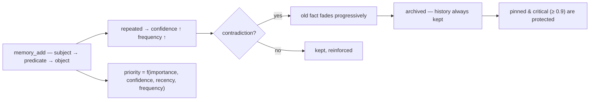

<p align="center">
  🌍 <strong>Languages:</strong>
  <a href="README.md">🇬🇧 English</a> ·
  <a href="README.fr.md">🇫🇷 Français</a> ·
  <a href="README.de.md">🇩🇪 Deutsch</a> ·
  <a href="README.es.md">🇪🇸 Español</a> ·
  <a href="README.it.md">🇮🇹 Italiano</a> ·
  <a href="README.pt.md">🇵🇹 Português</a> ·
  <a href="README.nl.md">🇳🇱 Nederlands</a> ·
  <a href="README.ru.md">🇷🇺 Русский</a> ·
  <a href="README.ja.md">🇯🇵 日本語</a> ·
  <a href="README.zh.md">🇨🇳 中文</a> ·
  <a href="README.ko.md">🇰🇷 한국어</a> ·
  <a href="README.pl.md">🇵🇱 Polski</a> ·
  <a href="README.tr.md">🇹🇷 Türkçe</a> ·
  <a href="README.uk.md">🇺🇦 Українська</a> ·
  <a href="README.hi.md">🇮🇳 हिन्दी</a> ·
  <a href="README.vi.md">🇻🇳 Tiếng Việt</a>
</p>

<p align="center">
  
</p>

<p align="center">
  <a href="https://www.npmjs.com/package/memsem"></a>
  <a href="LICENSE"></a>
  = 22.13">
  
  
</p>

> **Semantisches Gedächtnis für KI-Agenten** — erinnert sich an das Wichtige, weiß, was es vergessen soll.
> Ein Befehl zur Installation. Funktioniert in *jedem* Projekt, für *jede* KI. 100 % lokal.

## Warum?

Deine KI vergisst zwischen den Sitzungen alles. `CLAUDE.md` ist eine statische Datei — sie kann nicht lernen.
Vektor-Datenbanken sind schwergewichtig und oft in der Cloud gehostet. Die meisten „Memory"-Werkzeuge sind passive Speicher:
Sie behalten, was man ihnen hinwirft, priorisieren nie, gleichen Widersprüche nie ab.

**memsem ist anders.** Es ist ein Gedächtnis-*System*, keine Schublade:

- 🧠 **Es schreibt sich selbst** — während einer Sitzung hält deine KI dauerhafte Fakten (Präferenzen, Entscheidungen, Einschränkungen) automatisch fest. Kein „denk dran, das zu speichern" mehr.
- ⚖️ **Es priorisiert** — jeder Fakt hat eine dynamische Priorität (`importance × confidence × recency × frequency`). Wenn der Kontext knapp ist, tauchen zuerst immer die relevantesten Erinnerungen auf.
- 🔄 **Es geht mit Widersprüchen um** — „Ich trinke seit Jahren Milch … Moment, ich bin laktoseintolerant." Der alte Fakt wird nicht überschrieben: Er *verblasst* nach und nach und wird archiviert, die vollständige Historie bleibt erhalten. Kritische Fakten (importance ≥ 0.9) sind geschützt.
- 🔗 **Es überbrückt Konzepte** — ein optionaler lokaler semantischer Index (Ollama, auf deiner Maschine) lässt `fromage` `lactose` finden, ohne ein einziges gemeinsames Wort.
- 🕰️ **Es hat ein episodisches Gedächtnis** — Sitzungszusammenfassungen zusätzlich zu den semantischen Fakten, wie die beiden Langzeit-Systeme des Gehirns.
- 🔧 **Es wartet sich selbst** — Hintergrund-Agenten bündeln kleine Fakten zu Mustern (der „Hippocampus") und kalibrieren Prioritäten per paarweisem Vergleich neu, nur dann, wenn das die Suche in der Erinnerung *verbessert*.

## In Aktion sehen

Einmal installieren, laufen lassen. Dies ist eine echte Sitzung auf einer Wegwerf-Datenbank — deine tatsächliche Erinnerung wird nie angetastet (`node scripts/demo.mjs`):

```
=== memsem — demo on a temporary database ===
(your real memory in ~/.memory-mcp stays untouched)

1. The AI writes durable facts (memory_add_many)
   → 4 facts written

2. Strict search (lexical): memory_search { query: 'milk' }
   → user → drinks → milk

3. Semantic search (relax, local embeddings): memory_search { query: 'cheese', relax: true }
   No shared word with « lactose » — the local semantic index (Ollama) bridges it
   → lactose → is-present-in → cheese, yogurt, cream
   → user → is-intolerant-to → lactose
   → user → drinks → milk

4. Soft supersession: the AI learns you no longer drink milk
   → conflict: true, old fact faded (faded: [1])

5. Search now returns the current fact
   → user → drinks → no more milk (lactose intolerant)
   → user → drinks → milk

Stats: 5 active memories, semantic index OK (mxbai-embed-large)
```

## Privatsphäre — deine Erinnerung gehört dir

- **100 % lokal** — gespeichert in `~/.memory-mcp/memory.db` auf *deiner* Maschine. Keine Cloud, keine Telemetrie, nichts verlässt deinen Computer.
- **Wird nie committet** — die Datenbank liegt außerhalb jedes Repositories. Ein öffentliches Repo klonen, Code pushen, Screenshots teilen: Deine Erinnerung bleibt bei dir. Jeder Nutzer hat seine eigene Erinnerung.
- **Die Erinnerung folgt *dir***, nicht deinen Projekten — dieselbe Basis wird über alle deine Repos hinweg geteilt. Einen neuen Ordner, ein neues Repo anlegen: Die Erinnerung ist trotzdem noch da.

## Installation

### opencode — eine Zeile

Zu `opencode.json` hinzufügen (Projekt oder `~/.config/opencode/opencode.json`):

```json
{ "plugin": ["memsem"] }
```

Das war's. Das Plugin registriert den MCP-Server, injiziert das Memory-Protokoll und den Memory-Index in jede Sitzung, gewährt die nötigen Berechtigungen und führt die Hintergrund-Agenten aus. opencode neu starten.

### Claude Code — ein Befehl

```bash
npx -y memsem setup
```

Das registriert den MCP-Server (`claude mcp add memory -- npx -y memsem`) und fügt einen „memsem memory"-Block zu `~/.claude/CLAUDE.md` hinzu, der auf das vollständige Protokoll verweist.

**Oder mit KI installieren**: Einfach in Claude einfügen:

> Install the memsem persistent memory: run `npx -y memsem setup`, read `~/.memsem/memory-protocol.md`, and apply the protocol.

### Beliebiger MCP-Client

```bash
npx -y memsem
```

Der Server spricht MCP über stdio. Richte einen beliebigen MCP-fähigen Host darauf aus und injiziere `memory-protocol.md` in die Anweisungen des Hosts (z. B. als `AGENTS.md`), um die KI autonom zu machen.

### Universeller Installer

```bash
npx -y memsem setup        # erkennt und konfiguriert deine Hosts (opencode, Claude)
npx -y memsem setup --help # Optionen ansehen
```

Idempotent, sicher, umkehrbar (`--uninstall`).

## So funktioniert es

<p align="center">
  
</p>

**Der Lebenszyklus einer Erinnerung** — jeder Fakt durchläuft denselben Weg:



- **Atomare Fakten** — jede Erinnerung ist ein `subject → predicate → object`-Tripel mit importance, confidence, frequency, Tags, Theme und Provenienz.
- **Themen & Fokus** — hierarchische Themen (`food/drinks`) sind die Routing-Karte; eine Suche nach Thema durchquert alle Projekte. Die `focus`-Liste hält die aktiven Themen der Sitzung bei voller Priorität.
- **Dynamische Priorität** — `0.45 × importance + 0.25 × confidence + 0.2 × recency + 0.1 × frequency`. Ein kritischer Fakt schlägt ein wiederkehrendes Muster.
- **Sanfte Verdrängung** — Widersprüche lassen den alten Fakt verblassen (die confidence sinkt), bis er unter einem Schwellenwert archiviert wird. Die Historie bleibt immer erhalten.
- **Semantischer Index (optional)** — jeder Fakt wird lokal eingebettet (`mxbai-embed-large` über Ollama); Suchen mit `relax: true` ergänzen die Kosinus-Ähnlichkeit (Schwellenwert 0.5). Ohne Ollama funktioniert alles identisch — strikte lexikalische Suche.

## Vergleich

| | memsem | `CLAUDE.md` / Notizen | mem0 | Zep / Graphiti | offizielles Memory-MCP | Obsidian als Memory |
|---|---|---|---|---|---|---|
| Automatisches Schreiben während Sitzungen | ✅ | ❌ | ⚠️ über App-Code | ⚠️ | ❌ | ❌ |
| Priorisierung für das Kontextbudget | ✅ | ❌ | ❌ | ❌ | ❌ | ❌ |
| Widersprüche (sanfte Verdrängung) | ✅ | ❌ (überschreibt) | ❌ (überschreibt) | ❌ | ❌ | ❌ |
| Semantische Suche, lokal & privat | ✅ (Ollama) | ❌ | ⚠️ (braucht Vektor-DB) | ⚠️ (braucht Graph-DB) | ❌ | ⚠️ (Plugins) |
| Episodisches Gedächtnis + Selbstwartung | ✅ | ❌ | ❌ | ⚠️ | ❌ | ❌ |
| Eine Erinnerung über alle deine Repos | ✅ | ❌ (pro Projekt) | ⚠️ | ⚠️ | ❌ | ⚠️ (Vault) |
| Null Abhängigkeiten, `npx -y` | ✅ | ✅ | ❌ | ❌ | ✅ | ✅ |
| Menschenlesbar / bearbeitbar | ❌ | ✅ | ❌ | ❌ | ✅ (JSON) | ✅ |

## Dokumentation

- [`memory-protocol.md`](memory-protocol.md) — das Protokoll, das in deine KI injiziert wird: wie sie Erinnerungen automatisch schreibt, durchsucht und wartet.
- [`DESIGN.md`](DESIGN.md) — vollständiges Design: Vision, Prinzipien, die Lactose-Fallstudie, Roadmap.
- [`scripts/demo.mjs`](scripts/demo.mjs) — reproduziere die Demo oben auf einer Wegwerf-Datenbank.

## Roadmap

- [x] Semantischer Index (lokale Ollama-Embeddings)
- [x] Episodisches Gedächtnis + Sitzungsextraktion
- [x] Hippocampus-Konsolidierung + paarweiser Scoring-Judge
- [x] Universelles opencode-Plugin + `memsem setup`
- [ ] Obsidian-Brücke: Erinnerung als lesbare Markdown-Notizen exportieren/importieren
- [ ] Multi-Hop-Graph-Ausbreitung

## Lizenz

MIT — frei für alles. Deine Erinnerung bleibt deine.
