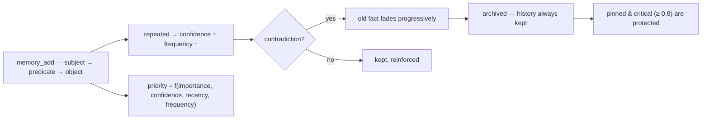

<p align="center">
  🌍 <strong>Languages:</strong>
  <a href="README.md">🇬🇧 English</a> ·
  <a href="README.fr.md">🇫🇷 Français</a> ·
  <a href="README.de.md">🇩🇪 Deutsch</a> ·
  <a href="README.es.md">🇪🇸 Español</a> ·
  <a href="README.it.md">🇮🇹 Italiano</a> ·
  <a href="README.pt.md">🇵🇹 Português</a> ·
  <a href="README.nl.md">🇳🇱 Nederlands</a> ·
  <a href="README.ru.md">🇷🇺 Русский</a> ·
  <a href="README.ja.md">🇯🇵 日本語</a> ·
  <a href="README.zh.md">🇨🇳 中文</a> ·
  <a href="README.ko.md">🇰🇷 한국어</a> ·
  <a href="README.pl.md">🇵🇱 Polski</a> ·
  <a href="README.tr.md">🇹🇷 Türkçe</a> ·
  <a href="README.uk.md">🇺🇦 Українська</a> ·
  <a href="README.hi.md">🇮🇳 हिन्दी</a> ·
  <a href="README.vi.md">🇻🇳 Tiếng Việt</a>
</p>

<p align="center">
  
</p>

<p align="center">
  <a href="https://www.npmjs.com/package/memsem"></a>
  <a href="LICENSE"></a>
  = 22.13">
  <a href="https://github.com/WindSeries69/memsem/actions"></a>
  
  
</p>

> **Memoria semántica para agentes de IA** — recuerda lo que importa, sabe qué olvidar.
> Un solo comando para instalarla. Funciona en *todos* los proyectos, para *toda* IA. 100 % local.

## Por qué — si ya existen grandes sistemas de memoria?

Existen, y resolvieron las partes difíciles: almacenes vectoriales (mem0), grafos
de conocimiento temporales (Zep / Graphiti), marcos para agentes (MemGPT / Letta).
Pero todos comparten los mismos tres defectos:

1. **Almacenamiento bruto, sin estructura.** Guardan lo que les lanzas, y la
   recuperación es una búsqueda de similitud sobre *todo*. La IA no sabe
   **dónde mirar** — así que mira en todas partes, y el ruido ahoga la señal.
2. **Sin precisión.** Una coincidencia difusa es una coincidencia difusa: las
   memorias casi correctas llenan el presupuesto de contexto y desperdician tokens.
3. **Sin autocorrección.** Un hecho contradicho hace meses sigue siendo tan fuerte
   como el día en que se escribió.

memsem corrige exactamente estas tres cosas:

- 🧭 **Sabe dónde buscar.** Cada sesión comienza con una tarjeta de enrutamiento
  (`memory-index.md`): temas + palabras clave, inyectada en el contexto. La IA
  enruta por tema, cruza proyectos y solo paga por lo que necesita.
  Los temas jerárquicos + una lista de enfoque en vivo mantienen las ramas
  activas de la sesión a plena prioridad — el resto se atenúa, nunca se pierde.
- 🎯 **Es precisa.** Búsqueda léxica estricta por defecto (umbral de coincidencia
  de palabras del 50 %, sin propagación por grafo salvo que lo pidas
  explícitamente) — una consulta devuelve los hechos correctos, ordenados por
  prioridad dinámica (`importancia × confianza × actualidad × frecuencia`).
  La precisión se mide, no se asume: **P@3 0.958** en el benchmark de referencia
  (51 hechos, 20 consultas, [`scripts/bench.mjs`](scripts/bench.mjs), resultados
  en [`DESIGN.md`](DESIGN.md) §11).
- 🔄 **Se corrige a sí misma.** Las contradicciones desvanecen el hecho antiguo
  en lugar de sobrescribirlo («bebí leche durante años… espera, intolerante a la
  lactosa») — el historial se conserva siempre, los hechos críticos (≥ 0.8) están
  protegidos. Los agentes de fondo extraen hechos duraderos al final de la sesión,
  consolidan hechos pequeños en patrones y recalibran las prioridades — solo
  cuando la memoria sigue siendo *al menos tan* recuperable.

Todas las promesas de los grandes sistemas, sin sus defectos: un comando, 100 %
local, y tu memoria sigue siendo tuya — nunca se confirma, por usuario, compartida
en todos tus repos.

## Verlo funcionar

Instala una vez, déjalo correr. Esta es una sesión real sobre una base de datos
desechable — tu memoria real nunca se toca (`node scripts/demo.mjs`):

<p align="center">
  
</p>

```
=== memsem — demo on a temporary database ===
(your real memory in ~/.memory-mcp stays untouched)

1. The AI writes durable facts (memory_add_many)
   → 4 facts written

2. Strict search (lexical): memory_search { query: 'milk' }
   → user → drinks → milk

3. Semantic search (relax, local embeddings): memory_search { query: 'cheese', relax: true }
   No shared word with « lactose » — the local semantic index (Ollama) bridges it
   → lactose → is-present-in → cheese, yogurt, cream
   → user → is-intolerant-to → lactose
   → user → drinks → milk

4. Soft supersession: the AI learns you no longer drink milk
   → conflict: true, old fact faded (faded: [1])

5. Search now returns the current fact
   → user → drinks → no more milk (lactose intolerant)
   → user → drinks → milk

Stats: 5 active memories, semantic index OK (mxbai-embed-large)
```

## Privacidad — tu memoria es tuya

- **100 % local** — se almacena en `~/.memory-mcp/memory.db` en *tu* máquina. Sin nube, sin telemetría, nada sale de tu ordenador.
- **Nunca se confirma** — la base de datos vive fuera de todos los repositorios. Clona un repo público, sube código, comparte capturas de pantalla: tu memoria se queda contigo. Cada usuario tiene su propia memoria.
- **La memoria te sigue a *ti***, no a tus proyectos — la misma base se comparte entre todos tus repos. Crea una carpeta nueva, un repo nuevo: la memoria sigue ahí.

## Instalación

### opencode — una línea

Añádelo a `opencode.json` (del proyecto o `~/.config/opencode/opencode.json`):

```json
{ "plugin": ["memsem"] }
```

Y ya está. El plugin registra el servidor MCP, inyecta el protocolo de memoria y el índice de memoria en cada sesión, concede los permisos necesarios y ejecuta los agentes de fondo. Reinicia opencode.

### Claude Code — un comando

```bash
npx -y memsem setup
```

Esto registra el servidor MCP (`claude mcp add memory -- npx -y memsem`) y añade un bloque «memsem memory» a `~/.claude/CLAUDE.md` que apunta al protocolo completo.

**O instálalo con IA**: basta con pegar esto en Claude:

> Instala la memoria persistente de memsem: ejecuta `npx -y memsem setup`, lee `~/.memsem/memory-protocol.md` y aplica el protocolo.

### Cualquier cliente MCP

```bash
npx -y memsem
```

El servidor habla MCP por stdio. Apunta cualquier host compatible con MCP hacia él e inyecta `memory-protocol.md` en las instrucciones del host (p. ej. como `AGENTS.md`) para que la IA sea autónoma.

### Instalador universal

```bash
npx -y memsem setup        # detecta y configura tus hosts (opencode, Claude)
npx -y memsem setup --help # consulta las opciones
```

Idempotente, seguro, reversible (`--uninstall`).

## Cómo funciona

<p align="center">
  
</p>

**El ciclo de vida de la memoria** — todo hecho sigue el mismo camino:



- **Hechos atómicos** — cada memoria es un triplete `subject → predicate → object` con importancia, confianza, frecuencia, etiquetas, tema y procedencia.
- **Temas y enfoque** — los temas jerárquicos (`food/drinks`) son el mapa de enrutamiento; una búsqueda por tema cruza todos los proyectos. La lista `focus` mantiene los temas activos de la sesión a plena prioridad.
- **Prioridad dinámica** — `0.45 × importance + 0.25 × confidence + 0.2 × recency + 0.1 × frequency`. Un hecho crítico vence a un patrón recurrente.
- **Supersesión suave** — las contradicciones desvanecen el hecho antiguo (la confianza decae) hasta que se archiva por debajo de un umbral. El historial se conserva siempre.
- **Índice semántico (opcional)** — cada hecho se incrusta localmente (`mxbai-embed-large` vía Ollama); las búsquedas con `relax: true` añaden similitud coseno (umbral 0.5). Sin Ollama, todo funciona igual — búsqueda léxica estricta.

## Comparativa

| | memsem | `CLAUDE.md` / notes | mem0 | Zep / Graphiti | official memory MCP | Obsidian as memory |
|---|---|---|---|---|---|---|
| Auto-writes during sessions | ✅ | ❌ | ⚠️ via app code | ⚠️ via app code | ❌ | ❌ |
| Priority for context budget | ✅ | ❌ | ❌ | ❌ | ❌ | ❌ |
| Contradictions (soft supersession) | ✅ | ❌ (overwrites) | ❌ (overwrites) | ✅ (temporal versioning) | ❌ | ❌ |
| Semantic search | ✅ local (Ollama) | ❌ | ✅ (vector store) | ✅ (graph + embeddings) | ❌ | ⚠️ (plugins) |
| Episodic memory + self-maintenance | ✅ | ❌ | ⚠️ (episodic add-ons) | ✅ (temporal knowledge graph) | ❌ | ❌ |
| One memory across all your repos | ✅ | ❌ (per project) | ⚠️ (per app config) | ⚠️ (per app config) | ❌ | ⚠️ (vault) |
| Zero dependency, `npx -y` | ✅ | ✅ | ❌ | ❌ | ✅ | ✅ |
| Human-readable / editable | ⚠️ (CLI list/edit) | ✅ | ❌ | ❌ | ✅ (JSON) | ✅ |

*Comparativa de agosto de 2026, a partir de la documentación pública; las capacidades evolucionan — verifica antes de elegir.*

## Línea de comandos

Todo lo que se puede hacer a través de MCP se puede hacer desde una terminal:

```bash
memsem list [--theme x] [--project p] [--limit n] [--all]   # read your memory
memsem edit <id> [--object "..."] [--importance 0.6] [...]  # fix a fact by hand (audited)
memsem forget <id> [--yes]                                  # archive a fact (confirm)
memsem doctor [--limit n] [--hours h]                       # most-modified facts — spot drift
memsem export [--output f] [--project p]                    # full JSON dump
memsem import <file.json>                                   # restore / merge a dump
memsem setup [--host opencode|claude]                       # install for your hosts
```

Las correcciones manuales se escriben en el diario de auditoría — `memsem doctor` también las muestra.

## Configuración

Las constantes ajustables (pesos de prioridad, umbrales, factores de desvanecimiento, modelo…) viven en
[`src/config.ts`](src/config.ts). Puedes sobrescribir cualquiera de ellas en `~/.memsem/config.json`
(o `$MEMSEM_CONFIG`), con fusión profunda y validación:

```json
{ "priority": { "importance": 0.4, "confidence": 0.3 }, "minLexical": 0.4 }
```

Los ajustes están documentados y validados por un benchmark
([`scripts/bench.mjs`](scripts/bench.mjs) — 51 hechos, 20 consultas, P@k/R@k entre
conjuntos de constantes; resultados en [`DESIGN.md`](DESIGN.md) §11).

## Durabilidad

La base de datos tiene versiones y se migra automáticamente al arrancar (`schema_migrations`),
con una copia de seguridad automática antes de cada migración (`~/.memory-mcp/backups/`, se conservan las 5 últimas).
El modo WAL está activado — un fallo a mitad de escritura deja la base de datos intacta. Volcados completos y
restauraciones mediante `memsem export` / `memsem import`.

## Documentación

- [`memory-protocol.md`](memory-protocol.md) — el protocolo inyectado en tu IA: cómo escribe, busca y mantiene la memoria automáticamente.
- [`DESIGN.md`](DESIGN.md) — diseño completo: visión, principios, el caso de estudio de la lactosa, calibración de constantes, hoja de ruta.
- [`scripts/demo.mjs`](scripts/demo.mjs) — reproduce la demo anterior sobre una base de datos desechable.

## Limitaciones conocidas

Leído con honestidad, a partir de una revisión independiente ([Agent Memory Atlas](https://neoneye.github.io/agent-memory-atlas/systems/memsem/)):

- **El camino de corrección automática no tiene candado.** Un valor rechazado
  que se *reafirma* (digamos que la misma transcripción antigua se lee diez
  veces) vuelve y desvanece su propia corrección — una corrección ordinaria se
  archiva a la tercera reafirmación. Solo un **humano que rechaza un candidato**
  escribe una supresión duradera (`memory_suppressions`) que rechaza el valor
  rotundamente. Es una posición deliberada (la repetición es evidencia) con un
  costo real.
- **Un pin protege la supervivencia, no la visibilidad.** Una corrección fijada
  nunca pierde confianza y sigue primero en `memsem list`, pero un valor
  rechazado repetido puede seguir tomando el primer resultado de `memory_search`.
- **`import` escribe más allá de la puerta** — restaurar una copia de seguridad
  reinstaura un valor suprimido.
- **Una escritura rechazada no deja ninguna fila de auditoría**, y purgar un
  hecho revisado deja su texto en `memory_candidates`.
- **Las reglas de seguridad de consolidación y extracción son prompts, no código.**

Aristas ásperas, no errores — cada una está recogida en la hoja de ruta de
[DESIGN.md](DESIGN.md) y en las preguntas abiertas.

## Hoja de ruta

- [x] Índice semántico (incrustaciones locales de Ollama)
- [x] Memoria episódica + extracción de sesiones
- [x] Consolidación hipocampal + juez de puntuación por pares
- [x] Plugin universal de opencode + `memsem setup`
- [x] Migraciones versionadas + copia de seguridad automática + export/import
- [x] Constantes configurables, validadas por un benchmark
- [x] Juez seguro: prueba en seco, diario de auditoría, salvaguardas, `memsem doctor`
- [x] CLI: `list` / `edit` / `forget` — corregir un hecho a mano
- [x] Contrato de evidencia, validez temporal, revisión de candidatos, auditoría y purga confirmada
- [x] Propagación por grafo multi-saltos (modo relax)
- [ ] Write gate en el camino automático (decisión de supersession → suppression)
- [ ] `import` tras la puerta (consultar las suppressions)
- [ ] Auditar las escrituras rechazadas; purgar el texto de los candidatos; reglas de consolidación en código
- [ ] Puente con Obsidian: export/import de la memoria como notas markdown legibles

## Licencia

MIT — libre para cualquier uso. Tu memoria sigue siendo tuya.
