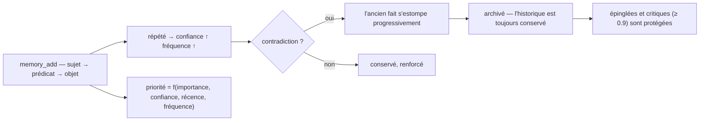

<p align="center">
  🌍 <strong>Langues :</strong>
  <a href="README.md">🇬🇧 English</a> ·
  <a href="README.fr.md">🇫🇷 Français</a> ·
  <a href="README.de.md">🇩🇪 Deutsch</a> ·
  <a href="README.es.md">🇪🇸 Español</a> ·
  <a href="README.it.md">🇮🇹 Italiano</a> ·
  <a href="README.pt.md">🇵🇹 Português</a> ·
  <a href="README.nl.md">🇳🇱 Nederlands</a> ·
  <a href="README.ru.md">🇷🇺 Русский</a> ·
  <a href="README.ja.md">🇯🇵 日本語</a> ·
  <a href="README.zh.md">🇨🇳 中文</a> ·
  <a href="README.ko.md">🇰🇷 한국어</a> ·
  <a href="README.pl.md">🇵🇱 Polski</a> ·
  <a href="README.tr.md">🇹🇷 Türkçe</a> ·
  <a href="README.uk.md">🇺🇦 Українська</a> ·
  <a href="README.hi.md">🇮🇳 हिन्दी</a> ·
  <a href="README.vi.md">🇻🇳 Tiếng Việt</a>
</p>

<p align="center">
  
</p>

<p align="center">
  <a href="https://www.npmjs.com/package/memsem"></a>
  <a href="LICENSE"></a>
  = 22.13">
  
  
</p>

> **Mémoire sémantique pour agents IA** — se souvient de ce qui compte, sait oublier le reste.
> Une commande à installer. Fonctionne dans *tous* les projets, pour *toutes* les IA. 100% local.

---

## Pourquoi ?

Ton IA oublie tout entre deux sessions. `CLAUDE.md` est un fichier statique — il ne peut pas apprendre.
Les bases vectorielles sont lourdes et souvent hébergées dans le cloud. La plupart des outils de
« mémoire » sont du stockage passif : ils gardent ce qu'on leur jette, sans priorité, sans
réconcilier les contradictions.

**memsem est différent.** C'est un système de mémoire, pas un tiroir :

- 🧠 **Elle s'écrit toute seule** — pendant une session, ton IA enregistre automatiquement les faits durables (préférences, décisions, contraintes). Fini le « pense à sauvegarder ça ».
- ⚖️ **Elle priorise** — chaque fait a une priorité dynamique (`importance × confiance × récence × fréquence`). Quand le contexte est serré, les souvenirs les plus pertinents remontent toujours en premier.
- 🔄 **Elle gère les contradictions** — « je bois du lait depuis des années… attends, je suis intolérant au lactose. » L'ancien fait n'est pas écrasé : il *s'estompe* progressivement puis s'archive, historique complet conservé. Les faits critiques (importance ≥ 0.9) sont protégés.
- 🔗 **Elle relie les concepts** — un index sémantique local optionnel (Ollama, sur ta machine) permet à `fromage` de retrouver `lactose` sans un seul mot commun.
- 🕰️ **Elle a une mémoire épisodique** — des résumés de session par-dessus les faits sémantiques, comme les deux systèmes de mémoire long-terme du cerveau.
- 🔧 **Elle s'entretient elle-même** — des agents de fond consolident les petits faits en patterns (l'« hippocampe ») et recalibrent les priorités par comparaison par paires, uniquement quand ça rend la mémoire *mieux cherchable*.

## Voyez-la fonctionner

Installez une fois, laissez tourner. Voici une session réelle sur une base jetable — votre vraie mémoire n'est jamais touchée (`node scripts/demo.mjs`) :

```
=== memsem — démo sur base temporaire ===
(ta vraie mémoire dans ~/.memory-mcp reste intacte)

1. L'IA écrit les faits durables (memory_add_many)
   → 4 faits écrits

2. Recherche stricte (lexicale) : memory_search { query: 'lait' }
   → utilisateur → boit → lait

3. Recherche sémantique (relax, embeddings locaux) : memory_search { query: 'fromage', relax: true }
   Aucun mot commun avec « lactose » — c'est l'index sémantique (Ollama, local) qui relie
   → lactose → est-present-dans → fromage, yaourt, creme
   → utilisateur → devient-intolerant-a → lactose
   → utilisateur → boit → lait

4. Supersession douce : l'IA apprend que l'utilisateur ne boit plus de lait
   → conflict: true, ancien fait estompé (faded: [1])

5. La recherche retrouve le fait actuel
   → utilisateur → boit → plus de lait (intolerant au lactose)
   → utilisateur → boit → lait

Stats: 5 mémoires actives, index sémantique OK (mxbai-embed-large)
```

*(Sortie de `node scripts/demo.mjs --fr`.)*

## Vie privée — ta mémoire t'appartient

- **100% local** — stockée dans `~/.memory-mcp/memory.db` sur *ta* machine. Pas de cloud, pas de télémétrie, rien ne quitte ton ordinateur.
- **Jamais commitée** — la base vit hors de tous les dépôts. Clone un repo public, pousse du code, partage des captures : ta mémoire reste chez toi. Chacun a sa mémoire.
- **La mémoire te suit, pas tes projets** — la même base est partagée entre tous tes repos. Nouveau dossier, nouveau repo : la mémoire est toujours là.

## Installation

### opencode — une ligne

Ajoutez dans `opencode.json` (projet ou `~/.config/opencode/opencode.json`) :

```json
{ "plugin": ["memsem"] }
```

C'est tout. Le plugin enregistre le serveur MCP, injecte le protocole mémoire et l'index dans chaque session, accorde les permissions nécessaires et pilote les agents de fond. Redémarrez opencode.

### Claude Code — une commande

```bash
npx -y memsem setup
```

Cela enregistre le serveur MCP (`claude mcp add memory -- npx -y memsem`) et ajoute un bloc « Mémoire persistante — memsem » dans `~/.claude/CLAUDE.md` pointant vers le protocole complet.

**Ou installez-la avec l'IA** : collez simplement ceci à Claude :

> Installe la mémoire persistante memsem : lance `npx -y memsem setup`, lis `~/.memsem/memory-protocol.md` et applique le protocole.

### N'importe quel client MCP

```bash
npx -y memsem
```

Le serveur parle MCP sur stdio. Branchez n'importe quel hôte compatible et injectez `memory-protocol.md` dans les instructions de l'hôte (par ex. en `AGENTS.md`) pour rendre l'IA autonome.

### Installateur universel

```bash
npx -y memsem setup        # détecte et configure tes hôtes (opencode, Claude)
npx -y memsem setup --help # options
```

Idempotent, sûr, réversible (`--uninstall`).

## Comment ça marche

<p align="center">
  
</p>

**Le cycle de vie d'une mémoire** — chaque fait suit le même chemin :



- **Faits atomiques** — chaque mémoire est un triplet `sujet → prédicat → objet` avec importance, confiance, fréquence, tags, thème, provenance.
- **Thèmes & focus** — les thèmes hiérarchiques (`alimentation/boissons`) sont la carte de routage ; une recherche par thème traverse tous les projets. La liste `focus` garde les thèmes actifs de la session en pleine priorité.
- **Priorité dynamique** — `0.45 × importance + 0.25 × confiance + 0.2 × récence + 0.1 × fréquence`. Un fait critique bat un pattern récurrent.
- **Supersession douce** — les contradictions estompent l'ancien fait (confiance en baisse) jusqu'à l'archivage sous un seuil. L'historique est toujours conservé.
- **Index sémantique (optionnel)** — chaque fait est embarqué localement (`mxbai-embed-large` via Ollama) ; les recherches `relax: true` ajoutent la similarité cosinus (seuil 0.5). Sans Ollama, tout fonctionne à l'identique — recherche lexicale stricte.

## Comparatif

| | memsem | `CLAUDE.md` / notes | mem0 | Zep / Graphiti | memory MCP officiel | Obsidian comme mémoire |
|---|---|---|---|---|---|---|
| Écriture auto pendant les sessions | ✅ | ❌ | ⚠️ via le code | ⚠️ | ❌ | ❌ |
| Priorité pour le budget de contexte | ✅ | ❌ | ❌ | ❌ | ❌ | ❌ |
| Contradictions (supersession douce) | ✅ | ❌ (écrase) | ❌ (écrase) | ❌ | ❌ | ❌ |
| Recherche sémantique locale et privée | ✅ (Ollama) | ❌ | ⚠️ (base vectorielle) | ⚠️ (base graphe) | ❌ | ⚠️ (plugins) |
| Mémoire épisodique + auto-entretien | ✅ | ❌ | ❌ | ⚠️ | ❌ | ❌ |
| Une mémoire pour tous tes repos | ✅ | ❌ (par projet) | ⚠️ | ⚠️ | ❌ | ⚠️ (vault) |
| Zéro dépendance, `npx -y` | ✅ | ✅ | ❌ | ❌ | ✅ | ✅ |
| Lisible / éditable à la main | ❌ | ✅ | ❌ | ❌ | ✅ (JSON) | ✅ |

## Documentation

- [`memory-protocol.md`](memory-protocol.md) — le protocole injecté à ton IA : comment elle écrit, cherche et entretient la mémoire automatiquement.
- [`DESIGN.md`](DESIGN.md) — la conception complète : vision, principes, le cas d'école du lactose, feuille de route.
- [`scripts/demo.mjs`](scripts/demo.mjs) — reproduire la démo ci-dessus sur une base jetable.

## Feuille de route

- [x] Index sémantique (embeddings Ollama locaux)
- [x] Mémoire épisodique + extraction de session
- [x] Consolidation hippocampe + juge de scoring par paires
- [x] Plugin opencode universel + `memsem setup`
- [ ] Pont Obsidian : export/import de la mémoire en notes markdown lisibles
- [ ] Propagation multi-sauts dans le graphe

## Licence

MIT — libre pour tout usage. Ta mémoire reste tienne.
