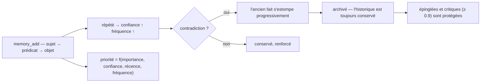

<p align="center">
  🌍 <strong>Langues :</strong>
  <a href="README.md">🇬🇧 English</a> ·
  <a href="README.fr.md">🇫🇷 Français</a> ·
  <a href="README.de.md">🇩🇪 Deutsch</a> ·
  <a href="README.es.md">🇪🇸 Español</a> ·
  <a href="README.it.md">🇮🇹 Italiano</a> ·
  <a href="README.pt.md">🇵🇹 Português</a> ·
  <a href="README.nl.md">🇳🇱 Nederlands</a> ·
  <a href="README.ru.md">🇷🇺 Русский</a> ·
  <a href="README.ja.md">🇯🇵 日本語</a> ·
  <a href="README.zh.md">🇨🇳 中文</a> ·
  <a href="README.ko.md">🇰🇷 한국어</a> ·
  <a href="README.pl.md">🇵🇱 Polski</a> ·
  <a href="README.tr.md">🇹🇷 Türkçe</a> ·
  <a href="README.uk.md">🇺🇦 Українська</a> ·
  <a href="README.hi.md">🇮🇳 हिन्दी</a> ·
  <a href="README.vi.md">🇻🇳 Tiếng Việt</a>
</p>

<p align="center">
  
</p>

<p align="center">
  <a href="https://www.npmjs.com/package/memsem"></a>
  <a href="LICENSE"></a>
  = 22.13">
  
  
</p>

> **Mémoire sémantique pour agents IA** — se souvient de ce qui compte, sait oublier le reste.
> Une commande à installer. Fonctionne dans *tous* les projets, pour *toutes* les IA. 100% local.

---

## Pourquoi — alors que les gros systèmes de mémoire existent déjà ?

Ils existent, et ils ont fait le dur : bases vectorielles (mem0), graphes de
connaissance temporels (Zep / Graphiti), frameworks d'agents (MemGPT / Letta).
Mais ils partagent tous les mêmes trois défauts :

1. **Stockage brut, sans structure.** Ils gardent ce qu'on leur jette, et la
   recherche est une similarité sur *tout*. L'IA ne sait pas **où chercher** —
   alors elle cherche partout, et le bruit noie le signal.
2. **Pas de précision.** Un match approximatif reste approximatif : des
   souvenirs presque justes remplissent le budget de contexte et gaspillent
   les tokens.
3. **Pas d'auto-correction.** Un fait contredit il y a des mois reste aussi
   fort que le jour où il a été écrit.

memsem corrige exactement ces trois choses :

- 🧭 **Elle sait où chercher.** Chaque session commence par une carte de
  routage (`memory-index.md`) : thèmes + mots-clés, injectée dans le contexte.
  L'IA route par thème, traverse les projets, et ne paie que ce dont elle a
  besoin. Les thèmes hiérarchiques + une liste `focus` vivante gardent les
  branches actives de la session en pleine priorité — le reste est atténué,
  jamais perdu.
- 🎯 **Elle est précise.** Recherche stricte par défaut (seuil lexical de 50 %
  des mots, pas de propagation de graphe sauf demande explicite) — une requête
  renvoie les bons faits, classés par priorité dynamique
  (`importance × confiance × récence × fréquence`). La précision est mesurée,
  pas supposée : **P@3 0.958** sur le banc de référence (51 faits, 20 requêtes,
  [`scripts/bench.mjs`](scripts/bench.mjs), résultats dans
  [`DESIGN.md`](DESIGN.md) §11).
- 🔄 **Elle se corrige.** Les contradictions estompent l'ancien fait au lieu de
  l'écraser (« je bois du lait depuis des années… attends, lactose ») —
  l'historique est toujours conservé, les faits critiques (≥ 0.9) sont
  protégés. Des agents de fond extraient les faits durables en fin de session,
  consolident les petits faits en patterns, et recalibrent les priorités —
  uniquement quand la mémoire reste *au moins aussi cherchable*.

Toutes les promesses des gros systèmes, sans leurs défauts : une commande,
100% local, et ta mémoire reste tienne — jamais commitée, par utilisateur,
partagée entre tous tes repos.

## Voyez-la fonctionner

Installez une fois, laissez tourner. Voici une session réelle sur une base jetable — votre vraie mémoire n'est jamais touchée (`node scripts/demo.mjs`) :

```
=== memsem — démo sur base temporaire ===
(ta vraie mémoire dans ~/.memory-mcp reste intacte)

1. L'IA écrit les faits durables (memory_add_many)
   → 4 faits écrits

2. Recherche stricte (lexicale) : memory_search { query: 'lait' }
   → utilisateur → boit → lait

3. Recherche sémantique (relax, embeddings locaux) : memory_search { query: 'fromage', relax: true }
   Aucun mot commun avec « lactose » — c'est l'index sémantique (Ollama, local) qui relie
   → lactose → est-present-dans → fromage, yaourt, creme
   → utilisateur → devient-intolerant-a → lactose
   → utilisateur → boit → lait

4. Supersession douce : l'IA apprend que l'utilisateur ne boit plus de lait
   → conflict: true, ancien fait estompé (faded: [1])

5. La recherche retrouve le fait actuel
   → utilisateur → boit → plus de lait (intolerant au lactose)
   → utilisateur → boit → lait

Stats: 5 mémoires actives, index sémantique OK (mxbai-embed-large)
```

*(Sortie de `node scripts/demo.mjs --fr`.)*

## Vie privée — ta mémoire t'appartient

- **100% local** — stockée dans `~/.memory-mcp/memory.db` sur *ta* machine. Pas de cloud, pas de télémétrie, rien ne quitte ton ordinateur.
- **Jamais commitée** — la base vit hors de tous les dépôts. Clone un repo public, pousse du code, partage des captures : ta mémoire reste chez toi. Chacun a sa mémoire.
- **La mémoire te suit, pas tes projets** — la même base est partagée entre tous tes repos. Nouveau dossier, nouveau repo : la mémoire est toujours là.

## Installation

### opencode — une ligne

Ajoutez dans `opencode.json` (projet ou `~/.config/opencode/opencode.json`) :

```json
{ "plugin": ["memsem"] }
```

C'est tout. Le plugin enregistre le serveur MCP, injecte le protocole mémoire et l'index dans chaque session, accorde les permissions nécessaires et pilote les agents de fond. Redémarrez opencode.

### Claude Code — une commande

```bash
npx -y memsem setup
```

Cela enregistre le serveur MCP (`claude mcp add memory -- npx -y memsem`) et ajoute un bloc « Mémoire persistante — memsem » dans `~/.claude/CLAUDE.md` pointant vers le protocole complet.

**Ou installez-la avec l'IA** : collez simplement ceci à Claude :

> Installe la mémoire persistante memsem : lance `npx -y memsem setup`, lis `~/.memsem/memory-protocol.md` et applique le protocole.

### N'importe quel client MCP

```bash
npx -y memsem
```

Le serveur parle MCP sur stdio. Branchez n'importe quel hôte compatible et injectez `memory-protocol.md` dans les instructions de l'hôte (par ex. en `AGENTS.md`) pour rendre l'IA autonome.

### Installateur universel

```bash
npx -y memsem setup        # détecte et configure tes hôtes (opencode, Claude)
npx -y memsem setup --help # options
```

Idempotent, sûr, réversible (`--uninstall`).

## Comment ça marche

<p align="center">
  
</p>

**Le cycle de vie d'une mémoire** — chaque fait suit le même chemin :



- **Faits atomiques** — chaque mémoire est un triplet `sujet → prédicat → objet` avec importance, confiance, fréquence, tags, thème, provenance.
- **Thèmes & focus** — les thèmes hiérarchiques (`alimentation/boissons`) sont la carte de routage ; une recherche par thème traverse tous les projets. La liste `focus` garde les thèmes actifs de la session en pleine priorité.
- **Priorité dynamique** — `0.45 × importance + 0.25 × confiance + 0.2 × récence + 0.1 × fréquence`. Un fait critique bat un pattern récurrent.
- **Supersession douce** — les contradictions estompent l'ancien fait (confiance en baisse) jusqu'à l'archivage sous un seuil. L'historique est toujours conservé.
- **Index sémantique (optionnel)** — chaque fait est embarqué localement (`mxbai-embed-large` via Ollama) ; les recherches `relax: true` ajoutent la similarité cosinus (seuil 0.5). Sans Ollama, tout fonctionne à l'identique — recherche lexicale stricte.

## Comparatif

| | memsem | `CLAUDE.md` / notes | mem0 | Zep / Graphiti | memory MCP officiel | Obsidian comme mémoire |
|---|---|---|---|---|---|---|
| Écriture auto pendant les sessions | ✅ | ❌ | ⚠️ via le code | ⚠️ via le code | ❌ | ❌ |
| Priorité pour le budget de contexte | ✅ | ❌ | ❌ | ❌ | ❌ | ❌ |
| Contradictions (supersession douce) | ✅ | ❌ (écrase) | ❌ (écrase) | ✅ (versionnage temporel) | ❌ | ❌ |
| Recherche sémantique | ✅ local (Ollama) | ❌ | ✅ (base vectorielle) | ✅ (graphe + embeddings) | ❌ | ⚠️ (plugins) |
| Mémoire épisodique + auto-entretien | ✅ | ❌ | ⚠️ (modules épisodiques) | ✅ (graphe de connaissance temporel) | ❌ | ❌ |
| Une mémoire pour tous tes repos | ✅ | ❌ (par projet) | ⚠️ (par config app) | ⚠️ (par config app) | ❌ | ⚠️ (vault) |
| Zéro dépendance, `npx -y` | ✅ | ✅ | ❌ | ❌ | ✅ | ✅ |
| Lisible / éditable à la main | ⚠️ (CLI list/edit) | ✅ | ❌ | ❌ | ✅ (JSON) | ✅ |

*Comparaison au 2026-08, sur la base des docs publiques ; les fonctionnalités évoluent — vérifiez avant de choisir.*

## Ligne de commande

Tout ce qui se fait via MCP se fait depuis un terminal :

```bash
memsem list [--theme x] [--project p] [--limit n] [--all]   # lire sa mémoire
memsem edit <id> [--object "..."] [--importance 0.6] [...]  # corriger un fait à la main (audité)
memsem forget <id> [--yes]                                  # archiver un fait (confirmation)
memsem doctor [--limit n] [--hours h]                       # faits les plus modifiés — repérer une dérive
memsem export [--output f] [--project p]                    # dump JSON complet
memsem import <fichier.json>                                # restaurer / fusionner un dump
memsem setup [--host opencode|claude]                       # installer pour ses hôtes
```

Les corrections manuelles sont consignées dans le journal d'audit — `memsem doctor`
les montre aussi.

## Configuration

Les constantes réglables (poids de priorité, seuils, facteurs d'estompage, modèle…)
vivent dans [`src/config.ts`](src/config.ts). Surchargez-les dans
`~/.memsem/config.json` (ou `$MEMSEM_CONFIG`), fusion partielle et validée :

```json
{ "priority": { "importance": 0.4, "confidence": 0.3 }, "minLexical": 0.4 }
```

Les réglages sont documentés et validés par un banc d'essai
([`scripts/bench.mjs`](scripts/bench.mjs) — 51 faits, 20 requêtes, P@k/R@k sur
plusieurs jeux de constantes ; résultats dans [`DESIGN.md`](DESIGN.md) §11).

## Durabilité

La base est versionnée et migrée automatiquement au démarrage
(`schema_migrations`), avec backup automatique avant toute migration
(`~/.memory-mcp/backups/`, les 5 derniers conservés). Le mode WAL est actif —
un crash en pleine écriture laisse la base intacte. Sauvegarde et restauration
complètes via `memsem export` / `memsem import`.

## Documentation

- [`memory-protocol.md`](memory-protocol.md) — le protocole injecté à ton IA : comment elle écrit, cherche et entretient la mémoire automatiquement.
- [`DESIGN.md`](DESIGN.md) — la conception complète : vision, principes, le cas d'école du lactose, calibration des constantes, feuille de route.
- [`scripts/demo.mjs`](scripts/demo.mjs) — reproduire la démo ci-dessus sur une base jetable.

## Feuille de route

- [x] Index sémantique (embeddings Ollama locaux)
- [x] Mémoire épisodique + extraction de session
- [x] Consolidation hippocampe + juge de scoring par paires
- [x] Plugin opencode universel + `memsem setup`
- [x] Migrations versionnées + backup automatique + export/import
- [x] Constantes configurables, validées par un banc d'essai
- [x] Juge sécurisé : dry-run, journal d'audit, garde-fous, `memsem doctor`
- [x] CLI : `list` / `edit` / `forget` — corriger un fait à la main
- [ ] Pont Obsidian : export/import de la mémoire en notes markdown lisibles
- [ ] Propagation multi-sauts dans le graphe

## Licence

MIT — libre pour tout usage. Ta mémoire reste tienne.
