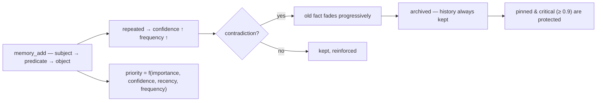

<p align="center">
  🌍 <strong>Languages:</strong>
  <a href="README.md">🇬🇧 English</a> ·
  <a href="README.fr.md">🇫🇷 Français</a> ·
  <a href="README.de.md">🇩🇪 Deutsch</a> ·
  <a href="README.es.md">🇪🇸 Español</a> ·
  <a href="README.it.md">🇮🇹 Italiano</a> ·
  <a href="README.pt.md">🇵🇹 Português</a> ·
  <a href="README.nl.md">🇳🇱 Nederlands</a> ·
  <a href="README.ru.md">🇷🇺 Русский</a> ·
  <a href="README.ja.md">🇯🇵 日本語</a> ·
  <a href="README.zh.md">🇨🇳 中文</a> ·
  <a href="README.ko.md">🇰🇷 한국어</a> ·
  <a href="README.pl.md">🇵🇱 Polski</a> ·
  <a href="README.tr.md">🇹🇷 Türkçe</a> ·
  <a href="README.uk.md">🇺🇦 Українська</a> ·
  <a href="README.hi.md">🇮🇳 हिन्दी</a> ·
  <a href="README.vi.md">🇻🇳 Tiếng Việt</a>
</p>

<p align="center">
  
</p>

<p align="center">
  <a href="https://www.npmjs.com/package/memsem"></a>
  <a href="LICENSE"></a>
  = 22.13">
  
  
</p>

> **AI एजेंटों के लिए सिमेंटिक मेमोरी** — जो मायने रखता है उसे याद रखती है, जो भूलना चाहिए उसे भूलना जानती है।
> एक कमांड में इंस्टॉल। *हर* प्रोजेक्ट में, *हर* AI के लिए काम करती है। 100% स्थानीय।

## क्यों?

आपका AI हर सत्र के बीच सब कुछ भूल जाता है। `CLAUDE.md` एक स्थिर फ़ाइल है — यह सीख नहीं सकती। वेक्टर डेटाबेस भारी होते हैं और अक्सर क्लाउड पर होस्ट किए जाते हैं। अधिकांश "मेमोरी" उपकरण निष्क्रिय भंडारण हैं: वे वही रखते हैं जो आप उनमें डालते हैं, कभी प्राथमिकता नहीं देते, कभी विरोधाभासों का समाधान नहीं करते।

**memsem अलग है।** यह एक मेमोरी *प्रणाली* है, कोई दराज़ नहीं:

- 🧠 **यह स्वयं लिखती है** — सत्र के दौरान, आपका AI स्थायी तथ्य (प्राथमिकताएँ, निर्णय, बाधाएँ) स्वचालित रूप से दर्ज करता है। अब और नहीं "इसे सहेजना याद रखें"।
- ⚖️ **यह प्राथमिकता देती है** — हर तथ्य की एक गतिशील प्राथमिकता होती है (`importance × confidence × recency × frequency`). जब संदर्भ सीमित होता है, तो सबसे प्रासंगिक यादें हमेशा पहले सामने आती हैं।
- 🔄 **यह विरोधाभासों को संभालती है** — "मैं वर्षों से दूध पी रहा हूँ… रुको, मुझे लैक्टोज़ असहिष्णुता है।" पुराना तथ्य मिटाया नहीं जाता: वह धीरे-धीरे *फीका* पड़ता है और संग्रहीत होता है, पूरा इतिहास सुरक्षित रहता है। महत्वपूर्ण तथ्य (importance ≥ 0.9) सुरक्षित रहते हैं।
- 🔗 **यह अवधारणाओं को जोड़ती है** — एक वैकल्पिक स्थानीय सिमेंटिक इंडेक्स (Ollama, आपकी मशीन पर) `fromage` को `lactose` खोजने देता है, बिना एक भी साझा शब्द के।
- 🕰️ **इसमें एपिसोडिक मेमोरी है** — सिमेंटिक तथ्यों के ऊपर सत्र सारांश, मस्तिष्क की दो दीर्घकालिक प्रणालियों की तरह।
- 🔧 **यह स्वयं का रखरखाव करती है** — पृष्ठभूमि एजेंट छोटे तथ्यों को पैटर्न में समेकित करते हैं ("हिप्पोकैम्पस") और जोड़ीवार तुलना द्वारा प्राथमिकताओं को पुनः समायोजित करते हैं, केवल तब जब यह मेमोरी को *खोजने में बेहतर* बनाता है।

## इसे काम करते देखें

एक बार इंस्टॉल करें, इसे चलने दें। यह एक अस्थायी डेटाबेस पर एक वास्तविक सत्र है — आपकी वास्तविक मेमोरी को कभी छुआ नहीं जाता (`node scripts/demo.mjs`):

```
=== memsem — demo on a temporary database ===
(your real memory in ~/.memory-mcp stays untouched)

1. The AI writes durable facts (memory_add_many)
   → 4 facts written

2. Strict search (lexical): memory_search { query: 'milk' }
   → user → drinks → milk

3. Semantic search (relax, local embeddings): memory_search { query: 'cheese', relax: true }
   No shared word with « lactose » — the local semantic index (Ollama) bridges it
   → lactose → is-present-in → cheese, yogurt, cream
   → user → is-intolerant-to → lactose
   → user → drinks → milk

4. Soft supersession: the AI learns you no longer drink milk
   → conflict: true, old fact faded (faded: [1])

5. Search now returns the current fact
   → user → drinks → no more milk (lactose intolerant)
   → user → drinks → milk

Stats: 5 active memories, semantic index OK (mxbai-embed-large)
```

## गोपनीयता — आपकी मेमोरी आपकी है

- **100% स्थानीय** — `~/.memory-mcp/memory.db` में *आपकी* मशीन पर संग्रहीत। कोई क्लाउड नहीं, कोई टेलीमेट्री नहीं, कुछ भी आपके कंप्यूटर से बाहर नहीं जाता।
- **कभी कमिट नहीं होती** — डेटाबेस हर रिपॉजिटरी के बाहर रहता है। पब्लिक रिपो क्लोन करें, कोड पुश करें, स्क्रीनशॉट साझा करें: आपकी मेमोरी आपके पास ही रहती है। हर उपयोगकर्ता की अपनी मेमोरी होती है।
- **मेमोरी *आपका* अनुसरण करती है**, आपके प्रोजेक्ट्स का नहीं — वही बेस आपके सभी रिपो में साझा होता है। नया फ़ोल्डर बनाएँ, नया रिपो बनाएँ: मेमोरी फिर भी वहीं होती है।

## इंस्टॉलेशन

### opencode — एक पंक्ति

`opencode.json` में जोड़ें (प्रोजेक्ट या `~/.config/opencode/opencode.json`):

```json
{ "plugin": ["memsem"] }
```

बस इतना ही। प्लगइन MCP सर्वर को पंजीकृत करता है, हर सत्र में मेमोरी प्रोटोकॉल और मेमोरी इंडेक्स इंजेक्ट करता है, आवश्यक अनुमतियाँ प्रदान करता है, और पृष्ठभूमि एजेंटों को चलाता है। opencode को पुनः आरंभ करें।

### Claude Code — एक कमांड

```bash
npx -y memsem setup
```

यह MCP सर्वर (`claude mcp add memory -- npx -y memsem`) को पंजीकृत करता है और `~/.claude/CLAUDE.md` में एक "memsem मेमोरी" ब्लॉक जोड़ता है जो पूर्ण प्रोटोकॉल की ओर इशारा करता है।

**या इसे AI के साथ इंस्टॉल करें**: बस Claude में पेस्ट करें:

> memsem स्थायी मेमोरी इंस्टॉल करें: `npx -y memsem setup` चलाएँ, `~/.memsem/memory-protocol.md` पढ़ें, और प्रोटोकॉल लागू करें।

### कोई भी MCP क्लाइंट

```bash
npx -y memsem
```

सर्वर stdio पर MCP बोलता है। किसी भी MCP-सक्षम होस्ट को इसकी ओर इंगित करें और AI को स्वायत्त बनाने के लिए `memory-protocol.md` को होस्ट के निर्देशों में इंजेक्ट करें (जैसे `AGENTS.md` के रूप में)।

### यूनिवर्सल इंस्टॉलर

```bash
npx -y memsem setup        # detects and configures your hosts (opencode, Claude)
npx -y memsem setup --help # see options
```

आइडेम्पोटेंट, सुरक्षित, प्रतिवर्ती (`--uninstall`)।

## यह कैसे काम करता है

<p align="center">
  
</p>

**मेमोरी लाइफ़साइकल** — हर तथ्य एक ही रास्ते पर चलता है:



- **परमाणु तथ्य** — हर मेमोरी एक `subject → predicate → object` ट्रिपल है जिसमें importance, confidence, frequency, tags, theme और provenance होते हैं।
- **थीम और फ़ोकस** — पदानुक्रमित थीम (`food/drinks`) रूटिंग मैप हैं; थीम द्वारा खोज सभी प्रोजेक्ट्स को पार करती है। `focus` सूची सत्र के सक्रिय थीम को पूर्ण प्राथमिकता पर रखती है।
- **गतिशील प्राथमिकता** — `0.45 × importance + 0.25 × confidence + 0.2 × recency + 0.1 × frequency`. एक महत्वपूर्ण तथ्य, एक आवर्ती पैटर्न को हरा देता है।
- **सॉफ्ट सुपरसेशन** — विरोधाभास पुराने तथ्य को फीका करते हैं (confidence घटता है) जब तक कि वह एक सीमा से नीचे संग्रहीत न हो जाए। इतिहास हमेशा रखा जाता है।
- **सिमेंटिक इंडेक्स (वैकल्पिक)** — हर तथ्य को स्थानीय रूप से एम्बेड किया जाता है (`mxbai-embed-large` Ollama के माध्यम से); `relax: true` खोजें cosine similarity (सीमा 0.5) जोड़ती हैं। Ollama के बिना, सब कुछ समान रूप से काम करता है — सख्त शाब्दिक खोज।

## तुलना

| | memsem | `CLAUDE.md` / notes | mem0 | Zep / Graphiti | official memory MCP | Obsidian as memory |
|---|---|---|---|---|---|---|
| सत्रों के दौरान स्वचालित लेखन | ✅ | ❌ | ⚠️ ऐप कोड के माध्यम से | ⚠️ | ❌ | ❌ |
| संदर्भ बजट के लिए प्राथमिकता | ✅ | ❌ | ❌ | ❌ | ❌ | ❌ |
| विरोधाभास (सॉफ्ट सुपरसेशन) | ✅ | ❌ (अधिलेखित करता है) | ❌ (अधिलेखित करता है) | ❌ | ❌ | ❌ |
| सिमेंटिक खोज, स्थानीय और निजी | ✅ (Ollama) | ❌ | ⚠️ (वेक्टर DB चाहिए) | ⚠️ (ग्राफ़ DB चाहिए) | ❌ | ⚠️ (प्लगइन्स) |
| एपिसोडिक मेमोरी + स्व-रखरखाव | ✅ | ❌ | ❌ | ⚠️ | ❌ | ❌ |
| आपके सभी रिपो में एक ही मेमोरी | ✅ | ❌ (प्रति प्रोजेक्ट) | ⚠️ | ⚠️ | ❌ | ⚠️ (vault) |
| शून्य निर्भरता, `npx -y` | ✅ | ✅ | ❌ | ❌ | ✅ | ✅ |
| मानव-पठनीय / संपादन योग्य | ❌ | ✅ | ❌ | ❌ | ✅ (JSON) | ✅ |

## दस्तावेज़ीकरण

- [`memory-protocol.md`](memory-protocol.md) — आपके AI में इंजेक्ट किया गया प्रोटोकॉल: यह मेमोरी को स्वचालित रूप से कैसे लिखता, खोजता और बनाए रखता है।
- [`DESIGN.md`](DESIGN.md) — पूर्ण डिज़ाइन: दृष्टि, सिद्धांत, लैक्टोज़ केस स्टडी, रोडमैप।
- [`scripts/demo.mjs`](scripts/demo.mjs) — ऊपर दिए गए डेमो को एक अस्थायी डेटाबेस पर दोबारा चलाएँ।

## रोडमैप

- [x] सिमेंटिक इंडेक्स (स्थानीय Ollama एम्बेडिंग)
- [x] एपिसोडिक मेमोरी + सत्र निष्कर्षण
- [x] हिप्पोकैम्पस समेकन + जोड़ीवार स्कोरिंग जज
- [x] यूनिवर्सल opencode प्लगइन + `memsem setup`
- [ ] Obsidian ब्रिज: मेमोरी को पठनीय मार्कडाउन नोट्स के रूप में निर्यात/आयात करें
- [ ] मल्टी-हॉप ग्राफ़ प्रसार

## लाइसेंस

MIT — किसी भी चीज़ के लिए स्वतंत्र। आपकी मेमोरी आपकी ही रहती है।
