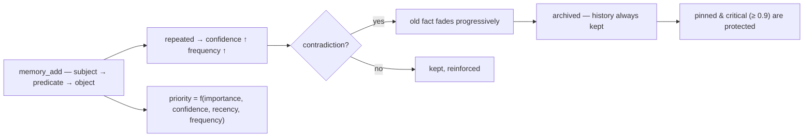

<p align="center">
  🌍 <strong>Languages:</strong>
  <a href="README.md">🇬🇧 English</a> ·
  <a href="README.fr.md">🇫🇷 Français</a> ·
  <a href="README.de.md">🇩🇪 Deutsch</a> ·
  <a href="README.es.md">🇪🇸 Español</a> ·
  <a href="README.it.md">🇮🇹 Italiano</a> ·
  <a href="README.pt.md">🇵🇹 Português</a> ·
  <a href="README.nl.md">🇳🇱 Nederlands</a> ·
  <a href="README.ru.md">🇷🇺 Русский</a> ·
  <a href="README.ja.md">🇯🇵 日本語</a> ·
  <a href="README.zh.md">🇨🇳 中文</a> ·
  <a href="README.ko.md">🇰🇷 한국어</a> ·
  <a href="README.pl.md">🇵🇱 Polski</a> ·
  <a href="README.tr.md">🇹🇷 Türkçe</a> ·
  <a href="README.uk.md">🇺🇦 Українська</a> ·
  <a href="README.hi.md">🇮🇳 हिन्दी</a> ·
  <a href="README.vi.md">🇻🇳 Tiếng Việt</a>
</p>

<p align="center">
  
</p>

<p align="center">
  <a href="https://www.npmjs.com/package/memsem"></a>
  <a href="LICENSE"></a>
  = 22.13">
  <a href="https://github.com/WindSeries69/memsem/actions"></a>
  
  
</p>

> **AI एजेंटों के लिए सिमेंटिक मेमोरी** — जो मायने रखता है उसे याद रखती है, जो भूलना चाहिए उसे भूलना जानती है।
> एक कमांड में इंस्टॉल। *हर* प्रोजेक्ट में, *हर* AI के लिए काम करती है। 100% स्थानीय।

## क्यों — जब बड़ी मेमोरी प्रणालियाँ पहले से मौजूद हैं?

वे मौजूद हैं, और उन्होंने कठिन हिस्सों को सही किया है: वेक्टर स्टोर (mem0),
अस्थायी ज्ञान ग्राफ़ (Zep / Graphiti), एजेंट फ्रेमवर्क (MemGPT / Letta)। लेकिन
उन सभी में तीन समान कमियाँ हैं:

1. **कच्चा भंडारण, कोई संरचना नहीं।** वे वही रखते हैं जो आप उनमें डालते हैं, और
   पुनर्प्राप्ति *हर चीज़* पर समानता खोज है। AI नहीं जानता कि **कहाँ देखना है** —
   इसलिए वह हर जगह देखता है, और शोर संकेत को दबा देता है।
2. **कोई सटीकता नहीं।** एक अस्पष्ट मिलान अस्पष्ट मिलान ही होता है: लगभग-सही
   यादें संदर्भ बजट भर देती हैं और टोकन बर्बाद करती हैं।
3. **कोई स्व-सुधार नहीं।** महीनों पहले खंडित किया गया तथ्य उतना ही मजबूत रहता है
   जितना उसके लिखे जाने के दिन था।

memsem इन तीनों चीज़ों को ठीक करता है:

- 🧭 **यह जानता है कि कहाँ खोजना है।** हर सत्र एक रूटिंग कार्ड
  (`memory-index.md`) से शुरू होता है: थीम + कीवर्ड, संदर्भ में इंजेक्ट किए गए। AI
  थीम के अनुसार रूट करता है, प्रोजेक्ट्स को पार करता है, और केवल उसी के लिए भुगतान
  करता है जिसकी उसे ज़रूरत है। पदानुक्रमित थीम + एक लाइव फ़ोकस सूची सत्र की सक्रिय
  शाखाओं को पूर्ण प्राथमिकता पर रखती हैं — बाकी को हल्का किया जाता है, कभी खोया नहीं जाता।
- 🎯 **यह सटीक है।** डिफ़ॉल्ट रूप से सख्त शाब्दिक खोज (50% शब्द-मिलान
  सीमा, जब तक आप स्पष्ट रूप से न पूछें तब तक कोई ग्राफ़ प्रसार नहीं) — एक क्वेरी
  सही तथ्य लौटाती है, जो गतिशील प्राथमिकता द्वारा क्रमबद्ध होते हैं
  (`importance × confidence × recency × frequency`)। सटीकता मापी जाती है,
  मानी नहीं जाती: संदर्भ बेंचमार्क पर **P@3 0.958** (51 तथ्य, 20 क्वेरी,
  [`scripts/bench.mjs`](scripts/bench.mjs), परिणाम
  [`DESIGN.md`](DESIGN.md) §11 में)।
- 🔄 **यह स्वयं को सुधारता है।** विरोधाभास पुराने तथ्य को अधिलेखित करने के
  बजाय फीका कर देते हैं ("मैं वर्षों से दूध पी रहा हूँ… रुको, लैक्टोज़ असहिष्णुता") —
  इतिहास हमेशा रखा जाता है, महत्वपूर्ण तथ्य (≥ 0.9) सुरक्षित रहते हैं। पृष्ठभूमि
  एजेंट सत्र के अंत में स्थायी तथ्य निकालते हैं, छोटे तथ्यों को पैटर्न में समेकित
  करते हैं, और प्राथमिकताओं को पुनः समायोजित करते हैं — केवल तब जब मेमोरी *कम से
  कम उतनी ही खोजने योग्य* रहती है।

बड़ी प्रणालियों के सभी वादे, उनकी कमियों के बिना: एक कमांड, 100% स्थानीय, और
आपकी मेमोरी आपकी ही रहती है — कभी कमिट नहीं होती, प्रति उपयोगकर्ता, आपके सभी रिपो में साझा।

## इसे काम करते देखें

एक बार इंस्टॉल करें, इसे चलने दें। यह एक अस्थायी डेटाबेस पर एक वास्तविक सत्र है — आपकी वास्तविक मेमोरी को कभी छुआ नहीं जाता (`node scripts/demo.mjs`):

<p align="center">
  
</p>

```
=== memsem — demo on a temporary database ===
(your real memory in ~/.memory-mcp stays untouched)

1. The AI writes durable facts (memory_add_many)
   → 4 facts written

2. Strict search (lexical): memory_search { query: 'milk' }
   → user → drinks → milk

3. Semantic search (relax, local embeddings): memory_search { query: 'cheese', relax: true }
   No shared word with « lactose » — the local semantic index (Ollama) bridges it
   → lactose → is-present-in → cheese, yogurt, cream
   → user → is-intolerant-to → lactose
   → user → drinks → milk

4. Soft supersession: the AI learns you no longer drink milk
   → conflict: true, old fact faded (faded: [1])

5. Search now returns the current fact
   → user → drinks → no more milk (lactose intolerant)
   → user → drinks → milk

Stats: 5 active memories, semantic index OK (mxbai-embed-large)
```

## गोपनीयता — आपकी मेमोरी आपकी है

- **100% स्थानीय** — `~/.memory-mcp/memory.db` में *आपकी* मशीन पर संग्रहीत। कोई क्लाउड नहीं, कोई टेलीमेट्री नहीं, कुछ भी आपके कंप्यूटर से बाहर नहीं जाता।
- **कभी कमिट नहीं होती** — डेटाबेस हर रिपॉजिटरी के बाहर रहता है। पब्लिक रिपो क्लोन करें, कोड पुश करें, स्क्रीनशॉट साझा करें: आपकी मेमोरी आपके पास ही रहती है। हर उपयोगकर्ता की अपनी मेमोरी होती है।
- **मेमोरी *आपका* अनुसरण करती है**, आपके प्रोजेक्ट्स का नहीं — वही बेस आपके सभी रिपो में साझा होता है। नया फ़ोल्डर बनाएँ, नया रिपो बनाएँ: मेमोरी फिर भी वहीं होती है।

## इंस्टॉलेशन

### opencode — एक पंक्ति

`opencode.json` में जोड़ें (प्रोजेक्ट या `~/.config/opencode/opencode.json`):

```json
{ "plugin": ["memsem"] }
```

बस इतना ही। प्लगइन MCP सर्वर को पंजीकृत करता है, हर सत्र में मेमोरी प्रोटोकॉल और मेमोरी इंडेक्स इंजेक्ट करता है, आवश्यक अनुमतियाँ प्रदान करता है, और पृष्ठभूमि एजेंटों को चलाता है। opencode को पुनः आरंभ करें।

### Claude Code — एक कमांड

```bash
npx -y memsem setup
```

यह MCP सर्वर (`claude mcp add memory -- npx -y memsem`) को पंजीकृत करता है और `~/.claude/CLAUDE.md` में एक "memsem मेमोरी" ब्लॉक जोड़ता है जो पूर्ण प्रोटोकॉल की ओर इशारा करता है।

**या इसे AI के साथ इंस्टॉल करें**: बस Claude में पेस्ट करें:

> memsem स्थायी मेमोरी इंस्टॉल करें: `npx -y memsem setup` चलाएँ, `~/.memsem/memory-protocol.md` पढ़ें, और प्रोटोकॉल लागू करें।

### कोई भी MCP क्लाइंट

```bash
npx -y memsem
```

सर्वर stdio पर MCP बोलता है। किसी भी MCP-सक्षम होस्ट को इसकी ओर इंगित करें और AI को स्वायत्त बनाने के लिए `memory-protocol.md` को होस्ट के निर्देशों में इंजेक्ट करें (जैसे `AGENTS.md` के रूप में)।

### यूनिवर्सल इंस्टॉलर

```bash
npx -y memsem setup        # detects and configures your hosts (opencode, Claude)
npx -y memsem setup --help # see options
```

आइडेम्पोटेंट, सुरक्षित, प्रतिवर्ती (`--uninstall`)।

## यह कैसे काम करता है

<p align="center">
  
</p>

**मेमोरी लाइफ़साइकल** — हर तथ्य एक ही रास्ते पर चलता है:



- **परमाणु तथ्य** — हर मेमोरी एक `subject → predicate → object` ट्रिपल है जिसमें importance, confidence, frequency, tags, theme और provenance होते हैं।
- **थीम और फ़ोकस** — पदानुक्रमित थीम (`food/drinks`) रूटिंग मैप हैं; थीम द्वारा खोज सभी प्रोजेक्ट्स को पार करती है। `focus` सूची सत्र के सक्रिय थीम को पूर्ण प्राथमिकता पर रखती है।
- **गतिशील प्राथमिकता** — `0.45 × importance + 0.25 × confidence + 0.2 × recency + 0.1 × frequency`. एक महत्वपूर्ण तथ्य, एक आवर्ती पैटर्न को हरा देता है।
- **सॉफ्ट सुपरसेशन** — विरोधाभास पुराने तथ्य को फीका करते हैं (confidence घटता है) जब तक कि वह एक सीमा से नीचे संग्रहीत न हो जाए। इतिहास हमेशा रखा जाता है।
- **सिमेंटिक इंडेक्स (वैकल्पिक)** — हर तथ्य को स्थानीय रूप से एम्बेड किया जाता है (`mxbai-embed-large` Ollama के माध्यम से); `relax: true` खोजें cosine similarity (सीमा 0.5) जोड़ती हैं। Ollama के बिना, सब कुछ समान रूप से काम करता है — सख्त शाब्दिक खोज।

## तुलना

| | memsem | `CLAUDE.md` / notes | mem0 | Zep / Graphiti | official memory MCP | Obsidian as memory |
|---|---|---|---|---|---|---|
| सत्रों के दौरान स्वचालित लेखन | ✅ | ❌ | ⚠️ ऐप कोड के माध्यम से | ⚠️ ऐप कोड के माध्यम से | ❌ | ❌ |
| संदर्भ बजट के लिए प्राथमिकता | ✅ | ❌ | ❌ | ❌ | ❌ | ❌ |
| विरोधाभास (सॉफ्ट सुपरसेशन) | ✅ | ❌ (अधिलेखित करता है) | ❌ (अधिलेखित करता है) | ✅ (अस्थायी संस्करणीकरण) | ❌ | ❌ |
| सिमेंटिक खोज | ✅ स्थानीय (Ollama) | ❌ | ✅ (वेक्टर स्टोर) | ✅ (ग्राफ़ + एम्बेडिंग) | ❌ | ⚠️ (प्लगइन्स) |
| एपिसोडिक मेमोरी + स्व-रखरखाव | ✅ | ❌ | ⚠️ (एपिसोडिक ऐड-ऑन) | ✅ (अस्थायी ज्ञान ग्राफ़) | ❌ | ❌ |
| आपके सभी रिपो में एक ही मेमोरी | ✅ | ❌ (प्रति प्रोजेक्ट) | ⚠️ (प्रति ऐप कॉन्फ़िगरेशन) | ⚠️ (प्रति ऐप कॉन्फ़िगरेशन) | ❌ | ⚠️ (vault) |
| शून्य निर्भरता, `npx -y` | ✅ | ✅ | ❌ | ❌ | ✅ | ✅ |
| मानव-पठनीय / संपादन योग्य | ⚠️ (CLI list/edit) | ✅ | ❌ | ❌ | ✅ (JSON) | ✅ |

*तुलना अगस्त 2026 तक, सार्वजनिक दस्तावेज़ों से; क्षमताएँ विकसित होती रहती हैं — चुनने से पहले सत्यापित करें।*

## कमांड लाइन

MCP के माध्यम से जो कुछ भी किया जा सकता है वह टर्मिनल से किया जा सकता है:

```bash
memsem list [--theme x] [--project p] [--limit n] [--all]   # read your memory
memsem edit <id> [--object "..."] [--importance 0.6] [...]  # fix a fact by hand (audited)
memsem forget <id> [--yes]                                  # archive a fact (confirm)
memsem doctor [--limit n] [--hours h]                       # most-modified facts — spot drift
memsem export [--output f] [--project p]                    # full JSON dump
memsem import <file.json>                                   # restore / merge a dump
memsem setup [--host opencode|claude]                       # install for your hosts
```

मैनुअल सुधार ऑडिट जर्नल में लिखे जाते हैं — `memsem doctor` उन्हें भी दिखाता है।

## कॉन्फ़िगरेशन

ट्यून करने योग्य स्थिरांक (प्राथमिकता भार, सीमाएँ, फीका कारक, मॉडल…) [`src/config.ts`](src/config.ts) में रहते हैं। उनमें से किसी को भी `~/.memsem/config.json` (या `$MEMSEM_CONFIG`) में ओवरराइड करें, सत्यापन के साथ डीप-मर्ज किया जाता है:

```json
{ "priority": { "importance": 0.4, "confidence": 0.3 }, "minLexical": 0.4 }
```

सेटिंग्स एक बेंचमार्क द्वारा प्रलेखित और सत्यापित की जाती हैं
([`scripts/bench.mjs`](scripts/bench.mjs) — 51 तथ्य, 20 क्वेरी, स्थिरांक
सेटों पर P@k/R@k; परिणाम [`DESIGN.md`](DESIGN.md) §11 में)।

## स्थायित्व

डेटाबेस को स्टार्टअप पर स्वचालित रूप से संस्करणित और माइग्रेट किया जाता है (`schema_migrations`),
किसी भी माइग्रेशन से पहले स्वचालित बैकअप के साथ (`~/.memory-mcp/backups/`, पिछले 5 रखे जाते हैं)।
WAL मोड चालू है — लिखने के बीच क्रैश होने पर भी डेटाबेस बरकरार रहता है। पूर्ण डंप और
रीस्टोर `memsem export` / `memsem import` के माध्यम से।

## दस्तावेज़ीकरण

- [`memory-protocol.md`](memory-protocol.md) — आपके AI में इंजेक्ट किया गया प्रोटोकॉल: यह मेमोरी को स्वचालित रूप से कैसे लिखता, खोजता और बनाए रखता है।
- [`DESIGN.md`](DESIGN.md) — पूर्ण डिज़ाइन: दृष्टि, सिद्धांत, लैक्टोज़ केस स्टडी, स्थिरांक अंशांकन, रोडमैप।
- [`scripts/demo.mjs`](scripts/demo.mjs) — ऊपर दिए गए डेमो को एक अस्थायी डेटाबेस पर दोबारा चलाएँ।

## रोडमैप

- [x] सिमेंटिक इंडेक्स (स्थानीय Ollama एम्बेडिंग)
- [x] एपिसोडिक मेमोरी + सत्र निष्कर्षण
- [x] हिप्पोकैम्पस समेकन + जोड़ीवार स्कोरिंग जज
- [x] यूनिवर्सल opencode प्लगइन + `memsem setup`
- [x] संस्करणित माइग्रेशन + स्वचालित बैकअप + export/import
- [x] कॉन्फ़िगर करने योग्य स्थिरांक, एक बेंचमार्क द्वारा सत्यापित
- [x] सुरक्षित जज: dry-run, ऑडिट जर्नल, सुरक्षा रेलिंग, `memsem doctor`
- [x] CLI: `list` / `edit` / `forget` — किसी तथ्य को हाथ से ठीक करें
- [ ] Obsidian ब्रिज: मेमोरी को पठनीय मार्कडाउन नोट्स के रूप में निर्यात/आयात करें
- [ ] मल्टी-हॉप ग्राफ़ प्रसार

## लाइसेंस

MIT — किसी भी चीज़ के लिए स्वतंत्र। आपकी मेमोरी आपकी ही रहती है।
