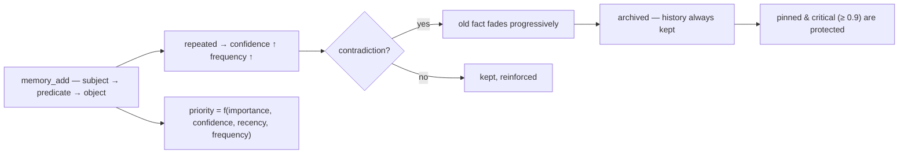

<p align="center">
  🌍 <strong>Languages:</strong>
  <a href="README.md">🇬🇧 English</a> ·
  <a href="README.fr.md">🇫🇷 Français</a> ·
  <a href="README.de.md">🇩🇪 Deutsch</a> ·
  <a href="README.es.md">🇪🇸 Español</a> ·
  <a href="README.it.md">🇮🇹 Italiano</a> ·
  <a href="README.pt.md">🇵🇹 Português</a> ·
  <a href="README.nl.md">🇳🇱 Nederlands</a> ·
  <a href="README.ru.md">🇷🇺 Русский</a> ·
  <a href="README.ja.md">🇯🇵 日本語</a> ·
  <a href="README.zh.md">🇨🇳 中文</a> ·
  <a href="README.ko.md">🇰🇷 한국어</a> ·
  <a href="README.pl.md">🇵🇱 Polski</a> ·
  <a href="README.tr.md">🇹🇷 Türkçe</a> ·
  <a href="README.uk.md">🇺🇦 Українська</a> ·
  <a href="README.hi.md">🇮🇳 हिन्दी</a> ·
  <a href="README.vi.md">🇻🇳 Tiếng Việt</a>
</p>

<p align="center">
  
</p>

<p align="center">
  <a href="https://www.npmjs.com/package/memsem"></a>
  <a href="LICENSE"></a>
  = 22.13">
  
  
</p>

> **Memoria semantica per agenti AI** — ricorda ciò che conta, sa cosa dimenticare.
> Un comando per installarla. Funziona in *ogni* progetto, con *ogni* AI. 100% locale.

## Perché?

La tua AI dimentica tutto tra una sessione e l'altra. `CLAUDE.md` è un file statico — non può imparare.
I database vettoriali sono pesanti e spesso ospitati nel cloud. La maggior parte degli strumenti di "memoria" sono archivi passivi:
conservano ciò che gli lanci, non danno mai priorità, non riconciliano mai le contraddizioni.

**memsem è diverso.** È un *sistema* di memoria, non un cassetto:

- 🧠 **Si scrive da sola** — durante una sessione, la tua AI registra automaticamente i fatti durevoli (preferenze, decisioni, vincoli). Niente più "ricordati di salvarlo".
- ⚖️ **Dà priorità** — ogni fatto ha una priorità dinamica (`importanza × confidenza × recenza × frequenza`). Quando il contesto è limitato, le memorie più rilevanti emergono sempre per prime.
- 🔄 **Gestisce le contraddizioni** — "bevo latte da anni… aspetta, sono intollerante al lattosio." Il fatto vecchio non viene sovrascritto: *svanisce* progressivamente e viene archiviato, conservando l'intero storico. I fatti critici (importanza ≥ 0.9) sono protetti.
- 🔗 **Collega i concetti** — un indice semantico locale opzionale (Ollama, sulla tua macchina) permette a `fromage` di trovare `lactose` senza una sola parola in comune.
- 🕰️ **Ha una memoria episodica** — riassunti di sessione sopra i fatti semantici, come i due sistemi di memoria a lungo termine del cervello.
- 🔧 **Si mantiene da sola** — agenti in background consolidano i piccoli fatti in pattern (l'"ippocampo") e ricalibrano le priorità tramite confronto a coppie, solo quando rendono la memoria *più facile da cercare*.

## Vedila in azione

Installa una volta, lasciala lavorare. Questa è una sessione reale su un database usa-e-getta — la tua memoria vera non viene toccata (`node scripts/demo.mjs`):

```
=== memsem — demo on a temporary database ===
(your real memory in ~/.memory-mcp stays untouched)

1. The AI writes durable facts (memory_add_many)
   → 4 facts written

2. Strict search (lexical): memory_search { query: 'milk' }
   → user → drinks → milk

3. Semantic search (relax, local embeddings): memory_search { query: 'cheese', relax: true }
   No shared word with « lactose » — the local semantic index (Ollama) bridges it
   → lactose → is-present-in → cheese, yogurt, cream
   → user → is-intolerant-to → lactose
   → user → drinks → milk

4. Soft supersession: the AI learns you no longer drink milk
   → conflict: true, old fact faded (faded: [1])

5. Search now returns the current fact
   → user → drinks → no more milk (lactose intolerant)
   → user → drinks → milk

Stats: 5 active memories, semantic index OK (mxbai-embed-large)
```

## Privacy — la tua memoria è tua

- **100% locale** — archiviata in `~/.memory-mcp/memory.db` sulla *tua* macchina. Niente cloud, niente telemetria, nulla lascia il tuo computer.
- **Mai committata** — il database vive fuori da ogni repository. Clona un repo pubblico, fai push del codice, condividi screenshot: la tua memoria resta con te. Ogni utente ha la propria memoria.
- **La memoria segue *te***, non i tuoi progetti — la stessa base è condivisa tra tutti i tuoi repo. Crea una nuova cartella, un nuovo repo: la memoria è ancora lì.

## Installazione

### opencode — una riga

Aggiungi a `opencode.json` (progetto o `~/.config/opencode/opencode.json`):

```json
{ "plugin": ["memsem"] }
```

Tutto qui. Il plugin registra il server MCP, inietta il protocollo di memoria e l'indice della memoria in ogni sessione, concede le autorizzazioni necessarie e avvia gli agenti in background. Riavvia opencode.

### Claude Code — un comando

```bash
npx -y memsem setup
```

Questo registra il server MCP (`claude mcp add memory -- npx -y memsem`) e aggiunge un blocco "memsem memory" a `~/.claude/CLAUDE.md` che punta al protocollo completo.

**Oppure installala con l'AI**: basta incollare in Claude:

> Installa la memoria persistente memsem: esegui `npx -y memsem setup`, leggi `~/.memsem/memory-protocol.md` e applica il protocollo.

### Qualsiasi client MCP

```bash
npx -y memsem
```

Il server parla MCP su stdio. Punta qualsiasi host compatibile con MCP verso di esso e inietta `memory-protocol.md` nelle istruzioni dell'host (ad es. come `AGENTS.md`) per rendere l'AI autonoma.

### Installer universale

```bash
npx -y memsem setup        # rileva e configura i tuoi host (opencode, Claude)
npx -y memsem setup --help # vedi le opzioni
```

Idempotente, sicuro, reversibile (`--uninstall`).

## Come funziona

<p align="center">
  
</p>

**Il ciclo di vita della memoria** — ogni fatto segue lo stesso percorso:



- **Fatti atomici** — ogni memoria è una tripla `soggetto → predicato → oggetto` con importanza, confidenza, frequenza, tag, tema, provenienza.
- **Temi e focus** — i temi gerarchici (`food/drinks`) sono la mappa di routing; una ricerca per tema attraversa tutti i progetti. La lista `focus` mantiene i temi attivi della sessione a piena priorità.
- **Priorità dinamica** — `0.45 × importanza + 0.25 × confidenza + 0.2 × recenza + 0.1 × frequenza`. Un fatto critico batte un pattern ricorrente.
- **Sostituzione morbida** — le contraddizioni fanno svanire il fatto vecchio (la confidenza decade) finché non si archivia sotto una soglia. Lo storico è sempre conservato.
- **Indice semantico (opzionale)** — ogni fatto viene incorporato localmente (`mxbai-embed-large` tramite Ollama); le ricerche con `relax: true` aggiungono la similarità del coseno (soglia 0.5). Senza Ollama, tutto funziona identicamente — ricerca lessicale rigorosa.

## Confronto

| | memsem | `CLAUDE.md` / note | mem0 | Zep / Graphiti | MCP memoria ufficiale | Obsidian come memoria |
|---|---|---|---|---|---|---|
| Scrittura automatica durante le sessioni | ✅ | ❌ | ⚠️ via codice app | ⚠️ | ❌ | ❌ |
| Priorità per il budget di contesto | ✅ | ❌ | ❌ | ❌ | ❌ | ❌ |
| Contraddizioni (sostituzione morbida) | ✅ | ❌ (sovrascrive) | ❌ (sovrascrive) | ❌ | ❌ | ❌ |
| Ricerca semantica, locale e privata | ✅ (Ollama) | ❌ | ⚠️ (serve DB vettoriale) | ⚠️ (serve DB a grafo) | ❌ | ⚠️ (plugin) |
| Memoria episodica + auto-manutenzione | ✅ | ❌ | ❌ | ⚠️ | ❌ | ❌ |
| Una memoria per tutti i tuoi repo | ✅ | ❌ (per progetto) | ⚠️ | ⚠️ | ❌ | ⚠️ (vault) |
| Zero dipendenze, `npx -y` | ✅ | ✅ | ❌ | ❌ | ✅ | ✅ |
| Leggibile / modificabile dall'uomo | ❌ | ✅ | ❌ | ❌ | ✅ (JSON) | ✅ |

## Documentazione

- [`memory-protocol.md`](memory-protocol.md) — il protocollo iniettato nella tua AI: come scrive, cerca e mantiene automaticamente la memoria.
- [`DESIGN.md`](DESIGN.md) — il design completo: visione, principi, il caso di studio sul lattosio, roadmap.
- [`scripts/demo.mjs`](scripts/demo.mjs) — riproduci la demo qui sopra su un database usa-e-getta.

## Roadmap

- [x] Indice semantico (embedding locali Ollama)
- [x] Memoria episodica + estrazione di sessione
- [x] Consolidamento dell'ippocampo + giudice di punteggio a coppie
- [x] Plugin opencode universale + `memsem setup`
- [ ] Ponte Obsidian: esporta/importa la memoria come note markdown leggibili
- [ ] Propagazione del grafo multi-hop

## Licenza

MIT — gratis per qualsiasi uso. La tua memoria resta tua.
