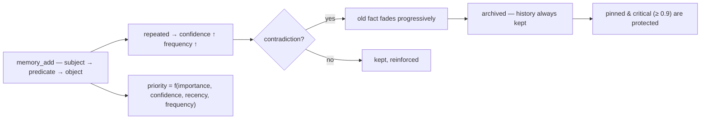

<p align="center">
  🌍 <strong>Languages:</strong>
  <a href="README.md">🇬🇧 English</a> ·
  <a href="README.fr.md">🇫🇷 Français</a> ·
  <a href="README.de.md">🇩🇪 Deutsch</a> ·
  <a href="README.es.md">🇪🇸 Español</a> ·
  <a href="README.it.md">🇮🇹 Italiano</a> ·
  <a href="README.pt.md">🇵🇹 Português</a> ·
  <a href="README.nl.md">🇳🇱 Nederlands</a> ·
  <a href="README.ru.md">🇷🇺 Русский</a> ·
  <a href="README.ja.md">🇯🇵 日本語</a> ·
  <a href="README.zh.md">🇨🇳 中文</a> ·
  <a href="README.ko.md">🇰🇷 한국어</a> ·
  <a href="README.pl.md">🇵🇱 Polski</a> ·
  <a href="README.tr.md">🇹🇷 Türkçe</a> ·
  <a href="README.uk.md">🇺🇦 Українська</a> ·
  <a href="README.hi.md">🇮🇳 हिन्दी</a> ·
  <a href="README.vi.md">🇻🇳 Tiếng Việt</a>
</p>

<p align="center">
  
</p>

<p align="center">
  <a href="https://www.npmjs.com/package/memsem"></a>
  <a href="LICENSE"></a>
  = 22.13">
  <a href="https://github.com/WindSeries69/memsem/actions"></a>
  
  
</p>

> **Memoria semantica per agenti AI** — ricorda ciò che conta, sa cosa dimenticare.
> Un comando per installarla. Funziona in *ogni* progetto, per *ogni* AI. 100% locale.

## Perché — quando esistono già grandi sistemi di memoria?

Esistono, e hanno risolto le parti difficili: vector store (mem0), knowledge
graph temporali (Zep / Graphiti), framework per agenti (MemGPT / Letta). Ma
condividono tutti gli stessi tre difetti:

1. **Archiviazione bruta, nessuna struttura.** Conservano tutto ciò che gli
   lanci, e il recupero è una ricerca di similarità su *tutto*. L'AI non sa
   **dove guardare** — quindi guarda ovunque, e il rumore sommerge il segnale.
2. **Nessuna precisione.** Un match fuzzy è un match fuzzy: memorie quasi
   giuste riempiono il budget di contesto e sprecano token.
3. **Nessuna autocorrezione.** Un fatto contraddetto mesi fa resta forte
   quanto il giorno in cui è stato scritto.

memsem corregge esattamente queste tre cose:

- 🧭 **Sa dove cercare.** Ogni sessione inizia con una scheda di routing
  (`memory-index.md`): temi + parole chiave, iniettati nel contesto. L'AI
  instrada per tema, attraversa i progetti e paga solo ciò di cui ha bisogno.
  Temi gerarchici + una lista di focus live mantengono i rami attivi della
  sessione a piena priorità — il resto è attenuato, mai perso.
- 🎯 **È precisa.** Ricerca lessicale rigorosa per impostazione predefinita
  (soglia di corrispondenza delle parole al 50%, nessuna propagazione di grafo
  a meno che non lo chieda esplicitamente) — una query restituisce i fatti
  giusti, classificati per priorità dinamica
  (`importanza × confidenza × recenza × frequenza`). La precisione è misurata,
  non presunta: **P@3 0.958** sul benchmark di riferimento (51 fatti, 20
  query, [`scripts/bench.mjs`](scripts/bench.mjs), risultati in
  [`DESIGN.md`](DESIGN.md) §11).
- 🔄 **Si corregge da sola.** Le contraddizioni attenuano il vecchio fatto
  invece di sovrascriverlo («ho bevuto latte per anni… aspetta, intollerante
  al lattosio») — la storia è sempre conservata, i fatti critici (≥ 0.9) sono
  protetti. Agenti in background estraggono i fatti durevoli a fine sessione,
  consolidano i piccoli fatti in pattern e ricalibrano le priorità — solo
  quando la memoria rimane *almeno altrettanto* ricercabile.

Tutte le promesse dei grandi sistemi, meno i loro difetti: un comando, 100%
locale, e la tua memoria resta tua — mai committata, per utente, condivisa in
tutti i tuoi repo.

## Vedilo in azione

Installa una volta, lascialo girare. Questa è una sessione reale su un database
usa-e-getta — la tua memoria vera non viene mai toccata (`node scripts/demo.mjs`):

<p align="center">
  
</p>

```
=== memsem — demo on a temporary database ===
(your real memory in ~/.memory-mcp stays untouched)

1. The AI writes durable facts (memory_add_many)
   → 4 facts written

2. Strict search (lexical): memory_search { query: 'milk' }
   → user → drinks → milk

3. Semantic search (relax, local embeddings): memory_search { query: 'cheese', relax: true }
   No shared word with « lactose » — the local semantic index (Ollama) bridges it
   → lactose → is-present-in → cheese, yogurt, cream
   → user → is-intolerant-to → lactose
   → user → drinks → milk

4. Soft supersession: the AI learns you no longer drink milk
   → conflict: true, old fact faded (faded: [1])

5. Search now returns the current fact
   → user → drinks → no more milk (lactose intolerant)
   → user → drinks → milk

Stats: 5 active memories, semantic index OK (mxbai-embed-large)
```

## Privacy — la tua memoria è tua

- **100% locale** — conservata in `~/.memory-mcp/memory.db` sulla *tua* macchina. Niente cloud, niente telemetria, nulla esce dal tuo computer.
- **Mai committata** — il database vive fuori da ogni repository. Clona un repo pubblico, fai push del codice, condividi screenshot: la tua memoria resta con te. Ogni utente ha la propria memoria.
- **La memoria segue *te***, non i tuoi progetti — la stessa base è condivisa in tutti i tuoi repo. Crea una nuova cartella, un nuovo repo: la memoria è ancora lì.

## Installazione

### opencode — una riga

Aggiungi a `opencode.json` (progetto o `~/.config/opencode/opencode.json`):

```json
{ "plugin": ["memsem"] }
```

È tutto. Il plugin registra il server MCP, inietta il protocollo di memoria e l'indice di memoria in ogni sessione, concede le autorizzazioni necessarie e avvia gli agenti in background. Riavvia opencode.

### Claude Code — un comando

```bash
npx -y memsem setup
```

Questo registra il server MCP (`claude mcp add memory -- npx -y memsem`) e aggiunge un blocco «memoria memsem» a `~/.claude/CLAUDE.md` che punta al protocollo completo.

**Oppure installala con l'AI**: incolla semplicemente questo a Claude:

> Installa la memoria persistente memsem: lancia `npx -y memsem setup`, leggi `~/.memsem/memory-protocol.md` e applica il protocollo.

### Qualsiasi client MCP

```bash
npx -y memsem
```

Il server parla MCP su stdio. Punta qualsiasi host compatibile con MCP verso di esso e inietta `memory-protocol.md` nelle istruzioni dell'host (ad es. come `AGENTS.md`) per rendere l'AI autonoma.

### Installatore universale

```bash
npx -y memsem setup        # detects and configures your hosts (opencode, Claude)
npx -y memsem setup --help # see options
```

Idempotente, sicuro, reversibile (`--uninstall`).

## Come funziona

<p align="center">
  
</p>

**Il ciclo di vita della memoria** — ogni fatto segue lo stesso percorso:



- **Fatti atomici** — ogni memoria è una tripletta `soggetto → predicato → oggetto` con importanza, confidenza, frequenza, tag, tema, provenienza.
- **Temi & focus** — i temi gerarchici (`food/drinks`) sono la mappa di routing; una ricerca per tema attraversa tutti i progetti. La lista `focus` mantiene i temi attivi della sessione a piena priorità.
- **Priorità dinamica** — `0.45 × importanza + 0.25 × confidenza + 0.2 × recenza + 0.1 × frequenza`. Un fatto critico batte un pattern ricorrente.
- **Sostituzione morbida** — le contraddizioni attenuano il vecchio fatto (la confidenza decade) finché non viene archiviato sotto una soglia. La storia è sempre conservata.
- **Indice semantico (opzionale)** — ogni fatto è incorporato localmente (`mxbai-embed-large` via Ollama); le ricerche `relax: true` aggiungono la similarità del coseno (soglia 0.5). Senza Ollama, tutto funziona in modo identico — ricerca lessicale rigorosa.

## Confronto

| | memsem | `CLAUDE.md` / note | mem0 | Zep / Graphiti | memory MCP ufficiale | Obsidian come memoria |
|---|---|---|---|---|---|---|
| Scritture automatiche durante le sessioni | ✅ | ❌ | ⚠️ tramite codice app | ⚠️ tramite codice app | ❌ | ❌ |
| Priorità per il budget di contesto | ✅ | ❌ | ❌ | ❌ | ❌ | ❌ |
| Contraddizioni (sostituzione morbida) | ✅ | ❌ (sovrascrive) | ❌ (sovrascrive) | ✅ (versionamento temporale) | ❌ | ❌ |
| Ricerca semantica | ✅ locale (Ollama) | ❌ | ✅ (vector store) | ✅ (grafo + embeddings) | ❌ | ⚠️ (plugin) |
| Memoria episodica + auto-manutenzione | ✅ | ❌ | ⚠️ (aggiunte episodiche) | ✅ (knowledge graph temporale) | ❌ | ❌ |
| Una memoria in tutti i tuoi repo | ✅ | ❌ (per progetto) | ⚠️ (per configurazione app) | ⚠️ (per configurazione app) | ❌ | ⚠️ (vault) |
| Zero dipendenze, `npx -y` | ✅ | ✅ | ❌ | ❌ | ✅ | ✅ |
| Leggibile / modificabile dagli umani | ⚠️ (CLI list/edit) | ✅ | ❌ | ❌ | ✅ (JSON) | ✅ |

*Confronto aggiornato ad agosto 2026, basato sulla documentazione pubblica; le funzionalità evolvono — verifica prima di scegliere.*

## Riga di comando

Tutto ciò che si può fare tramite MCP si può fare da terminale:

```bash
memsem list [--theme x] [--project p] [--limit n] [--all]   # read your memory
memsem edit <id> [--object "..."] [--importance 0.6] [...]  # fix a fact by hand (audited)
memsem forget <id> [--yes]                                  # archive a fact (confirm)
memsem doctor [--limit n] [--hours h]                       # most-modified facts — spot drift
memsem export [--output f] [--project p]                    # full JSON dump
memsem import <file.json>                                   # restore / merge a dump
memsem setup [--host opencode|claude]                       # install for your hosts
```

Le correzioni manuali vengono scritte nel registro di audit — `memsem doctor` le mostra anche.

## Configurazione

Le costanti regolabili (pesi della priorità, soglie, fattori di attenuazione, modello…) vivono in
[`src/config.ts`](src/config.ts). Puoi sovrascriverne qualsiasi in `~/.memsem/config.json`
(o `$MEMSEM_CONFIG`), con merge profondo e validazione:

```json
{ "priority": { "importance": 0.4, "confidence": 0.3 }, "minLexical": 0.4 }
```

Le impostazioni sono documentate e validate da un benchmark
([`scripts/bench.mjs`](scripts/bench.mjs) — 51 fatti, 20 query, P@k/R@k su
insiemi di costanti; risultati in [`DESIGN.md`](DESIGN.md) §11).

## Durabilità

Il database è versionato e migrato automaticamente all'avvio (`schema_migrations`),
con un backup automatico prima di ogni migrazione (`~/.memory-mcp/backups/`, ultimi 5 conservati).
La modalità WAL è attiva — un crash durante una scrittura lascia il database intatto. Dump completi e
ripristini tramite `memsem export` / `memsem import`.

## Documentazione

- [`memory-protocol.md`](memory-protocol.md) — il protocollo iniettato nella tua AI: come scrive, cerca e mantiene la memoria automaticamente.
- [`DESIGN.md`](DESIGN.md) — il design completo: visione, principi, il caso di studio del lattosio, calibrazione delle costanti, roadmap.
- [`scripts/demo.mjs`](scripts/demo.mjs) — riproduce la demo qui sopra su un database usa-e-getta.

## Roadmap

- [x] Indice semantico (embedding locali Ollama)
- [x] Memoria episodica + estrazione di sessione
- [x] Consolidamento dell'ippocampo + giudice di scoring a coppie
- [x] Plugin opencode universale + `memsem setup`
- [x] Migrazioni versionate + backup automatico + export/import
- [x] Costanti configurabili, validate da un benchmark
- [x] Giudice sicuro: dry-run, registro di audit, guardrail, `memsem doctor`
- [x] CLI: `list` / `edit` / `forget` — correggi un fatto a mano
- [ ] Ponte Obsidian: export/import della memoria come note markdown leggibili
- [ ] Propagazione di grafo multi-hop

## Licenza

MIT — libera per qualsiasi uso. La tua memoria resta tua.
