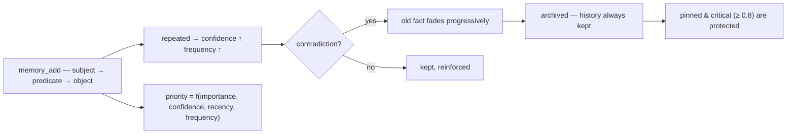

<p align="center">
  🌍 <strong>Languages:</strong>
  <a href="README.md">🇬🇧 English</a> ·
  <a href="README.fr.md">🇫🇷 Français</a> ·
  <a href="README.de.md">🇩🇪 Deutsch</a> ·
  <a href="README.es.md">🇪🇸 Español</a> ·
  <a href="README.it.md">🇮🇹 Italiano</a> ·
  <a href="README.pt.md">🇵🇹 Português</a> ·
  <a href="README.nl.md">🇳🇱 Nederlands</a> ·
  <a href="README.ru.md">🇷🇺 Русский</a> ·
  <a href="README.ja.md">🇯🇵 日本語</a> ·
  <a href="README.zh.md">🇨🇳 中文</a> ·
  <a href="README.ko.md">🇰🇷 한국어</a> ·
  <a href="README.pl.md">🇵🇱 Polski</a> ·
  <a href="README.tr.md">🇹🇷 Türkçe</a> ·
  <a href="README.uk.md">🇺🇦 Українська</a> ·
  <a href="README.hi.md">🇮🇳 हिन्दी</a> ·
  <a href="README.vi.md">🇻🇳 Tiếng Việt</a>
</p>

<p align="center">
  
</p>

<p align="center">
  <a href="https://www.npmjs.com/package/memsem"></a>
  <a href="LICENSE"></a>
  = 22.13">
  <a href="https://github.com/WindSeries69/memsem/actions"></a>
  
  
</p>

> **AIエージェントのための意味的メモリ** — 大切なことは覚え、忘れるべきことは忘れる。
> インストールは1コマンド。*あらゆる*プロジェクトで、*あらゆる*AIで動作する。100%ローカル。

## なぜ — 巨大なメモリシステムがすでにあるのに？

それらは存在し、難しい部分は正しく解決している：ベクトルストア（mem0）、時系列ナレッジグラフ（Zep / Graphiti）、エージェントフレームワーク（MemGPT / Letta）。しかし、それらには共通して3つの欠陥がある：

1. **無造作な保存、構造なし。** 投げ込まれたものをそのまま保持し、検索は*すべて*に対する類似度検索になる。AIは**どこを見ればよいか**を知らない — だからどこでも見てしまい、ノイズがシグナルを飲み込む。
2. **精度がない。** 曖昧なマッチは曖昧なマッチだ：ほぼ正しいメモリがコンテキストの予算を埋め尽くし、トークンを無駄にする。
3. **自己修正がない。** 数か月前に矛盾した事実は、書かれた当日と同じ強さで残り続ける。

memsemはまさにこの3つの問題を解決する：

- 🧭 **どこを検索すればよいかを知っている。** すべてのセッションはルーティングカード（`memory-index.md`：テーマ＋キーワード）で始まり、コンテキストに注入される。AIはテーマでルーティングし、プロジェクトを横断し、必要な分だけを支払う。階層的なテーマ＋ライブなフォーカスリストによって、セッションのアクティブな分岐はフル優先度を維持する — それ以外は減衰されるだけで、決して失われない。
- 🎯 **正確である。** デフォルトは厳密な語彙検索（単語一致率50%の閾値、明示的に求めない限りグラフ伝播なし）— クエリは正しい事実を、動的優先度（`importance × confidence × recency × frequency`）でランク付けして返す。精度は仮定ではなく計測される：参照ベンチマークで **P@3 0.958**（51事実、20クエリ、[`scripts/bench.mjs`](scripts/bench.mjs)、結果は[`DESIGN.md`](DESIGN.md) §11）。
- 🔄 **自己修正する。** 矛盾は古い事実を上書きするのではなく、薄れさせていく（「何年も牛乳を飲んできた…待って、乳糖不耐症だ」）— 履歴は常に保持され、重要な事実（≥ 0.8）は保護される。バックグラウンドエージェントがセッション終了時に持続的な事実を抽出し、小さな事実をパターンに統合し、優先度を再調整する — それはメモリが*少なくとも同じくらい検索しやすい*状態に留まる場合に限られる。

大規模システムの約束のすべてを、その欠陥なしで：1コマンド、100%ローカル、そしてあなたのメモリはあなたのもの — 決してコミットされず、ユーザーごとであり、すべてのリポジトリにわたって共有される。

## 動作を見る

一度インストールして、そのまま走らせる。これは使い捨てデータベースでの実際のセッションだ — あなたの実際のメモリには触れない（`node scripts/demo.mjs`）：

<p align="center">
  
</p>

```
=== memsem — demo on a temporary database ===
(your real memory in ~/.memory-mcp stays untouched)

1. The AI writes durable facts (memory_add_many)
   → 4 facts written

2. Strict search (lexical): memory_search { query: 'milk' }
   → user → drinks → milk

3. Semantic search (relax, local embeddings): memory_search { query: 'cheese', relax: true }
   No shared word with « lactose » — the local semantic index (Ollama) bridges it
   → lactose → is-present-in → cheese, yogurt, cream
   → user → is-intolerant-to → lactose
   → user → drinks → milk

4. Soft supersession: the AI learns you no longer drink milk
   → conflict: true, old fact faded (faded: [1])

5. Search now returns the current fact
   → user → drinks → no more milk (lactose intolerant)
   → user → drinks → milk

Stats: 5 active memories, semantic index OK (mxbai-embed-large)
```

## プライバシー — あなたのメモリはあなたのもの

- **100%ローカル** — *あなたの*マシン上の `~/.memory-mcp/memory.db` に保存される。クラウドなし、テレメトリなし、何もコンピュータの外に出ない。
- **決してコミットされない** — データベースはすべてのリポジトリの外に置かれる。公開リポジトリをクローンしても、コードをプッシュしても、スクリーンショットを共有しても：あなたのメモリはあなたとともにある。各ユーザーはそれぞれ自分のメモリを持つ。
- **メモリはプロジェクトではなく*あなた*に付いてくる** — 同じベースがすべてのリポジトリで共有される。新しいフォルダを作っても、新しいリポジトリを作っても：メモリはそこにある。

## インストール

### opencode — 1行

`opencode.json`（プロジェクトまたは `~/.config/opencode/opencode.json`）に追加する：

```json
{ "plugin": ["memsem"] }
```

これだけ。プラグインがMCPサーバーを登録し、メモリプロトコルとメモリインデックスをすべてのセッションに注入し、必要な権限を付与し、バックグラウンドエージェントを実行する。opencodeを再起動する。

### Claude Code — 1コマンド

```bash
npx -y memsem setup
```

これはMCPサーバー（`claude mcp add memory -- npx -y memsem`）を登録し、完全なプロトコルを指す「memsem memory」ブロックを `~/.claude/CLAUDE.md` に追加する。

**またはAIにインストールさせる**：Claudeに以下を貼り付けるだけ：

> Install the memsem persistent memory: run `npx -y memsem setup`, read `~/.memsem/memory-protocol.md`, and apply the protocol.

### 任意のMCPクライアント

```bash
npx -y memsem
```

サーバーはstdio上でMCPを話す。MCP対応の任意のホストをこれに向け、`memory-protocol.md` をホストの指示（例：`AGENTS.md` として）に注入して、AIを自律的にする。

### ユニバーサルインストーラー

```bash
npx -y memsem setup        # ホスト（opencode、Claude）を検出して設定
npx -y memsem setup --help # オプションを見る
```

冪等で、安全で、取り消し可能（`--uninstall`）。

## 仕組み

<p align="center">
  
</p>

**メモリのライフサイクル** — すべての事実は同じ道をたどる：



- **原子的な事実** — すべてのメモリは `subject → predicate → object` のトリプルであり、importance、confidence、frequency、tags、theme、provenanceを持つ。
- **テーマとフォーカス** — 階層的なテーマ（`food/drinks`）がルーティングマップになる；テーマによる検索はすべてのプロジェクトを横断する。`focus` リストがセッションのアクティブなテーマをフル優先度に保つ。
- **動的優先度** — `0.45 × importance + 0.25 × confidence + 0.2 × recency + 0.1 × frequency`。重要な事実は反復パターンに勝る。
- **ソフトな置換** — 矛盾は古い事実を薄れさせ（confidenceが減衰）、閾値を下回るとアーカイブされる。履歴は常に保持される。
- **意味インデックス（オプション）** — 各事実はローカルに埋め込まれる（Ollama経由の `mxbai-embed-large`）；`relax: true` 検索はコサイン類似度（閾値0.5）を加える。Ollamaがなくても、すべてが同じように機能する — 厳密な語彙検索。

## 比較

| | memsem | `CLAUDE.md` / notes | mem0 | Zep / Graphiti | official memory MCP | Obsidian as memory |
|---|---|---|---|---|---|---|
| セッション中の自動書き込み | ✅ | ❌ | ⚠️ アプリコード経由 | ⚠️ アプリコード経由 | ❌ | ❌ |
| コンテキスト予算の優先度 | ✅ | ❌ | ❌ | ❌ | ❌ | ❌ |
| 矛盾（ソフトな置換） | ✅ | ❌（上書き） | ❌（上書き） | ✅（時系列バージョニング） | ❌ | ❌ |
| 意味検索 | ✅ ローカル（Ollama） | ❌ | ✅（ベクトルストア） | ✅（グラフ＋埋め込み） | ❌ | ⚠️（プラグイン） |
| エピソード記憶＋自己メンテナンス | ✅ | ❌ | ⚠️（エピソードのアドオン） | ✅（時系列ナレッジグラフ） | ❌ | ❌ |
| 全リポジトリで1つのメモリ | ✅ | ❌（プロジェクトごと） | ⚠️（アプリ設定ごと） | ⚠️（アプリ設定ごと） | ❌ | ⚠️（ヴォールト） |
| ゼロ依存、`npx -y` | ✅ | ✅ | ❌ | ❌ | ✅ | ✅ |
| 人が読める／編集できる | ⚠️（CLI list/edit） | ✅ | ❌ | ❌ | ✅（JSON） | ✅ |

*2026年8月時点の比較、公開ドキュメントに基づく；機能は進化する — 選択前に確認すること。*

## コマンドライン

MCPでできることはすべて、ターミナルからもできる：

```bash
memsem list [--theme x] [--project p] [--limit n] [--all]   # read your memory
memsem edit <id> [--object "..."] [--importance 0.6] [...]  # fix a fact by hand (audited)
memsem forget <id> [--yes]                                  # archive a fact (confirm)
memsem doctor [--limit n] [--hours h]                       # most-modified facts — spot drift
memsem export [--output f] [--project p]                    # full JSON dump
memsem import <file.json>                                   # restore / merge a dump
memsem setup [--host opencode|claude]                       # install for your hosts
```

手動の修正は監査ジャーナルに書き込まれる — `memsem doctor` でもそれらを表示する。

## 設定

調整可能な定数（優先度の重み、閾値、減衰係数、モデル…）は [`src/config.ts`](src/config.ts) にある。そのいずれかを `~/.memsem/config.json`（または `$MEMSEM_CONFIG`）で上書きでき、検証付きでディープマージされる：

```json
{ "priority": { "importance": 0.4, "confidence": 0.3 }, "minLexical": 0.4 }
```

設定はベンチマークによって文書化され、検証される（[`scripts/bench.mjs`](scripts/bench.mjs) — 51事実、20クエリ、定数セットを横断したP@k/R@k；結果は[`DESIGN.md`](DESIGN.md) §11）。

## 耐久性

データベースはバージョン管理され、起動時に自動でマイグレーションされる（`schema_migrations`）、マイグレーション前には自動バックアップがある（`~/.memory-mcp/backups/`、直近5件を保持）。WALモードが有効 — 書き込み途中のクラッシュでもデータベースは無傷のまま。完全なダンプと復元は `memsem export` / `memsem import` で行う。

## ドキュメント

- [`memory-protocol.md`](memory-protocol.md) — あなたのAIに注入されるプロトコル：書き方、検索の仕方、メモリの自動メンテナンス方法。
- [`DESIGN.md`](DESIGN.md) — 完全な設計：ビジョン、原則、乳糖のケーススタディ、定数のキャリブレーション、ロードマップ。
- [`scripts/demo.mjs`](scripts/demo.mjs) — 上記のデモを使い捨てデータベースで再現する。

## 既知の制限

独立したレビュー（[Agent Memory Atlas](https://neoneye.github.io/agent-memory-atlas/systems/memsem/)）に基づいて率直に記す：

- **自動修正パスにはロックがない。** 拒否された値が*再主張*されると（たとえば、同じ古いトランスクリプトを10回読む場合）、それは戻ってきて自身の修正を薄めてしまう — 通常の修正は3回目の再主張でアーカイブされる。**人間が候補を拒否したときだけ**、その値を完全に拒否する永続的な抑制（`memory_suppressions`）が書き込まれる。これは（反復は証拠であるという）意図的な立場であり、現実のコストを伴う。
- **ピンは生存を保護するものであって、可視性を保護するものではない。** 固定された修正はconfidenceを失うことなく、常に`memsem list`の先頭に留まる。しかし、繰り返し拒否された値が、依然として`memory_search`のトップの結果を奪うことはあり得る。
- **`import`はゲートを越えて書き込む** — バックアップを復元すると、抑制された値が復活する。
- **拒否された書き込みは監査行を残さない**、そしてレビュー済みの事実をpurgeしても、そのテキストは`memory_candidates`に残る。
- **統合と抽出の安全ルールはプロンプトであり、コードではない。**

バグではなく粗いエッジ — それぞれが[DESIGN.md](DESIGN.md)のロードマップと未解決の質問に追跡される。

## ロードマップ

- [x] 意味インデックス（ローカルOllama埋め込み）
- [x] エピソード記憶＋セッション抽出
- [x] ヒポカンパス（海馬）統合＋ペアワイズスコアリング判定
- [x] ユニバーサルなopencodeプラグイン＋ `memsem setup`
- [x] バージョン管理されたマイグレーション＋自動バックアップ＋export/import
- [x] ベンチマークで検証された設定可能な定数
- [x] 安全な判定：ドライラン、監査ジャーナル、ガードレール、`memsem doctor`
- [x] CLI：`list` / `edit` / `forget` — 事実を手動で修正
- [x] マルチホップのグラフ伝播（relaxモード）
- [ ] 自動パスへのライトゲート（置換 → 抑制の決定）
- [ ] ゲートの背後にある `import`（抑制を参照）
- [ ] 拒否された書き込みの監査、候補テキストの削除、コードでの統合ルール
- [ ] Obsidianブリッジ：メモリを読みやすいマークダウンノートとしてexport/import

## ライセンス

MIT — 何にでも自由に使える。あなたのメモリはあなたのもの。
