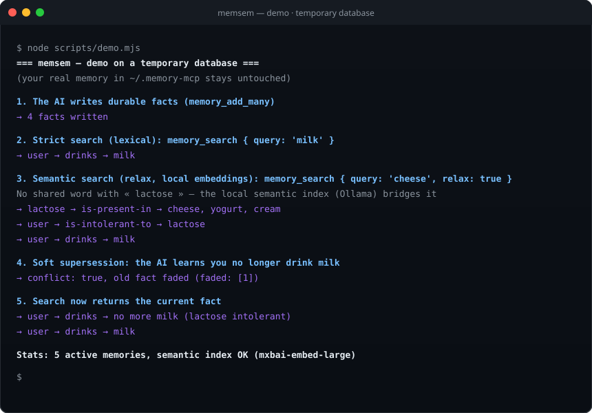
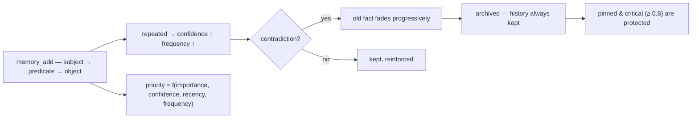

<p align="center">
  🌍 <strong>Languages:</strong>
  <a href="README.md">🇬🇧 English</a> ·
  <a href="README.fr.md">🇫🇷 Français</a> ·
  <a href="README.de.md">🇩🇪 Deutsch</a> ·
  <a href="README.es.md">🇪🇸 Español</a> ·
  <a href="README.it.md">🇮🇹 Italiano</a> ·
  <a href="README.pt.md">🇵🇹 Português</a> ·
  <a href="README.nl.md">🇳🇱 Nederlands</a> ·
  <a href="README.ru.md">🇷🇺 Русский</a> ·
  <a href="README.ja.md">🇯🇵 日本語</a> ·
  <a href="README.zh.md">🇨🇳 中文</a> ·
  <a href="README.ko.md">🇰🇷 한국어</a> ·
  <a href="README.pl.md">🇵🇱 Polski</a> ·
  <a href="README.tr.md">🇹🇷 Türkçe</a> ·
  <a href="README.uk.md">🇺🇦 Українська</a> ·
  <a href="README.hi.md">🇮🇳 हिन्दी</a> ·
  <a href="README.vi.md">🇻🇳 Tiếng Việt</a>
</p>

<p align="center">
  
</p>

<p align="center">
  <a href="https://www.npmjs.com/package/memsem"></a>
  <a href="LICENSE"></a>
  = 22.13">
  <a href="https://github.com/WindSeries69/memsem/actions"></a>
  
  
</p>

> **AI 에이전트를 위한 의미론적 메모리** — 중요한 것은 기억하고, 잊어야 할 것은 안다.
> 설치 명령 하나면 끝. *모든* 프로젝트에서, *모든* AI와 함께 동작한다. 100% 로컬.

## 왜 — 이미 큰 메모리 시스템이 있는데?

그런 시스템들은 존재한다. 그리고 그들은 어려운 부분을 이미 제대로 해냈다: 벡터 스토어(mem0), 시간 축 지식 그래프(Zep / Graphiti), 에이전트 프레임워크(MemGPT / Letta). 하지만 그들 모두에게는 똑같은 세 가지 결함이 있다:

1. **구조 없는 무차별 저장.** 넣어주는 대로 다 저장하고, 검색은 *모든 것*을 대상으로 하는 유사도 검색이다. AI는 **어디를 봐야 하는지** 모른다 — 그래서 온통 다 뒤지고, 결국 노이즈가 신호를 삼켜버린다.
2. **정밀함이 없다.** 애매한 일치는 그저 애매한 일치다: 거의 맞는 메모리들이 컨텍스트 예산을 채우고 토큰을 낭비한다.
3. **자기 교정이 없다.** 몇 달 전에 반박된 사실도 쓰여진 그날만큼 강하게 남아 있다.

memsem은 바로 이 세 가지를 정확히 해결한다:

- 🧭 **어디를 검색할지 안다.** 모든 세션이 라우팅 카드(`memory-index.md`)로 시작한다: 테마와 키워드가 컨텍스트에 주입된다. AI는 테마로 라우팅하고, 프로젝트를 가로질러 이동하며, 필요한 것에만 비용을 지불한다. 계층적 테마 + 실시간 focus 목록 덕분에 세션의 활성 분기는 항상 최우선 순위를 유지한다 — 나머지는 약해질 뿐, 결코 사라지지 않는다.
- 🎯 **정밀하다.** 기본은 엄격한 어휘 검색(단어 일치 50% 임계값, 명시적으로 요청하지 않는 한 그래프 전파 없음) — 쿼리는 동적 우선순위(`importance × confidence × recency × frequency`)로 정렬된 올바른 사실들을 돌려준다. 정밀도는 추정이 아니라 측정된다: 참조 벤치마크에서 **P@3 0.958** (51개 사실, 20개 쿼리, [`scripts/bench.mjs`](scripts/bench.mjs), 결과는 [`DESIGN.md`](DESIGN.md) §11에 있음).
- 🔄 **스스로 교정한다.** 모순이 생기면 기존 사실을 덮어쓰는 대신 서서히 퇴색시킨다("몇 년 동안 우유를 마셨는데… 잠깐, 유당 불내증이라니까") — 기록은 항상 보존되고, 중요 사실(≥ 0.8)은 보호된다. 백그라운드 에이전트가 세션 종료 시 지속 가능한 사실을 추출하고, 작은 사실들을 패턴으로 통합하며, 우선순위를 재보정한다 — 단, 메모리가 *적어도 지금만큼은* 검색 가능한 상태를 유지할 때에만.

큰 시스템들이 약속하는 모든 것에서, 그들의 결함만 뺀 것: 명령 하나, 100% 로컬, 그리고 당신의 메모리는 당신의 것이다 — 결코 커밋되지 않으며, 사용자별로 분리되고, 모든 저장소에서 공유된다.

## 직접 보기

한 번 설치하고 실행만 하면 된다. 다음은 임시 데이터베이스에서의 실제 세션이다 — 실제 메모리는 절대 건드리지 않는다 (`node scripts/demo.mjs`):

<p align="center">
  
</p>

```
=== memsem — demo on a temporary database ===
(your real memory in ~/.memory-mcp stays untouched)

1. The AI writes durable facts (memory_add_many)
   → 4 facts written

2. Strict search (lexical): memory_search { query: 'milk' }
   → user → drinks → milk

3. Semantic search (relax, local embeddings): memory_search { query: 'cheese', relax: true }
   No shared word with « lactose » — the local semantic index (Ollama) bridges it
   → lactose → is-present-in → cheese, yogurt, cream
   → user → is-intolerant-to → lactose
   → user → drinks → milk

4. Soft supersession: the AI learns you no longer drink milk
   → conflict: true, old fact faded (faded: [1])

5. Search now returns the current fact
   → user → drinks → no more milk (lactose intolerant)
   → user → drinks → milk

Stats: 5 active memories, semantic index OK (mxbai-embed-large)
```

## 개인정보 — 당신의 메모리는 당신의 것이다

- **100% 로컬** — *당신의* 기기에 있는 `~/.memory-mcp/memory.db`에 저장된다. 클라우드도, 텔레메트리도, 어떤 것도 당신의 컴퓨터를 떠나지 않는다.
- **결코 커밋되지 않는다** — 데이터베이스는 모든 저장소 바깥에 존재한다. 공개 저장소를 클론하고, 코드를 푸시하고, 스크린샷을 공유해도: 당신의 메모리는 당신 곁에 남는다. 사용자마다 각자의 메모리를 가진다.
- **메모리는 프로젝트가 아니라 *당신*을 따라간다** — 같은 데이터베이스가 모든 저장소에서 공유된다. 새 폴더를 만들고, 새 저장소를 만들어도: 메모리는 그대로 있다.

## 설치

### opencode — 한 줄이면 끝

`opencode.json`(프로젝트 또는 `~/.config/opencode/opencode.json`)에 추가:

```json
{ "plugin": ["memsem"] }
```

그게 전부다. 플러그인이 MCP 서버를 등록하고, 메모리 프로토콜과 메모리 인덱스를 모든 세션에 주입하고, 필요한 권한을 부여하고, 백그라운드 에이전트를 실행한다. opencode를 재시작하라.

### Claude Code — 명령 하나

```bash
npx -y memsem setup
```

이 명령은 MCP 서버(`claude mcp add memory -- npx -y memsem`)를 등록하고, 전체 프로토콜을 가리키는 "memsem memory" 블록을 `~/.claude/CLAUDE.md`에 추가한다.

**또는 AI로 설치하기**: Claude에게 그냥 붙여넣기만 하면 된다:

> Install the memsem persistent memory: run `npx -y memsem setup`, read `~/.memsem/memory-protocol.md`, and apply the protocol.

### 모든 MCP 클라이언트

```bash
npx -y memsem
```

서버는 stdio로 MCP를 사용한다. MCP를 지원하는 호스트 어디에든 연결하고, `memory-protocol.md`를 호스트의 지침(예: `AGENTS.md`)에 주입하면 AI가 자율적으로 동작한다.

### 범용 설치 프로그램

```bash
npx -y memsem setup        # detects and configures your hosts (opencode, Claude)
npx -y memsem setup --help # see options
```

멱등적이고, 안전하며, 되돌릴 수 있다(`--uninstall`).

## 동작 방식

<p align="center">
  
</p>

**메모리 수명 주기** — 모든 사실은 같은 경로를 따른다:



- **원자적 사실** — 모든 메모리는 importance, confidence, frequency, tags, theme, provenance를 가진 `subject → predicate → object` 삼중항이다.
- **테마와 focus** — 계층적 테마(`food/drinks`)가 라우팅 맵이다; 테마로 검색하면 모든 프로젝트를 가로지른다. `focus` 목록은 세션의 활성 테마를 최우선 순위로 유지한다.
- **동적 우선순위** — `0.45 × importance + 0.25 × confidence + 0.2 × recency + 0.1 × frequency`. 중요 사실이 반복 패턴을 이긴다.
- **부드러운 대체(soft supersession)** — 모순이 생기면 기존 사실이 퇴색하고(confidence 감소) 임계값 아래로 내려가면 아카이브된다. 기록은 항상 보존된다.
- **의미론적 인덱스(선택 사항)** — 각 사실이 로컬로 임베딩된다(`mxbai-embed-large` via Ollama); `relax: true` 검색은 코사인 유사도(임계값 0.5)를 더한다. Ollama가 없어도 모든 것이 동일하게 동작한다 — 엄격한 어휘 검색.

## 비교

| | memsem | `CLAUDE.md` / notes | mem0 | Zep / Graphiti | official memory MCP | Obsidian as memory |
|---|---|---|---|---|---|---|
| 세션 중 자동 기록 | ✅ | ❌ | ⚠️ 앱 코드 통해 | ⚠️ 앱 코드 통해 | ❌ | ❌ |
| 컨텍스트 예산을 위한 우선순위 | ✅ | ❌ | ❌ | ❌ | ❌ | ❌ |
| 모순 처리 (부드러운 대체) | ✅ | ❌ (덮어쓰기) | ❌ (덮어쓰기) | ✅ (시간 축 버전 관리) | ❌ | ❌ |
| 의미론적 검색 | ✅ 로컬 (Ollama) | ❌ | ✅ (벡터 스토어) | ✅ (그래프 + 임베딩) | ❌ | ⚠️ (플러그인) |
| 에피소드 메모리 + 자가 유지보수 | ✅ | ❌ | ⚠️ (에피소드 애드온) | ✅ (시간 축 지식 그래프) | ❌ | ❌ |
| 모든 저장소에서 하나의 메모리 | ✅ | ❌ (프로젝트별) | ⚠️ (앱 설정별) | ⚠️ (앱 설정별) | ❌ | ⚠️ (볼트) |
| 의존성 제로, `npx -y` | ✅ | ✅ | ❌ | ❌ | ✅ | ✅ |
| 사람이 읽고 편집 가능 | ⚠️ (CLI list/edit) | ✅ | ❌ | ❌ | ✅ (JSON) | ✅ |

*2026년 8월 기준, 공개 문서를 바탕으로 한 비교; 기능은 계속 진화한다 — 선택 전에 확인할 것.*

## 명령줄

MCP로 할 수 있는 모든 것은 터미널에서도 할 수 있다:

```bash
memsem list [--theme x] [--project p] [--limit n] [--all]   # read your memory
memsem edit <id> [--object "..."] [--importance 0.6] [...]  # fix a fact by hand (audited)
memsem forget <id> [--yes]                                  # archive a fact (confirm)
memsem doctor [--limit n] [--hours h]                       # most-modified facts — spot drift
memsem export [--output f] [--project p]                    # full JSON dump
memsem import <file.json>                                   # restore / merge a dump
memsem setup [--host opencode|claude]                       # install for your hosts
```

수동 수정은 감사 저널에 기록된다 — `memsem doctor`에도 표시된다.

## 설정

조정 가능한 상수(우선순위 가중치, 임계값, 퇴색 계수, 모델…)는 [`src/config.ts`](src/config.ts)에 있다. 그 중 어떤 것이든 `~/.memsem/config.json`(또는 `$MEMSEM_CONFIG`)에서 검증과 함께 깊은 병합(deep-merge)으로 덮어쓸 수 있다:

```json
{ "priority": { "importance": 0.4, "confidence": 0.3 }, "minLexical": 0.4 }
```

설정은 벤치마크([`scripts/bench.mjs`](scripts/bench.mjs) — 51개 사실, 20개 쿼리, 상수 집합별 P@k/R@k; 결과는 [`DESIGN.md`](DESIGN.md) §11에 있음)로 문서화되고 검증된다.

## 내구성

데이터베이스는 버전 관리되며 시작 시 자동으로 마이그레이션된다(`schema_migrations`), 모든 마이그레이션 전에 자동 백업이 만들어진다(`~/.memory-mcp/backups/`, 최근 5개 보관). WAL 모드가 켜져 있다 — 쓰기 도중 충돌해도 데이터베이스는 그대로 유지된다. 전체 덤프와 복원은 `memsem export` / `memsem import`로 수행한다.

## 문서

- [`memory-protocol.md`](memory-protocol.md) — AI에 주입되는 프로토콜: 어떻게 자동으로 쓰고, 검색하고, 메모리를 유지보수하는가.
- [`DESIGN.md`](DESIGN.md) — 전체 설계: 비전, 원칙, 유당(lactose) 사례 연구, 상수 캘리브레이션, 로드맵.
- [`scripts/demo.mjs`](scripts/demo.mjs) — 위의 데모를 임시 데이터베이스에서 재현한다.

## 알려진 제한 사항

독립적인 리뷰([Agent Memory Atlas](https://neoneye.github.io/agent-memory-atlas/systems/memsem/))에 따라 솔직하게 정리한 내용:

- **자동 교정 경로에는 잠금(lock)이 없다.** 거부된 값이 *다시 주장되면*(예: 같은 오래된 대본을 열 번 읽는 경우) 돌아와서 자신의 교정을 희미하게 만든다 — 일반 교정은 세 번째 재주장에서 아카이브된다. **사람이 후보를 거부할 때만** 그 값을 완전히 거부하는 영구 억제(`memory_suppressions`)가 기록된다. 이것은 (반복은 증거라는) 의도적인 입장이며, 그에 따르는 실질적인 비용이 있다.
- **핀은 생존을 보호하지 가시성은 보호하지 않는다.** 고정된 교정은 confidence를 잃지 않고 `memsem list`에서 항상 첫 번째로 유지되지만, 반복되어 거부된 값이 여전히 `memory_search`의 최상위 결과를 차지할 수 있다.
- **`import`는 게이트를 지나쳐 쓴다** — 백업을 복원하면 억제된 값이 되살아난다.
- **거부된 쓰기는 감사 행을 남기지 않는다**, 그리고 검토된 사실을 purge하면 그 텍스트가 `memory_candidates`에 남는다.
- **통합 및 추출 안전 규칙은 프롬프트이지 코드가 아니다.**

버그가 아니라 거친 모서리들 — 각각은 [DESIGN.md](DESIGN.md) 로드맵과 미해결 질문에 기록된다.

## 로드맵

- [x] 의미론적 인덱스 (로컬 Ollama 임베딩)
- [x] 에피소드 메모리 + 세션 추출
- [x] 해마(hippocampus) 통합 + 쌍별 점수 심판
- [x] 범용 opencode 플러그인 + `memsem setup`
- [x] 버전 관리 마이그레이션 + 자동 백업 + export/import
- [x] 벤치마크로 검증된 조정 가능한 상수
- [x] 안전한 심판: dry-run, 감사 저널, 가드레일, `memsem doctor`
- [x] CLI: `list` / `edit` / `forget` — 사실을 손으로 고치기
- [x] 다중 홉 그래프 전파 (relax 모드)
- [ ] 자동 경로의 쓰기 게이트(대체 → 억제 결정)
- [ ] 게이트 뒤의 `import`(억제 목록 조회)
- [ ] 거부된 쓰기 감사, 후보 텍스트 정리, 통합 규칙을 코드로
- [ ] Obsidian 브리지: 메모리를 읽을 수 있는 마크다운 노트로 export/import

## 라이선스

MIT — 어떤 용도로든 자유롭게 사용 가능. 당신의 메모리는 당신의 것이다.
