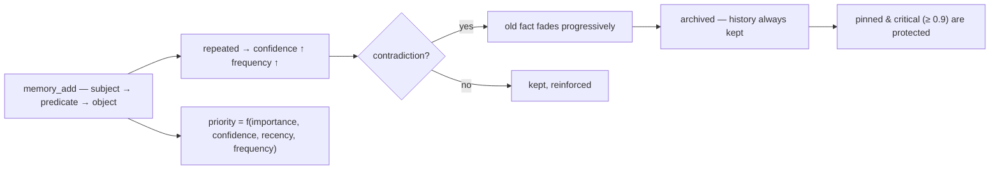

<p align="center">
  🌍 <strong>Languages:</strong>
  <a href="README.md">🇬🇧 English</a> ·
  <a href="README.fr.md">🇫🇷 Français</a> ·
  <a href="README.de.md">🇩🇪 Deutsch</a> ·
  <a href="README.es.md">🇪🇸 Español</a> ·
  <a href="README.it.md">🇮🇹 Italiano</a> ·
  <a href="README.pt.md">🇵🇹 Português</a> ·
  <a href="README.nl.md">🇳🇱 Nederlands</a> ·
  <a href="README.ru.md">🇷🇺 Русский</a> ·
  <a href="README.ja.md">🇯🇵 日本語</a> ·
  <a href="README.zh.md">🇨🇳 中文</a> ·
  <a href="README.ko.md">🇰🇷 한국어</a> ·
  <a href="README.pl.md">🇵🇱 Polski</a> ·
  <a href="README.tr.md">🇹🇷 Türkçe</a> ·
  <a href="README.uk.md">🇺🇦 Українська</a> ·
  <a href="README.hi.md">🇮🇳 हिन्दी</a> ·
  <a href="README.vi.md">🇻🇳 Tiếng Việt</a>
</p>

<p align="center">
  
</p>

<p align="center">
  <a href="https://www.npmjs.com/package/memsem"></a>
  <a href="LICENSE"></a>
  = 22.13">
  <a href="https://github.com/WindSeries69/memsem/actions"></a>
  
  
</p>

> **Semantic memory for AI agents** — remembers what matters, knows what to forget.
> One command to install. Works in *every* project, for *every* AI. 100% local.

## Why?

Your AI forgets everything between sessions. `CLAUDE.md` is a static file — it can't learn.
Vector databases are heavy and often cloud-hosted. Most "memory" tools are passive storage:
they keep what you throw at them, never prioritize, never reconcile contradictions.

**memsem is different.** It's a memory *system*, not a drawer:

- 🧠 **It writes itself** — during a session, your AI records durable facts (preferences, decisions, constraints) automatically. No more "remember to save this".
- ⚖️ **It prioritizes** — every fact has a dynamic priority (`importance × confidence × recency × frequency`). When context is tight, the most relevant memories always surface first.
- 🔄 **It handles contradictions** — "I've been drinking milk for years… wait, I'm lactose intolerant." The old fact doesn't get overwritten: it *fades* progressively and archives, with full history preserved. Critical facts (importance ≥ 0.9) are protected.
- 🔗 **It bridges concepts** — an optional local semantic index (Ollama, on your machine) lets `fromage` find `lactose` without a single shared word.
- 🕰️ **It has episodic memory** — session summaries on top of semantic facts, like the brain's two long-term systems.
- 🔧 **It maintains itself** — background agents consolidate small facts into patterns (the "hippocampus") and recalibrate priorities by pairwise comparison, only when it makes the memory *better to search*.

## See it work

Install once, let it run. This is a real session on a throwaway database — your actual memory is never touched (`node scripts/demo.mjs`):

<p align="center">
  
</p>

```
=== memsem — demo on a temporary database ===
(your real memory in ~/.memory-mcp stays untouched)

1. The AI writes durable facts (memory_add_many)
   → 4 facts written

2. Strict search (lexical): memory_search { query: 'milk' }
   → user → drinks → milk

3. Semantic search (relax, local embeddings): memory_search { query: 'cheese', relax: true }
   No shared word with « lactose » — the local semantic index (Ollama) bridges it
   → lactose → is-present-in → cheese, yogurt, cream
   → user → is-intolerant-to → lactose
   → user → drinks → milk

4. Soft supersession: the AI learns you no longer drink milk
   → conflict: true, old fact faded (faded: [1])

5. Search now returns the current fact
   → user → drinks → no more milk (lactose intolerant)
   → user → drinks → milk

Stats: 5 active memories, semantic index OK (mxbai-embed-large)
```

## Privacy — your memory is yours

- **100% local** — stored in `~/.memory-mcp/memory.db` on *your* machine. No cloud, no telemetry, nothing leaves your computer.
- **Never committed** — the database lives outside every repository. Clone a public repo, push code, share screenshots: your memory stays with you. Each user has their own memory.
- **The memory follows *you***, not your projects — the same base is shared across all your repos. Create a new folder, a new repo: the memory is still there.

## Install

### opencode — one line

Add to `opencode.json` (project or `~/.config/opencode/opencode.json`):

```json
{ "plugin": ["memsem"] }
```

That's it. The plugin registers the MCP server, injects the memory protocol and the memory index into every session, grants the needed permissions, and runs the background agents. Restart opencode.

### Claude Code — one command

```bash
npx -y memsem setup
```

This registers the MCP server (`claude mcp add memory -- npx -y memsem`) and adds a "memsem memory" block to `~/.claude/CLAUDE.md` pointing to the full protocol.

**Or install it with AI**: just paste into Claude:

> Install the memsem persistent memory: run `npx -y memsem setup`, read `~/.memsem/memory-protocol.md`, and apply the protocol.

### Any MCP client

```bash
npx -y memsem
```

The server speaks MCP over stdio. Point any MCP-capable host at it and inject `memory-protocol.md` into the host's instructions (e.g. as `AGENTS.md`) to make the AI autonomous.

### Universal installer

```bash
npx -y memsem setup        # detects and configures your hosts (opencode, Claude)
npx -y memsem setup --help # see options
```

Idempotent, safe, reversible (`--uninstall`).

## How it works

<p align="center">
  
</p>

**The memory lifecycle** — every fact follows the same path:



- **Atomic facts** — every memory is a `subject → predicate → object` triple with importance, confidence, frequency, tags, theme, provenance.
- **Themes & focus** — hierarchical themes (`food/drinks`) are the routing map; a search by theme crosses all projects. The `focus` list keeps the session's active themes at full priority.
- **Dynamic priority** — `0.45 × importance + 0.25 × confidence + 0.2 × recency + 0.1 × frequency`. A critical fact beats a recurring pattern.
- **Soft supersession** — contradictions fade the old fact (confidence decays) until it archives under a threshold. History is always kept.
- **Semantic index (optional)** — each fact is embedded locally (`mxbai-embed-large` via Ollama); `relax: true` searches add cosine similarity (threshold 0.5). Without Ollama, everything works identically — strict lexical search.

## Comparison

| | memsem | `CLAUDE.md` / notes | mem0 | Zep / Graphiti | official memory MCP | Obsidian as memory |
|---|---|---|---|---|---|---|
| Auto-writes during sessions | ✅ | ❌ | ⚠️ via app code | ⚠️ via app code | ❌ | ❌ |
| Priority for context budget | ✅ | ❌ | ❌ | ❌ | ❌ | ❌ |
| Contradictions (soft supersession) | ✅ | ❌ (overwrites) | ❌ (overwrites) | ✅ (temporal versioning) | ❌ | ❌ |
| Semantic search | ✅ local (Ollama) | ❌ | ✅ (vector store) | ✅ (graph + embeddings) | ❌ | ⚠️ (plugins) |
| Episodic memory + self-maintenance | ✅ | ❌ | ⚠️ (episodic add-ons) | ✅ (temporal knowledge graph) | ❌ | ❌ |
| One memory across all your repos | ✅ | ❌ (per project) | ⚠️ (per app config) | ⚠️ (per app config) | ❌ | ⚠️ (vault) |
| Zero dependency, `npx -y` | ✅ | ✅ | ❌ | ❌ | ✅ | ✅ |
| Human-readable / editable | ⚠️ (CLI list/edit) | ✅ | ❌ | ❌ | ✅ (JSON) | ✅ |

*Comparison as of Aug 2026, from public docs; capabilities evolve — verify before choosing.*

## Command line

Everything that can be done through MCP can be done from a terminal:

```bash
memsem list [--theme x] [--project p] [--limit n] [--all]   # read your memory
memsem edit <id> [--object "..."] [--importance 0.6] [...]  # fix a fact by hand (audited)
memsem forget <id> [--yes]                                  # archive a fact (confirm)
memsem doctor [--limit n] [--hours h]                       # most-modified facts — spot drift
memsem export [--output f] [--project p]                    # full JSON dump
memsem import <file.json>                                   # restore / merge a dump
memsem setup [--host opencode|claude]                       # install for your hosts
```

Manual fixes are written to the audit journal — `memsem doctor` shows them too.

## Configuration

Tunable constants (priority weights, thresholds, fade factors, model…) live in
[`src/config.ts`](src/config.ts). Override any of them in `~/.memsem/config.json`
(or `$MEMSEM_CONFIG`), deep-merged with validation:

```json
{ "priority": { "importance": 0.4, "confidence": 0.3 }, "minLexical": 0.4 }
```

Settings are documented and validated by a benchmark
([`scripts/bench.mjs`](scripts/bench.mjs) — 51 facts, 20 queries, P@k/R@k across
constant sets; results in [`DESIGN.md`](DESIGN.md) §11).

## Durability

The database is versioned and migrated automatically at startup (`schema_migrations`),
with an automatic backup before any migration (`~/.memory-mcp/backups/`, last 5 kept).
WAL mode is on — a crash mid-write leaves the database intact. Full dumps and
restores via `memsem export` / `memsem import`.

## Documentation

- [`memory-protocol.md`](memory-protocol.md) — the protocol injected into your AI: how it writes, searches, and maintains memory automatically.
- [`DESIGN.md`](DESIGN.md) — full design: vision, principles, the lactose case study, constant calibration, roadmap.
- [`scripts/demo.mjs`](scripts/demo.mjs) — reproduce the demo above on a throwaway database.

## Roadmap

- [x] Semantic index (local Ollama embeddings)
- [x] Episodic memory + session extraction
- [x] Hippocampus consolidation + pairwise scoring judge
- [x] Universal opencode plugin + `memsem setup`
- [x] Versioned migrations + automatic backup + export/import
- [x] Configurable constants, validated by a benchmark
- [x] Secure judge: dry-run, audit journal, guardrails, `memsem doctor`
- [x] CLI: `list` / `edit` / `forget` — fix a fact by hand
- [ ] Obsidian bridge: export/import memory as readable markdown notes
- [ ] Multi-hop graph propagation

## License

MIT — free for anything. Your memory stays yours.
