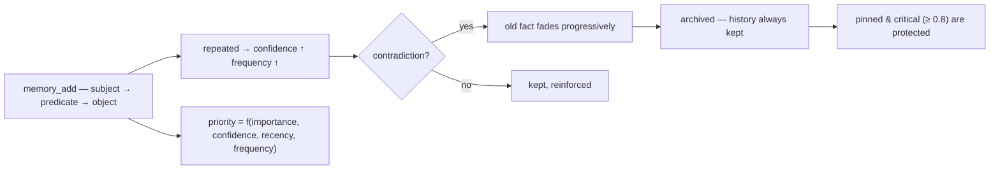

<p align="center">
  🌍 <strong>Languages:</strong>
  <a href="README.md">🇬🇧 English</a> ·
  <a href="README.fr.md">🇫🇷 Français</a> ·
  <a href="README.de.md">🇩🇪 Deutsch</a> ·
  <a href="README.es.md">🇪🇸 Español</a> ·
  <a href="README.it.md">🇮🇹 Italiano</a> ·
  <a href="README.pt.md">🇵🇹 Português</a> ·
  <a href="README.nl.md">🇳🇱 Nederlands</a> ·
  <a href="README.ru.md">🇷🇺 Русский</a> ·
  <a href="README.ja.md">🇯🇵 日本語</a> ·
  <a href="README.zh.md">🇨🇳 中文</a> ·
  <a href="README.ko.md">🇰🇷 한국어</a> ·
  <a href="README.pl.md">🇵🇱 Polski</a> ·
  <a href="README.tr.md">🇹🇷 Türkçe</a> ·
  <a href="README.uk.md">🇺🇦 Українська</a> ·
  <a href="README.hi.md">🇮🇳 हिन्दी</a> ·
  <a href="README.vi.md">🇻🇳 Tiếng Việt</a>
</p>

<p align="center">
  
</p>

<p align="center">
  <a href="https://www.npmjs.com/package/memsem"></a>
  <a href="LICENSE"></a>
  = 22.13">
  <a href="https://github.com/WindSeries69/memsem/actions"></a>
  
  
</p>

> **Semantic memory for AI agents** — onthoudt wat ertoe doet, weet wat het moet vergeten.
> Één commando om te installeren. Werkt in *elk* project, voor *elke* AI. 100% lokaal.

## Waarom — als er al grote geheugensystemen bestaan?

Die bestaan, en ze hebben de moeilijke delen goed opgelost: vector-winkels (mem0), temporele
kennisdatagrafen (Zep / Graphiti), agent-frameworks (MemGPT / Letta). Maar ze delen allemaal
dezelfde drie gebreken:

1. **Ruwe opslag, geen structuur.** Ze bewaren wat je erin gooit, en het ophalen is een
   similariteitszoektocht over *alles*. De AI weet niet **waar hij moet kijken** — dus kijkt
   hij overal, en de ruis verdrinkt het signaal.
2. **Geen precisie.** Een fuzzy match is een fuzzy match: bijna-juiste herinneringen vullen
   het contextbudget en verspillen tokens.
3. **Geen zelfcorrectie.** Een feit dat maanden geleden is tegengesproken, blijft net zo
   sterk als op de dag dat het werd geschreven.

memsem lost precies deze drie dingen op:

- 🧭 **Het weet waar het moet zoeken.** Elke sessie begint met een routeringskaart
  (`memory-index.md`): thema's + trefwoorden, geïnjecteerd in de context. De AI routeert
  per thema, kruist projecten, en betaalt alleen voor wat hij nodig heeft.
  Hiërarchische thema's + een levende focuslijst houden de actieve takken van de sessie op
  volle prioriteit — de rest wordt gedempt, nooit verloren.
- 🎯 **Het is precies.** Strikte lexicale zoektocht standaard (drempel van 50%
  woordovereenkomst, geen graafpropagatie tenzij je er expliciet om vraagt) — een query
  geeft de juiste feiten terug, gerangschikt op dynamische prioriteit
  (`importance × confidence × recency × frequency`). Precisie wordt gemeten, niet
  aangenomen: **P@3 0.958** op de referentiebenchmark (51 feiten, 20 queries,
  [`scripts/bench.mjs`](scripts/bench.mjs), resultaten in
  [`DESIGN.md`](DESIGN.md) §11).
- 🔄 **Het corrigeert zichzelf.** Tegenstrijdigheden laten het oude feit vervagen in plaats
  van het te overschrijven ("Ik heb jarenlang melk gedronken… wacht, lactose-intolerant") —
  de geschiedenis wordt altijd bewaard, kritieke feiten (≥ 0.8) worden beschermd.
  Achtergrondagenten extraheren duurzame feiten aan het einde van de sessie, consolideren
  kleine feiten tot patronen, en kalibreren prioriteiten opnieuw — alleen wanneer de
  geheugen blijft *minstens zo doorzoekbaar*.

Alle beloften van de grote systemen, minus hun gebreken: één commando, 100% lokaal, en
jouw geheugen blijft van jou — nooit gecommit, per gebruiker, gedeeld over al je repos.

## Zie het aan het werk

Installeer één keer, laat het draaien. Dit is een echte sessie op een weggooidatabase — jouw
echte geheugen wordt nooit aangeraakt (`node scripts/demo.mjs`):

<p align="center">
  
</p>

```
=== memsem — demo on a temporary database ===
(your real memory in ~/.memory-mcp stays untouched)

1. The AI writes durable facts (memory_add_many)
   → 4 facts written

2. Strict search (lexical): memory_search { query: 'milk' }
   → user → drinks → milk

3. Semantic search (relax, local embeddings): memory_search { query: 'cheese', relax: true }
   No shared word with « lactose » — the local semantic index (Ollama) bridges it
   → lactose → is-present-in → cheese, yogurt, cream
   → user → is-intolerant-to → lactose
   → user → drinks → milk

4. Soft supersession: the AI learns you no longer drink milk
   → conflict: true, old fact faded (faded: [1])

5. Search now returns the current fact
   → user → drinks → no more milk (lactose intolerant)
   → user → drinks → milk

Stats: 5 active memories, semantic index OK (mxbai-embed-large)
```

## Privacy — jouw geheugen is van jou

- **100% lokaal** — opgeslagen in `~/.memory-mcp/memory.db` op *jouw* machine. Geen cloud,
  geen telemetrie, niets verlaat je computer.
- **Nooit gecommit** — de database leeft buiten elke repository. Kloon een publieke repo,
  push code, deel screenshots: jouw geheugen blijft bij jou. Elke gebruiker heeft zijn
  eigen geheugen.
- **Het geheugen volgt *jou***, niet je projecten — dezelfde basis wordt gedeeld over al
  je repos. Maak een nieuwe map, een nieuwe repo: het geheugen is er nog steeds.

## Installatie

### opencode — één regel

Voeg toe aan `opencode.json` (project of `~/.config/opencode/opencode.json`):

```json
{ "plugin": ["memsem"] }
```

Dat is alles. De plugin registreert de MCP-server, injecteert het geheugenprotocol en de
geheugenindex in elke sessie, verleent de nodige rechten, en draait de achtergrondagenten.
Herstart opencode.

### Claude Code — één commando

```bash
npx -y memsem setup
```

Dit registreert de MCP-server (`claude mcp add memory -- npx -y memsem`) en voegt een
"memsem memory"-blok toe aan `~/.claude/CLAUDE.md` dat verwijst naar het volledige protocol.

**Of installeer het met AI**: plak dit gewoon in Claude:

> Installeer het memsem-persistent geheugen: draai `npx -y memsem setup`, lees
> `~/.memsem/memory-protocol.md`, en pas het protocol toe.

### Elke MCP-client

```bash
npx -y memsem
```

De server spreekt MCP over stdio. Wijs elke MCP-capabele host erop aan en injecteer
`memory-protocol.md` in de instructies van de host (bijv. als `AGENTS.md`) om de AI
autonoom te maken.

### Universele installer

```bash
npx -y memsem setup        # detecteert en configureert je hosts (opencode, Claude)
npx -y memsem setup --help # zie opties
```

Idempotent, veilig, omkeerbaar (`--uninstall`).

## Hoe het werkt

<p align="center">
  
</p>

**De geheugenlevenscyclus** — elk feit volgt hetzelfde pad:



- **Atomaire feiten** — elke herinnering is een `subject → predicate → object`-triplé met
  importance, confidence, frequency, tags, theme, provenance.
- **Thema's & focus** — hiërarchische thema's (`food/drinks`) zijn de routeringskaart; een
  zoektocht per thema kruist alle projecten. De `focus`-lijst houdt de actieve thema's van
  de sessie op volle prioriteit.
- **Dynamische prioriteit** — `0.45 × importance + 0.25 × confidence + 0.2 × recency +
  0.1 × frequency`. Een kritiek feit verslaat een terugkerend patroon.
- **Zachte supersessie** — tegenstrijdigheden laten het oude feit vervagen (confidence
  neemt af) tot het onder een drempel wordt gearchiveerd. Geschiedenis wordt altijd
  bewaard.
- **Semantische index (optioneel)** — elk feit wordt lokaal geëmbed ( `mxbai-embed-large`
  via Ollama); `relax: true`-zoektochten voegen cosinus-similariteit toe (drempel 0.5).
  Zonder Ollama werkt alles identiek — strikte lexicale zoektocht.

## Vergelijking

| | memsem | `CLAUDE.md` / notities | mem0 | Zep / Graphiti | officiële memory MCP | Obsidian als geheugen |
|---|---|---|---|---|---|---|
| Schrijft automatisch tijdens sessies | ✅ | ❌ | ⚠️ via app-code | ⚠️ via app-code | ❌ | ❌ |
| Prioriteit voor contextbudget | ✅ | ❌ | ❌ | ❌ | ❌ | ❌ |
| Tegenstrijdigheden (zachte supersessie) | ✅ | ❌ (overschrijft) | ❌ (overschrijft) | ✅ (temporele versiebeheer) | ❌ | ❌ |
| Semantische zoektocht | ✅ lokaal (Ollama) | ❌ | ✅ (vector-winkel) | ✅ (graaf + embeddings) | ❌ | ⚠️ (plugins) |
| Episodisch geheugen + zelfonderhoud | ✅ | ❌ | ⚠️ (episodische add-ons) | ✅ (temporele kennisdatagraaf) | ❌ | ❌ |
| Eén geheugen over al je repos | ✅ | ❌ (per project) | ⚠️ (per app-config) | ⚠️ (per app-config) | ❌ | ⚠️ (vault) |
| Nul afhankelijkheden, `npx -y` | ✅ | ✅ | ❌ | ❌ | ✅ | ✅ |
| Leesbaar / bewerkbaar door mensen | ⚠️ (CLI list/edit) | ✅ | ❌ | ❌ | ✅ (JSON) | ✅ |

*Vergelijking van aug 2026, uit publieke documentatie; mogelijkheden evolueren — verifieer
voordat je kiest.*

## Opdrachtregel

Alles wat via MCP kan, kan ook vanaf een terminal:

```bash
memsem list [--theme x] [--project p] [--limit n] [--all]   # lees je geheugen
memsem edit <id> [--object "..."] [--importance 0.6] [...]  # corrigeer een feit met de hand (gecontroleerd)
memsem forget <id> [--yes]                                  # archiveer een feit (bevestiging)
memsem doctor [--limit n] [--hours h]                       # meest gewijzigde feiten — zie afwijkingen
memsem export [--output f] [--project p]                    # volledige JSON-dump
memsem import <file.json>                                   # herstel / voeg een dump samen
memsem setup [--host opencode|claude]                       # installeer voor je hosts
```

Handmatige correcties worden naar het auditlogboek geschreven — `memsem doctor` toont ze ook.

## Configuratie

Aanpasbare constanten (prioriteitsgewichten, drempels, vervagingsfactoren, model…) staan in
[`src/config.ts`](src/config.ts). Overschrijf elk ervan in `~/.memsem/config.json`
(of `$MEMSEM_CONFIG`), diep samengevoegd met validatie:

```json
{ "priority": { "importance": 0.4, "confidence": 0.3 }, "minLexical": 0.4 }
```

Instellingen zijn gedocumenteerd en gevalideerd door een benchmark
([`scripts/bench.mjs`](scripts/bench.mjs) — 51 feiten, 20 queries, P@k/R@k over
constantsets; resultaten in [`DESIGN.md`](DESIGN.md) §11).

## Duurzaamheid

De database is geversioneerd en wordt automatisch gemigreerd bij het opstarten
(`schema_migrations`), met een automatische back-up vóór elke migratie
(`~/.memory-mcp/backups/`, laatste 5 bewaard). WAL-modus is aan — een crash midden in een
schrijfbewerking laat de database intact. Volledige dumps en herstellen via
`memsem export` / `memsem import`.

## Documentatie

- [`memory-protocol.md`](memory-protocol.md) — het protocol dat in je AI wordt
  geïnjecteerd: hoe het geheugen automatisch schrijft, zoekt en onderhoudt.
- [`DESIGN.md`](DESIGN.md) — volledig ontwerp: visie, principes, de lactose-casestudy,
  constantekalibratie, routekaart.
- [`scripts/demo.mjs`](scripts/demo.mjs) — reproduceer de demo hierboven op een
  weggooidatabase.

## Bekende beperkingen

Eerlijk gelezen, uit een onafhankelijke review ([Agent Memory Atlas](https://neoneye.github.io/agent-memory-atlas/systems/memsem/)):

- **Het automatische correctiepad heeft geen slot.** Een afgewezen waarde die
  *opnieuw wordt bevestigd* (zeg dat hetzelfde oude transcript tien keer wordt gelezen) keert terug en
  vervaagt de eigen correctie — een gewone correctie wordt gearchiveerd bij de derde
  herbevestiging. Alleen een **mens die een kandidaat afwijst** schrijft een
  duurzame onderdrukking (`memory_suppressions`) die de waarde botweg weigert. Dit is
  een bewuste positie (herhaling is bewijs) met een reële kost.
- **Een pin beschermt overleving, niet zichtbaarheid.** Een vastgezette correctie verliest nooit
  vertrouwen en blijft eerste in `memsem list`, maar een herhaalde afgewezen waarde
  kan nog steeds het bovenste `memory_search`-resultaat innemen.
- **`import` schrijft achter de poort** — het herstellen van een back-up brengt een
  onderdrukte waarde terug.
- **Een geweigerde schrijfoperatie laat geen auditregel na**, en het opschonen van een beoordeeld feit
  laat zijn tekst achter in `memory_candidates`.
- **De veiligheidsregels voor consolidatie en extractie zijn prompts, geen code.**

Ruwe randjes, geen bugs — elk ervan wordt bijgehouden in de routekaart van [DESIGN.md](DESIGN.md)
en open vragen.

## Routekaart

- [x] Semantische index (lokale Ollama-embeddings)
- [x] Episodisch geheugen + sessie-extractie
- [x] Hippocampus-consolidatie + pairwise-scoringjudge
- [x] Universele opencode-plugin + `memsem setup`
- [x] Geversioneerde migraties + automatische back-up + export/import
- [x] Configureerbare constanten, gevalideerd door een benchmark
- [x] Veilige judge: dry-run, auditlogboek, guardrails, `memsem doctor`
- [x] CLI: `list` / `edit` / `forget` — corrigeer een feit met de hand
- [x] Multi-hop-graafpropagatie
- [ ] Write gate op het automatische pad (beslissing supersessie → onderdrukking)
- [ ] `import` achter de poort (raadpleeg de onderdrukkingen)
- [ ] Audit van weigeringen; kandidaatteksten opschonen; consolidatieregels in code
- [ ] Obsidian-brug: exporteer/importeer geheugen als leesbare markdown-notities

## Licentie

MIT — gratis voor alles. Jouw geheugen blijft van jou.
