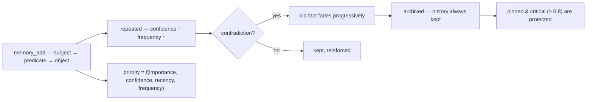

<p align="center">
  🌍 <strong>Languages:</strong>
  <a href="README.md">🇬🇧 English</a> ·
  <a href="README.fr.md">🇫🇷 Français</a> ·
  <a href="README.de.md">🇩🇪 Deutsch</a> ·
  <a href="README.es.md">🇪🇸 Español</a> ·
  <a href="README.it.md">🇮🇹 Italiano</a> ·
  <a href="README.pt.md">🇵🇹 Português</a> ·
  <a href="README.nl.md">🇳🇱 Nederlands</a> ·
  <a href="README.ru.md">🇷🇺 Русский</a> ·
  <a href="README.ja.md">🇯🇵 日本語</a> ·
  <a href="README.zh.md">🇨🇳 中文</a> ·
  <a href="README.ko.md">🇰🇷 한국어</a> ·
  <a href="README.pl.md">🇵🇱 Polski</a> ·
  <a href="README.tr.md">🇹🇷 Türkçe</a> ·
  <a href="README.uk.md">🇺🇦 Українська</a> ·
  <a href="README.hi.md">🇮🇳 हिन्दी</a> ·
  <a href="README.vi.md">🇻🇳 Tiếng Việt</a>
</p>

<p align="center">
  
</p>

<p align="center">
  <a href="https://www.npmjs.com/package/memsem"></a>
  <a href="LICENSE"></a>
  = 22.13">
  <a href="https://github.com/WindSeries69/memsem/actions"></a>
  
  
</p>

> **Pamięć semantyczna dla agentów AI** — pamięta to, co ważne, wie, co zapomnieć.
> Jedna komenda do instalacji. Działa w *każdym* projekcie, dla *każdego* AI. W 100% lokalnie.

## Dlaczego — skoro istnieją już duże systemy pamięci?

Istnieją i dobrze rozwiązały trudne części: magazyny wektorowe (mem0), czasowe
grafy wiedzy (Zep / Graphiti), frameworki agentowe (MemGPT / Letta). Ale
wszystkie mają te same trzy wady:

1. **Surowy magazyn, brak struktury.** Przechowują wszystko, co do nich
   wrzucisz, a wyszukiwanie to porównywanie podobieństwa po *wszystkim*. AI nie
   wie, **gdzie szukać** — więc szuka wszędzie, a szum zagłusza sygnał.
2. **Brak precyzji.** Rozmyte dopasowanie to rozmyte dopasowanie: prawie-trafne
   pamięci wypełniają budżet kontekstu i marnują tokeny.
3. **Brak samokorekty.** Fakt zaprzeczony miesiące temu pozostaje tak samo silny
   jak w dniu zapisania.

memsem naprawia dokładnie te trzy rzeczy:

- 🧭 **Wie, gdzie szukać.** Każda sesja zaczyna się od karty routingu
  (`memory-index.md`): tematy + słowa kluczowe, wstrzykiwane do kontekstu. AI
  routuje po tematach, przekracza granice projektów i płaci tylko za to, czego
  potrzebuje. Tematy hierarchiczne + żywa lista focus utrzymują aktywne gałęzie
  sesji na pełnym priorytecie — reszta jest tłumiona, nigdy nie tracona.
- 🎯 **Jest precyzyjna.** Domyślnie ścisłe wyszukiwanie leksykalne (próg 50%
  zgodności słów, bez propagacji po grafie, chyba że wyraźnie o to poprosisz) —
  zapytanie zwraca właściwe fakty, uszeregowane według dynamicznego priorytetu
  (`importance × confidence × recency × frequency`). Precyzja jest mierzona,
  nie zakładana: **P@3 0.958** na referencyjnym benchmarku (51 faktów, 20
  zapytań, [`scripts/bench.mjs`](scripts/bench.mjs), wyniki w
  [`DESIGN.md`](DESIGN.md) §11).
- 🔄 **Koryguje się sama.** Sprzeczności wygaszają stary fakt zamiast go
  nadpisywać („piłem mleko przez lata… chwila, nietolerancja laktozy") —
  historia jest zawsze zachowana, fakty krytyczne (≥ 0.8) są chronione. Agenci
  w tle wyciągają trwałe fakty na koniec sesji, konsolidują drobne fakty we
  wzorce i recalibrują priorytety — tylko wtedy, gdy pamięć pozostaje
  *przynajmniej tak samo przeszukiwalna*.

Wszystkie obietnice wielkich systemów, minus ich wady: jedna komenda, 100%
lokalnie, a Twoja pamięć pozostaje Twoja — nigdy nie commitowana, per
użytkownik, współdzielona we wszystkich Twoich repo.

## Zobacz to w działaniu

Zainstaluj raz i pozwól jej działać. To prawdziwa sesja na jednorazowej bazie danych — Twoja prawdziwa pamięć nigdy nie jest dotykana (`node scripts/demo.mjs`):

<p align="center">
  
</p>

```
=== memsem — demo on a temporary database ===
(your real memory in ~/.memory-mcp stays untouched)

1. The AI writes durable facts (memory_add_many)
   → 4 facts written

2. Strict search (lexical): memory_search { query: 'milk' }
   → user → drinks → milk

3. Semantic search (relax, local embeddings): memory_search { query: 'cheese', relax: true }
   No shared word with « lactose » — the local semantic index (Ollama) bridges it
   → lactose → is-present-in → cheese, yogurt, cream
   → user → is-intolerant-to → lactose
   → user → drinks → milk

4. Soft supersession: the AI learns you no longer drink milk
   → conflict: true, old fact faded (faded: [1])

5. Search now returns the current fact
   → user → drinks → no more milk (lactose intolerant)
   → user → drinks → milk

Stats: 5 active memories, semantic index OK (mxbai-embed-large)
```

## Prywatność — pamięć należy do Ciebie

- **100% lokalnie** — przechowywana w `~/.memory-mcp/memory.db` na *Twojej* maszynie. Żadnej chmury, żadnej telemetrii, nic nie opuszcza Twojego komputera.
- **Nigdy nie commitowana** — baza danych żyje poza każdym repozytorium. Sklonuj publiczne repo, wypchnij kod, udostępnij zrzuty ekranu: Twoja pamięć zostaje z Tobą. Każdy użytkownik ma własną pamięć.
- **Pamięć podąża za *Tobą***, nie za Twoimi projektami — ta sama baza jest współdzielona we wszystkich Twoich repo. Utwórz nowy folder, nowe repo: pamięć wciąż tam jest.

## Instalacja

### opencode — jedna linia

Dodaj do `opencode.json` (projektowego lub `~/.config/opencode/opencode.json`):

```json
{ "plugin": ["memsem"] }
```

I to wszystko. Wtyczka rejestruje serwer MCP, wstrzykuje protokół pamięci i indeks pamięci do każdej sesji, przyznaje potrzebne uprawnienia i uruchamia agentów w tle. Zrestartuj opencode.

### Claude Code — jedna komenda

```bash
npx -y memsem setup
```

Rejestruje to serwer MCP (`claude mcp add memory -- npx -y memsem`) i dodaje blok „memsem memory" do `~/.claude/CLAUDE.md`, wskazujący na pełny protokół.

**Albo zainstaluj z AI**: po prostu wklej do Claude:

> Zainstaluj trwałą pamięć memsem: uruchom `npx -y memsem setup`, przeczytaj `~/.memsem/memory-protocol.md` i zastosuj protokół.

### Dowolny klient MCP

```bash
npx -y memsem
```

Serwer mówi MCP przez stdio. Wskaż na niego dowolnego hosta obsługującego MCP i wstrzyknij `memory-protocol.md` do instrukcji hosta (np. jako `AGENTS.md`), aby AI działało autonomicznie.

### Uniwersalny instalator

```bash
npx -y memsem setup        # detects and configures your hosts (opencode, Claude)
npx -y memsem setup --help # see options
```

Idempotentny, bezpieczny, odwracalny (`--uninstall`).

## Jak to działa

<p align="center">
  
</p>

**Cykl życia pamięci** — każdy fakt podąża tą samą ścieżką:



- **Fakty atomowe** — każda pamięć to trójka `subject → predicate → object` z wagą (importance), pewnością (confidence), częstotliwością (frequency), tagami, tematem i pochodzeniem (provenance).
- **Tematy i focus** — hierarchiczne tematy (`food/drinks`) to mapa routingu; wyszukiwanie po temacie przekracza granice wszystkich projektów. Lista `focus` utrzymuje aktywne tematy sesji na pełnym priorytecie.
- **Dynamiczny priorytet** — `0.45 × importance + 0.25 × confidence + 0.2 × recency + 0.1 × frequency`. Fakt krytyczny bije powtarzający się wzorzec.
- **Miękka supersesja** — sprzeczności wygaszają stary fakt (pewność zanika), aż zostanie zarchiwizowany poniżej progu. Historia jest zawsze zachowana.
- **Indeks semantyczny (opcjonalnie)** — każdy fakt jest embedowany lokalnie (`mxbai-embed-large` przez Ollama); wyszukiwania z `relax: true` dodają podobieństwo kosinusowe (próg 0.5). Bez Ollamy wszystko działa identycznie — ścisłe wyszukiwanie leksykalne.

## Porównanie

| | memsem | `CLAUDE.md` / notes | mem0 | Zep / Graphiti | official memory MCP | Obsidian as memory |
|---|---|---|---|---|---|---|
| Automatyczne zapisy w trakcie sesji | ✅ | ❌ | ⚠️ przez kod aplikacji | ⚠️ przez kod aplikacji | ❌ | ❌ |
| Priorytetyzacja dla budżetu kontekstu | ✅ | ❌ | ❌ | ❌ | ❌ | ❌ |
| Sprzeczności (miękka supersesja) | ✅ | ❌ (nadpisuje) | ❌ (nadpisuje) | ✅ (wersjonowanie czasowe) | ❌ | ❌ |
| Wyszukiwanie semantyczne | ✅ lokalnie (Ollama) | ❌ | ✅ (magazyn wektorowy) | ✅ (graf + embeddingi) | ❌ | ⚠️ (wtyczki) |
| Pamięć epizodyczna + samodzielna konserwacja | ✅ | ❌ | ⚠️ (dodatki epizodyczne) | ✅ (czasowy graf wiedzy) | ❌ | ❌ |
| Jedna pamięć we wszystkich repo | ✅ | ❌ (per projekt) | ⚠️ (per konfiguracja aplikacji) | ⚠️ (per konfiguracja aplikacji) | ❌ | ⚠️ (sejf) |
| Zero zależności, `npx -y` | ✅ | ✅ | ❌ | ❌ | ✅ | ✅ |
| Czytelna / edytowalna | ⚠️ (CLI list/edit) | ✅ | ❌ | ❌ | ✅ (JSON) | ✅ |

*Porównanie na dzień sierpnia 2026, na podstawie publicznej dokumentacji; możliwości ewoluują — zweryfikuj przed wyborem.*

## Wiersz poleceń

Wszystko, co można zrobić przez MCP, można zrobić z terminala:

```bash
memsem list [--theme x] [--project p] [--limit n] [--all]   # read your memory
memsem edit <id> [--object "..."] [--importance 0.6] [...]  # fix a fact by hand (audited)
memsem forget <id> [--yes]                                  # archive a fact (confirm)
memsem doctor [--limit n] [--hours h]                       # most-modified facts — spot drift
memsem export [--output f] [--project p]                    # full JSON dump
memsem import <file.json>                                   # restore / merge a dump
memsem setup [--host opencode|claude]                       # install for your hosts
```

Ręczne poprawki są zapisywane w dzienniku audytu — pokazuje je również `memsem doctor`.

## Konfiguracja

Regulowane stałe (wagi priorytetu, progi, współczynniki wygaszania, model…)
znajdują się w [`src/config.ts`](src/config.ts). Dowolną z nich możesz nadpisać
w `~/.memsem/config.json` (lub `$MEMSEM_CONFIG`) — głębokie scalanie
z walidacją:

```json
{ "priority": { "importance": 0.4, "confidence": 0.3 }, "minLexical": 0.4 }
```

Ustawienia są udokumentowane i walidowane przez benchmark
([`scripts/bench.mjs`](scripts/bench.mjs) — 51 faktów, 20 zapytań, P@k/R@k dla
różnych zestawów stałych; wyniki w [`DESIGN.md`](DESIGN.md) §11).

## Trwałość

Baza danych jest wersjonowana i migrowana automatycznie przy starcie (`schema_migrations`),
z automatyczną kopią zapasową przed każdą migracją (`~/.memory-mcp/backups/`, zachowywanych 5 ostatnich).
Tryb WAL jest włączony — awaria w trakcie zapisu pozostawia bazę nienaruszoną. Pełne zrzuty i
przywracanie przez `memsem export` / `memsem import`.

## Dokumentacja

- [`memory-protocol.md`](memory-protocol.md) — protokół wstrzykiwany do Twojego AI: jak automatycznie zapisuje, wyszukuje i utrzymuje pamięć.
- [`DESIGN.md`](DESIGN.md) — pełny projekt: wizja, zasady, studium przypadku laktozy, kalibracja stałych, plan rozwoju.
- [`scripts/demo.mjs`](scripts/demo.mjs) — odtwórz powyższą demonstrację na jednorazowej bazie danych.

## Znane ograniczenia

Przeczytaj szczerze, z niezależnej recenzji ([Agent Memory Atlas](https://neoneye.github.io/agent-memory-atlas/systems/memsem/)):

- **Automatyczna ścieżka korekty nie ma blokady.** Odrzucona wartość,
  *ponownie potwierdzona* (powiedzmy, ten sam stary transkrypt jest czytany
  dziesięć razy), wraca i wygasza własną korektę — zwykła korekta jest
  archiwizowana przy trzecim ponownym potwierdzeniu. Tylko **człowiek
  odrzucający kandydata** zapisuje trwałe tłumienie (`memory_suppressions`),
  które odrzuca wartość wprost. To celowe stanowisko (powtórzenie jest dowodem)
  z realnym kosztem.
- **Przypięcie chroni przetrwanie, nie widoczność.** Przypięta korekta nigdy
  nie traci pewności i pozostaje pierwsza na `memsem list`, ale powtarzana
  odrzucona wartość może nadal zająć pierwszy wynik `memory_search`.
- **`import` pisze poza bramą** — przywrócenie kopii zapasowej przywraca
  tłumioną wartość.
- **Odrzucony zapis nie pozostawia wiersza audytu**, a usunięcie sprawdzonego
  faktu pozostawia jego tekst w `memory_candidates`.
- **Zasady bezpieczeństwa konsolidacji i ekstrakcji to prompty, nie kod.**

Ostre krawędzie, nie błędy — każda jest śledzona w [DESIGN.md](DESIGN.md)
planie rozwoju i otwartych pytaniach.

## Plan rozwoju

- [x] Indeks semantyczny (lokalne embeddingi Ollama)
- [x] Pamięć epizodyczna + ekstrakcja sesji
- [x] Konsolidacja hipokampa + sędzia oceniający parami
- [x] Uniwersalna wtyczka opencode + `memsem setup`
- [x] Wersjonowane migracje + automatyczna kopia zapasowa + export/import
- [x] Konfigurowalne stałe, walidowane benchmarkiem
- [x] Bezpieczny sędzia: dry-run, dziennik audytu, zabezpieczenia, `memsem doctor`
- [x] CLI: `list` / `edit` / `forget` — popraw fakt ręcznie
- [x] Propagacja wieloprzeskokowa po grafie
- [ ] Write gate na automatycznej ścieżce (decyzja supersession → suppression)
- [ ] `import` za bramą (konsultowanie suppressions)
- [ ] Audyt odmów ; czyszczenie kandydatów ; reguły konsolidacji w kodzie
- [ ] Most Obsidian: export/import pamięci jako czytelne notatki markdown

## Licencja

MIT — wolne na wszystko. Twoja pamięć pozostaje Twoja.
