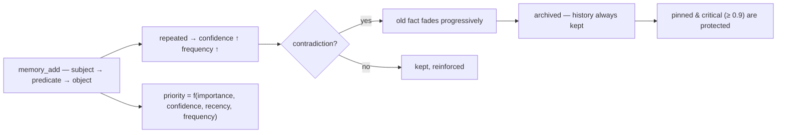

<p align="center">
  🌍 <strong>Languages:</strong>
  <a href="README.md">🇬🇧 English</a> ·
  <a href="README.fr.md">🇫🇷 Français</a> ·
  <a href="README.de.md">🇩🇪 Deutsch</a> ·
  <a href="README.es.md">🇪🇸 Español</a> ·
  <a href="README.it.md">🇮🇹 Italiano</a> ·
  <a href="README.pt.md">🇵🇹 Português</a> ·
  <a href="README.nl.md">🇳🇱 Nederlands</a> ·
  <a href="README.ru.md">🇷🇺 Русский</a> ·
  <a href="README.ja.md">🇯🇵 日本語</a> ·
  <a href="README.zh.md">🇨🇳 中文</a> ·
  <a href="README.ko.md">🇰🇷 한국어</a> ·
  <a href="README.pl.md">🇵🇱 Polski</a> ·
  <a href="README.tr.md">🇹🇷 Türkçe</a> ·
  <a href="README.uk.md">🇺🇦 Українська</a> ·
  <a href="README.hi.md">🇮🇳 हिन्दी</a> ·
  <a href="README.vi.md">🇻🇳 Tiếng Việt</a>
</p>

<p align="center">
  
</p>

<p align="center">
  <a href="https://www.npmjs.com/package/memsem"></a>
  <a href="LICENSE"></a>
  = 22.13">
  
  
</p>

> **Memória semântica para agentes de IA** — lembra o que importa, sabe o que esquecer.
> Um comando para instalar. Funciona em *todos* os projetos, para *toda* IA. 100% local.

## Por quê?

Sua IA esquece tudo entre as sessões. `CLAUDE.md` é um arquivo estático — ele não aprende.
Bancos de dados vetoriais são pesados e muitas vezes hospedados na nuvem. A maioria das ferramentas de "memória" é armazenamento passivo:
guardam o que você joga nelas, nunca priorizam, nunca reconciliam contradições.

**O memsem é diferente.** É um *sistema* de memória, não uma gaveta:

- 🧠 **Escreve-se sozinho** — durante uma sessão, sua IA registra fatos duráveis (preferências, decisões, restrições) automaticamente. Chega de "lembra de salvar isso".
- ⚖️ **Prioriza** — cada fato tem uma prioridade dinâmica (`importance × confidence × recency × frequency`). Quando o contexto está apertado, as memórias mais relevantes sempre vêm primeiro.
- 🔄 **Lida com contradições** — "Bebo leite há anos… espera, sou intolerante à lactose." O fato antigo não é sobrescrito: ele *desvanece* progressivamente e é arquivado, com histórico completo preservado. Fatos críticos (importância ≥ 0.9) são protegidos.
- 🔗 **Faz pontes entre conceitos** — um índice semântico local opcional (Ollama, na sua máquina) permite que `fromage` encontre `lactose` sem uma única palavra em comum.
- 🕰️ **Tem memória episódica** — resumos de sessão por cima dos fatos semânticos, como os dois sistemas de memória de longo prazo do cérebro.
- 🔧 **Mantém-se sozinho** — agentes de fundo consolidam fatos pequenos em padrões (o "hipocampo") e recalibram prioridades por comparação em pares, somente quando isso torna a memória *melhor de buscar*.

## Veja funcionando

Instale uma vez, deixe rodar. Esta é uma sessão real em um banco de dados descartável — sua memória real nunca é tocada (`node scripts/demo.mjs`):

```
=== memsem — demo on a temporary database ===
(your real memory in ~/.memory-mcp stays untouched)

1. The AI writes durable facts (memory_add_many)
   → 4 facts written

2. Strict search (lexical): memory_search { query: 'milk' }
   → user → drinks → milk

3. Semantic search (relax, local embeddings): memory_search { query: 'cheese', relax: true }
   No shared word with « lactose » — the local semantic index (Ollama) bridges it
   → lactose → is-present-in → cheese, yogurt, cream
   → user → is-intolerant-to → lactose
   → user → drinks → milk

4. Soft supersession: the AI learns you no longer drink milk
   → conflict: true, old fact faded (faded: [1])

5. Search now returns the current fact
   → user → drinks → no more milk (lactose intolerant)
   → user → drinks → milk

Stats: 5 active memories, semantic index OK (mxbai-embed-large)
```

## Privacidade — sua memória é sua

- **100% local** — armazenada em `~/.memory-mcp/memory.db` na *sua* máquina. Sem nuvem, sem telemetria, nada sai do seu computador.
- **Nunca é commitada** — o banco de dados vive fora de todos os repositórios. Clone um repo público, faça push de código, compartilhe capturas de tela: sua memória fica com você. Cada usuário tem a própria memória.
- **A memória segue *você***, não seus projetos — a mesma base é compartilhada entre todos os seus repos. Crie uma nova pasta, um novo repo: a memória continua lá.

## Instalação

### opencode — uma linha

Adicione ao `opencode.json` (do projeto ou `~/.config/opencode/opencode.json`):

```json
{ "plugin": ["memsem"] }
```

Pronto. O plugin registra o servidor MCP, injeta o protocolo de memória e o índice de memória em toda sessão, concede as permissões necessárias e roda os agentes de fundo. Reinicie o opencode.

### Claude Code — um comando

```bash
npx -y memsem setup
```

Isso registra o servidor MCP (`claude mcp add memory -- npx -y memsem`) e adiciona um bloco "memsem memory" ao `~/.claude/CLAUDE.md` apontando para o protocolo completo.

**Ou instale com IA**: basta colar no Claude:

> Instale a memória persistente do memsem: execute `npx -y memsem setup`, leia `~/.memsem/memory-protocol.md` e aplique o protocolo.

### Qualquer cliente MCP

```bash
npx -y memsem
```

O servidor fala MCP via stdio. Aponte qualquer host compatível com MCP para ele e injete `memory-protocol.md` nas instruções do host (por exemplo, como `AGENTS.md`) para tornar a IA autônoma.

### Instalador universal

```bash
npx -y memsem setup        # detecta e configura seus hosts (opencode, Claude)
npx -y memsem setup --help # veja as opções
```

Idempotente, seguro, reversível (`--uninstall`).

## Como funciona

<p align="center">
  
</p>

**O ciclo de vida da memória** — todo fato segue o mesmo caminho:



- **Fatos atômicos** — cada memória é um trio `subject → predicate → object` com importância, confiança, frequência, tags, tema e procedência.
- **Temas & foco** — temas hierárquicos (`food/drinks`) são o mapa de roteamento; uma busca por tema atravessa todos os projetos. A lista `focus` mantém os temas ativos da sessão com prioridade máxima.
- **Prioridade dinâmica** — `0.45 × importance + 0.25 × confidence + 0.2 × recency + 0.1 × frequency`. Um fato crítico vence um padrão recorrente.
- **Suplantação suave** — contradições desvanecem o fato antigo (a confiança decai) até que ele seja arquivado abaixo de um limite. O histórico é sempre mantido.
- **Índice semântico (opcional)** — cada fato é incorporado localmente (`mxbai-embed-large` via Ollama); buscas com `relax: true` adicionam similaridade por cosseno (limiar 0.5). Sem Ollama, tudo funciona de forma idêntica — busca lexical estrita.

## Comparação

| | memsem | `CLAUDE.md` / notes | mem0 | Zep / Graphiti | official memory MCP | Obsidian as memory |
|---|---|---|---|---|---|---|
| Auto-writes during sessions | ✅ | ❌ | ⚠️ via app code | ⚠️ | ❌ | ❌ |
| Priority for context budget | ✅ | ❌ | ❌ | ❌ | ❌ | ❌ |
| Contradictions (soft supersession) | ✅ | ❌ (overwrites) | ❌ (overwrites) | ❌ | ❌ | ❌ |
| Semantic search, local & private | ✅ (Ollama) | ❌ | ⚠️ (needs vector DB) | ⚠️ (needs graph DB) | ❌ | ⚠️ (plugins) |
| Episodic memory + self-maintenance | ✅ | ❌ | ❌ | ⚠️ | ❌ | ❌ |
| One memory across all your repos | ✅ | ❌ (per project) | ⚠️ | ⚠️ | ❌ | ⚠️ (vault) |
| Zero dependency, `npx -y` | ✅ | ✅ | ❌ | ❌ | ✅ | ✅ |
| Human-readable / editable | ❌ | ✅ | ❌ | ❌ | ✅ (JSON) | ✅ |

## Documentação

- [`memory-protocol.md`](memory-protocol.md) — o protocolo injetado na sua IA: como ela escreve, busca e mantém a memória automaticamente.
- [`DESIGN.md`](DESIGN.md) — design completo: visão, princípios, o estudo de caso da lactose, roadmap.
- [`scripts/demo.mjs`](scripts/demo.mjs) — reproduza a demonstração acima em um banco de dados descartável.

## Roadmap

- [x] Índice semântico (embeddings locais via Ollama)
- [x] Memória episódica + extração de sessão
- [x] Consolidação do hipocampo + juiz de pontuação em pares
- [x] Plugin universal do opencode + `memsem setup`
- [ ] Ponte Obsidian: exportar/importar memória como notas markdown legíveis
- [ ] Propagação no grafo multi-hop

## Licença

MIT — livre para qualquer uso. Sua memória continua sendo sua.
