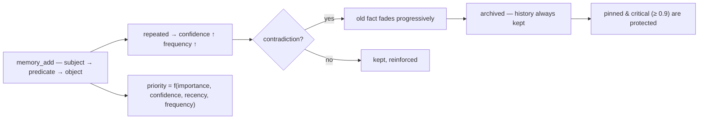

<p align="center">
  🌍 <strong>Languages:</strong>
  <a href="README.md">🇬🇧 English</a> ·
  <a href="README.fr.md">🇫🇷 Français</a> ·
  <a href="README.de.md">🇩🇪 Deutsch</a> ·
  <a href="README.es.md">🇪🇸 Español</a> ·
  <a href="README.it.md">🇮🇹 Italiano</a> ·
  <a href="README.pt.md">🇵🇹 Português</a> ·
  <a href="README.nl.md">🇳🇱 Nederlands</a> ·
  <a href="README.ru.md">🇷🇺 Русский</a> ·
  <a href="README.ja.md">🇯🇵 日本語</a> ·
  <a href="README.zh.md">🇨🇳 中文</a> ·
  <a href="README.ko.md">🇰🇷 한국어</a> ·
  <a href="README.pl.md">🇵🇱 Polski</a> ·
  <a href="README.tr.md">🇹🇷 Türkçe</a> ·
  <a href="README.uk.md">🇺🇦 Українська</a> ·
  <a href="README.hi.md">🇮🇳 हिन्दी</a> ·
  <a href="README.vi.md">🇻🇳 Tiếng Việt</a>
</p>

<p align="center">
  
</p>

<p align="center">
  <a href="https://www.npmjs.com/package/memsem"></a>
  <a href="LICENSE"></a>
  = 22.13">
  <a href="https://github.com/WindSeries69/memsem/actions"></a>
  
  
</p>

> **Memória semântica para agentes de IA** — lembra o que importa, sabe o que esquecer.
> Um comando para instalar. Funciona em *todo* projeto, com *toda* IA. 100% local.

## Porquê — quando já existem grandes sistemas de memória?

Eles existem e acertaram nas partes difíceis: armazenamento vetorial (mem0), grafo
de conhecimento temporal (Zep / Graphiti), frameworks de agentes (MemGPT / Letta).
Mas todos partilham os mesmos três defeitos:

1. **Armazenamento bruto, sem estrutura.** Guardam o que lhes atiras e a
   recuperação é uma busca por similaridade sobre *tudo*. A IA não sabe
   **onde procurar** — por isso procura em todo o lado, e o ruído afoga o sinal.
2. **Sem precisão.** Uma correspondência difusa é uma correspondência difusa:
   memórias quase-certas enchem o orçamento de contexto e desperdiçam tokens.
3. **Sem autocorreção.** Um facto contradito há meses continua tão forte quanto
   no dia em que foi escrito.

O memsem corrige exatamente estas três coisas:

- 🧭 **Ele sabe onde procurar.** Cada sessão começa com um cartão de roteamento
  (`memory-index.md`): temas + palavras-chave, injetado no contexto. A IA
  roteia por tema, atravessa projetos e só paga pelo que precisa.
  Temas hierárquicos + uma lista de foco viva mantêm os ramos ativos da sessão
  com prioridade total — o resto é atenuado, nunca perdido.
- 🎯 **Ele é preciso.** Busca lexical estrita por padrão (limiar de 50% de
  correspondência de palavras, sem propagação no grafo a menos que peças
  explicitamente) — uma consulta devolve os factos certos, ordenados por
  prioridade dinâmica
  (`importance × confidence × recency × frequency`). A precisão é medida,
  não assumida: **P@3 0.958** no benchmark de referência (51 factos, 20 consultas,
  [`scripts/bench.mjs`](scripts/bench.mjs), resultados em
  [`DESIGN.md`](DESIGN.md) §11).
- 🔄 **Ele corrige-se a si próprio.** Contradições desvanecem o facto antigo em
  vez de o sobrescrever ("bebi leite durante anos… espera, intolerante à lactose") —
  o histórico é sempre mantido, factos críticos (≥ 0.9) são protegidos. Agentes
  em segundo plano extraem factos duradouros no fim da sessão, consolidam pequenos
  factos em padrões e recalibram prioridades — apenas quando a memória continua
  *pelo menos tão* pesquisável.

Todas as promessas dos grandes sistemas, menos os seus defeitos: um comando,
100% local, e a tua memória continua a ser tua — nunca é commitada,
por utilizador, partilhada em todos os teus repositórios.

## Vê-lo em ação

Instala uma vez, deixa-o correr. Esta é uma sessão real numa base de dados
descartável — a tua memória real nunca é tocada (`node scripts/demo.mjs`):

<p align="center">
  
</p>

```
=== memsem — demo on a temporary database ===
(your real memory in ~/.memory-mcp stays untouched)

1. The AI writes durable facts (memory_add_many)
   → 4 facts written

2. Strict search (lexical): memory_search { query: 'milk' }
   → user → drinks → milk

3. Semantic search (relax, local embeddings): memory_search { query: 'cheese', relax: true }
   No shared word with « lactose » — the local semantic index (Ollama) bridges it
   → lactose → is-present-in → cheese, yogurt, cream
   → user → is-intolerant-to → lactose
   → user → drinks → milk

4. Soft supersession: the AI learns you no longer drink milk
   → conflict: true, old fact faded (faded: [1])

5. Search now returns the current fact
   → user → drinks → no more milk (lactose intolerant)
   → user → drinks → milk

Stats: 5 active memories, semantic index OK (mxbai-embed-large)
```

## Privacidade — a tua memória é tua

- **100% local** — armazenada em `~/.memory-mcp/memory.db` na *tua* máquina. Sem cloud, sem telemetria, nada sai do teu computador.
- **Nunca é commitada** — a base de dados vive fora de todos os repositórios. Clona um repositório público, faz push de código, partilha capturas de ecrã: a tua memória fica contigo. Cada utilizador tem a sua própria memória.
- **A memória segue-te a *ti***, não aos teus projetos — a mesma base é partilhada em todos os teus repositórios. Cria uma nova pasta, um novo repositório: a memória continua lá.

## Instalação

### opencode — uma linha

Adiciona a `opencode.json` (do projeto ou de `~/.config/opencode/opencode.json`):

```json
{ "plugin": ["memsem"] }
```

É isso. O plugin regista o servidor MCP, injeta o protocolo de memória e o índice de memória em cada sessão, concede as permissões necessárias e executa os agentes de segundo plano. Reinicia o opencode.

### Claude Code — um comando

```bash
npx -y memsem setup
```

Isto regista o servidor MCP (`claude mcp add memory -- npx -y memsem`) e adiciona um bloco "memsem memory" a `~/.claude/CLAUDE.md` que aponta para o protocolo completo.

**Ou instala com IA**: basta colar no Claude:

> Install the memsem persistent memory: run `npx -y memsem setup`, read `~/.memsem/memory-protocol.md`, and apply the protocol.

### Qualquer cliente MCP

```bash
npx -y memsem
```

O servidor fala MCP sobre stdio. Aponta qualquer anfitrião compatível com MCP para ele e injeta `memory-protocol.md` nas instruções do anfitrião (por exemplo, como `AGENTS.md`) para tornar a IA autónoma.

### Instalador universal

```bash
npx -y memsem setup        # detects and configures your hosts (opencode, Claude)
npx -y memsem setup --help # see options
```

Idempotente, seguro, reversível (`--uninstall`).

## Como funciona

<p align="center">
  
</p>

**O ciclo de vida da memória** — cada facto segue o mesmo caminho:



- **Factos atómicos** — cada memória é um triplo `subject → predicate → object` com importância, confiança, frequência, tags, tema e proveniência.
- **Temas & foco** — temas hierárquicos (`food/drinks`) são o mapa de roteamento; uma busca por tema atravessa todos os projetos. A lista `focus` mantém os temas ativos da sessão com prioridade total.
- **Prioridade dinâmica** — `0.45 × importance + 0.25 × confidence + 0.2 × recency + 0.1 × frequency`. Um facto crítico vence um padrão recorrente.
- **Substituição suave** — contradições desvanecem o facto antigo (a confiança decai) até ele ser arquivado sob um limiar. O histórico é sempre mantido.
- **Índice semântico (opcional)** — cada facto é embutido localmente (`mxbai-embed-large` via Ollama); buscas com `relax: true` acrescentam similaridade por cosseno (limiar 0.5). Sem Ollama, tudo funciona de forma idêntica — busca lexical estrita.

## Comparação

| | memsem | `CLAUDE.md` / notas | mem0 | Zep / Graphiti | memory MCP oficial | Obsidian como memória |
|---|---|---|---|---|---|---|
| Escrita automática durante as sessões | ✅ | ❌ | ⚠️ via código da app | ⚠️ via código da app | ❌ | ❌ |
| Prioridade para o orçamento de contexto | ✅ | ❌ | ❌ | ❌ | ❌ | ❌ |
| Contradições (substituição suave) | ✅ | ❌ (sobrescreve) | ❌ (sobrescreve) | ✅ (versionamento temporal) | ❌ | ❌ |
| Busca semântica | ✅ local (Ollama) | ❌ | ✅ (armazenamento vetorial) | ✅ (grafo + embeddings) | ❌ | ⚠️ (plugins) |
| Memória episódica + automanutenção | ✅ | ❌ | ⚠️ (extras episódicos) | ✅ (grafo de conhecimento temporal) | ❌ | ❌ |
| Uma memória em todos os teus repositórios | ✅ | ❌ (por projeto) | ⚠️ (por configuração da app) | ⚠️ (por configuração da app) | ❌ | ⚠️ (vault) |
| Zero dependências, `npx -y` | ✅ | ✅ | ❌ | ❌ | ✅ | ✅ |
| Legível / editável por humanos | ⚠️ (CLI list/edit) | ✅ | ❌ | ❌ | ✅ (JSON) | ✅ |

*Comparação de ago. de 2026, com base em documentação pública; as capacidades evoluem — verifica antes de escolher.*

## Linha de comando

Tudo o que pode ser feito através do MCP pode ser feito a partir do terminal:

```bash
memsem list [--theme x] [--project p] [--limit n] [--all]   # read your memory
memsem edit <id> [--object "..."] [--importance 0.6] [...]  # fix a fact by hand (audited)
memsem forget <id> [--yes]                                  # archive a fact (confirm)
memsem doctor [--limit n] [--hours h]                       # most-modified facts — spot drift
memsem export [--output f] [--project p]                    # full JSON dump
memsem import <file.json>                                   # restore / merge a dump
memsem setup [--host opencode|claude]                       # install for your hosts
```

Correções manuais são escritas no diário de auditoria — `memsem doctor` também as mostra.

## Configuração

As constantes ajustáveis (pesos de prioridade, limiares, fatores de desvanecimento, modelo…) vivem em
[`src/config.ts`](src/config.ts). Sobrescreve qualquer uma delas em `~/.memsem/config.json`
(ou `$MEMSEM_CONFIG`), com fusão profunda e validação:

```json
{ "priority": { "importance": 0.4, "confidence": 0.3 }, "minLexical": 0.4 }
```

As definições são documentadas e validadas por um benchmark
([`scripts/bench.mjs`](scripts/bench.mjs) — 51 factos, 20 consultas, P@k/R@k em
conjuntos de constantes; resultados em [`DESIGN.md`](DESIGN.md) §11).

## Durabilidade

A base de dados é versionada e migrada automaticamente no arranque (`schema_migrations`),
com uma cópia de segurança automática antes de qualquer migração (`~/.memory-mcp/backups/`, mantêm-se as últimas 5).
O modo WAL está ativo — uma falha a meio de uma escrita deixa a base de dados intacta. Dumps completos e
restauros via `memsem export` / `memsem import`.

## Documentação

- [`memory-protocol.md`](memory-protocol.md) — o protocolo injetado na tua IA: como ela escreve, pesquisa e mantém a memória automaticamente.
- [`DESIGN.md`](DESIGN.md) — o design completo: visão, princípios, o estudo de caso da lactose, calibração de constantes, folha de rota.
- [`scripts/demo.mjs`](scripts/demo.mjs) — reproduz a demo acima numa base de dados descartável.

## Folha de rota

- [x] Índice semântico (embeddings locais do Ollama)
- [x] Memória episódica + extração de sessões
- [x] Consolidação do hipocampo + juiz de avaliação por pares
- [x] Plugin opencode universal + `memsem setup`
- [x] Migrações versionadas + cópia de segurança automática + export/import
- [x] Constantes configuráveis, validadas por um benchmark
- [x] Juiz seguro: dry-run, diário de auditoria, salvaguardas, `memsem doctor`
- [x] CLI: `list` / `edit` / `forget` — corrigir um facto à mão
- [ ] Ponte para Obsidian: exportar/importar memória como notas markdown legíveis
- [ ] Propagação multi-saltos no grafo

## Licença

MIT — livre para qualquer uso. A tua memória continua a ser tua.
