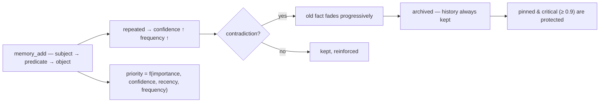

<p align="center">
  🌍 <strong>Languages:</strong>
  <a href="README.md">🇬🇧 English</a> ·
  <a href="README.fr.md">🇫🇷 Français</a> ·
  <a href="README.de.md">🇩🇪 Deutsch</a> ·
  <a href="README.es.md">🇪🇸 Español</a> ·
  <a href="README.it.md">🇮🇹 Italiano</a> ·
  <a href="README.pt.md">🇵🇹 Português</a> ·
  <a href="README.nl.md">🇳🇱 Nederlands</a> ·
  <a href="README.ru.md">🇷🇺 Русский</a> ·
  <a href="README.ja.md">🇯🇵 日本語</a> ·
  <a href="README.zh.md">🇨🇳 中文</a> ·
  <a href="README.ko.md">🇰🇷 한국어</a> ·
  <a href="README.pl.md">🇵🇱 Polski</a> ·
  <a href="README.tr.md">🇹🇷 Türkçe</a> ·
  <a href="README.uk.md">🇺🇦 Українська</a> ·
  <a href="README.hi.md">🇮🇳 हिन्दी</a> ·
  <a href="README.vi.md">🇻🇳 Tiếng Việt</a>
</p>

<p align="center">
  
</p>

<p align="center">
  <a href="https://www.npmjs.com/package/memsem"></a>
  <a href="LICENSE"></a>
  = 22.13">
  
  
</p>

> **Семантическая память для ИИ-агентов** — запоминает важное, умеет забывать.
> Одна команда для установки. Работает в *каждом* проекте, для *каждого* ИИ. 100% локально.

## Зачем?

Ваш ИИ забывает всё между сессиями. `CLAUDE.md` — это статичный файл, он не умеет учиться.
Векторные базы данных тяжеловесны и часто размещаются в облаке. Большинство «инструментов памяти» — это пассивное хранилище:
они хранят то, что им бросили, никогда не расставляют приоритеты и не согласуют противоречия.

**memsem — другой.** Это память как *система*, а не ящик:

- 🧠 **Пишет сама** — во время сессии ваш ИИ автоматически фиксирует долговечные факты (предпочтения, решения, ограничения). Больше никаких «не забудь это сохранить».
- ⚖️ **Расставляет приоритеты** — у каждого факта есть динамический приоритет (`важность × уверенность × недавность × частота`). Когда контекст ограничен, самые релевантные воспоминания всегда всплывают первыми.
- 🔄 **Разрешает противоречия** — «Я годами пил молоко… стоп, у меня непереносимость лактозы». Старый факт не перезаписывается: он *постепенно угасает* и архивируется, полная история сохраняется. Критичные факты (важность ≥ 0.9) защищены.
- 🔗 **Связывает понятия** — опциональный локальный семантический индекс (Ollama, на вашей машине) позволяет `fromage` найти `lactose` без единого общего слова.
- 🕰️ **Обладает эпизодической памятью** — сводки сессий поверх семантических фактов, как две долговременные системы мозга.
- 🔧 **Поддерживает себя сама** — фоновые агенты объединяют мелкие факты в паттерны («гиппокамп») и перекалибруют приоритеты попарным сравнением, только когда это делает память *удобнее для поиска*.

## Посмотрите, как это работает

Установите один раз — и дальше всё само. Ниже реальная сессия на одноразовой базе данных — ваша настоящая память не затрагивается (`node scripts/demo.mjs`):

```
=== memsem — demo on a temporary database ===
(your real memory in ~/.memory-mcp stays untouched)

1. The AI writes durable facts (memory_add_many)
   → 4 facts written

2. Strict search (lexical): memory_search { query: 'milk' }
   → user → drinks → milk

3. Semantic search (relax, local embeddings): memory_search { query: 'cheese', relax: true }
   No shared word with « lactose » — the local semantic index (Ollama) bridges it
   → lactose → is-present-in → cheese, yogurt, cream
   → user → is-intolerant-to → lactose
   → user → drinks → milk

4. Soft supersession: the AI learns you no longer drink milk
   → conflict: true, old fact faded (faded: [1])

5. Search now returns the current fact
   → user → drinks → no more milk (lactose intolerant)
   → user → drinks → milk

Stats: 5 active memories, semantic index OK (mxbai-embed-large)
```

## Конфиденциальность — память принадлежит вам

- **100% локально** — хранится в `~/.memory-mcp/memory.db` на *вашей* машине. Никакого облака, никакой телеметрии, ничего не покидает ваш компьютер.
- **Никогда не попадает в коммиты** — база данных живёт вне любого репозитория. Клонируйте публичный репозиторий, пушите код, делитесь скриншотами: ваша память остаётся с вами. У каждого пользователя своя память.
- **Память следует за *вами***, а не за вашими проектами — одна и та же база используется во всех ваших репозиториях. Создайте новую папку, новый репозиторий — память всё равно на месте.

## Установка

### opencode — одна строка

Добавьте в `opencode.json` (в проект или в `~/.config/opencode/opencode.json`):

```json
{ "plugin": ["memsem"] }
```

И всё. Плагин регистрирует MCP-сервер, внедряет протокол памяти и индекс памяти в каждую сессию, выдаёт необходимые разрешения и запускает фоновые агенты. Перезапустите opencode.

### Claude Code — одна команда

```bash
npx -y memsem setup
```

Эта команда регистрирует MCP-сервер (`claude mcp add memory -- npx -y memsem`) и добавляет блок «memsem memory» в `~/.claude/CLAUDE.md`, указывающий на полный протокол.

**Или установите с помощью ИИ**: просто вставьте в Claude:

> Install the memsem persistent memory: run `npx -y memsem setup`, read `~/.memsem/memory-protocol.md`, and apply the protocol.

### Любой MCP-клиент

```bash
npx -y memsem
```

Сервер говорит по MCP через stdio. Подключите к нему любой MCP-совместимый хост и внедрите `memory-protocol.md` в инструкции хоста (например, как `AGENTS.md`), чтобы сделать ИИ автономным.

### Универсальный установщик

```bash
npx -y memsem setup        # detects and configures your hosts (opencode, Claude)
npx -y memsem setup --help # see options
```

Идемпотентный, безопасный, обратимый (`--uninstall`).

## Как это работает

<p align="center">
  
</p>

**Жизненный цикл памяти** — каждый факт проходит один и тот же путь:



- **Атомарные факты** — каждое воспоминание — это тройка `субъект → предикат → объект` с важностью, уверенностью, частотой, тегами, темой и происхождением.
- **Темы и фокус** — иерархические темы (`food/drinks`) — это карта маршрутизации; поиск по теме пересекает все проекты. Список `focus` держит активные темы сессии на полном приоритете.
- **Динамический приоритет** — `0.45 × важность + 0.25 × уверенность + 0.2 × недавность + 0.1 × частота`. Критичный факт побеждает повторяющийся паттерн.
- **Мягкое вытеснение** — противоречия заставляют старый факт угасать (уверенность падает), пока он не архивируется ниже порога. История всегда сохраняется.
- **Семантический индекс (опционально)** — каждый факт эмбеддируется локально (`mxbai-embed-large` через Ollama); поиски с `relax: true` добавляют косинусное сходство (порог 0.5). Без Ollama всё работает точно так же — строгий лексический поиск.

## Сравнение

| | memsem | `CLAUDE.md` / заметки | mem0 | Zep / Graphiti | официальный memory MCP | Obsidian как память |
|---|---|---|---|---|---|---|
| Автозапись во время сессий | ✅ | ❌ | ⚠️ через код приложения | ⚠️ | ❌ | ❌ |
| Приоритет для бюджета контекста | ✅ | ❌ | ❌ | ❌ | ❌ | ❌ |
| Противоречия (мягкое вытеснение) | ✅ | ❌ (перезаписывает) | ❌ (перезаписывает) | ❌ | ❌ | ❌ |
| Семантический поиск, локальный и приватный | ✅ (Ollama) | ❌ | ⚠️ (нужна векторная БД) | ⚠️ (нужна графовая БД) | ❌ | ⚠️ (плагины) |
| Эпизодическая память + самоподдержка | ✅ | ❌ | ❌ | ⚠️ | ❌ | ❌ |
| Одна память для всех ваших репозиториев | ✅ | ❌ (по проектам) | ⚠️ | ⚠️ | ❌ | ⚠️ (хранилище) |
| Ноль зависимостей, `npx -y` | ✅ | ✅ | ❌ | ❌ | ✅ | ✅ |
| Читаемость / редактируемость человеком | ❌ | ✅ | ❌ | ❌ | ✅ (JSON) | ✅ |

## Документация

- [`memory-protocol.md`](memory-protocol.md) — протокол, внедряемый в вашего ИИ: как он автоматически пишет, ищет и поддерживает память.
- [`DESIGN.md`](DESIGN.md) — полный дизайн: видение, принципы, кейс про лактозу, дорожная карта.
- [`scripts/demo.mjs`](scripts/demo.mjs) — воспроизведите демонстрацию выше на одноразовой базе данных.

## Дорожная карта

- [x] Семантический индекс (локальные эмбеддинги Ollama)
- [x] Эпизодическая память + извлечение сессий
- [x] Консолидация гиппокампа + судья попарного оценивания
- [x] Универсальный плагин opencode + `memsem setup`
- [ ] Мост Obsidian: экспорт/импорт памяти как читаемых markdown-заметок
- [ ] Многошаговая передача по графу

## Лицензия

MIT — свободно для любых целей. Ваша память остаётся вашей.
