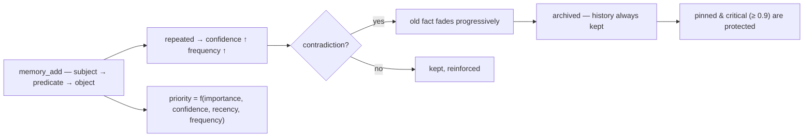

<p align="center">
  🌍 <strong>Languages:</strong>
  <a href="README.md">🇬🇧 English</a> ·
  <a href="README.fr.md">🇫🇷 Français</a> ·
  <a href="README.de.md">🇩🇪 Deutsch</a> ·
  <a href="README.es.md">🇪🇸 Español</a> ·
  <a href="README.it.md">🇮🇹 Italiano</a> ·
  <a href="README.pt.md">🇵🇹 Português</a> ·
  <a href="README.nl.md">🇳🇱 Nederlands</a> ·
  <a href="README.ru.md">🇷🇺 Русский</a> ·
  <a href="README.ja.md">🇯🇵 日本語</a> ·
  <a href="README.zh.md">🇨🇳 中文</a> ·
  <a href="README.ko.md">🇰🇷 한국어</a> ·
  <a href="README.pl.md">🇵🇱 Polski</a> ·
  <a href="README.tr.md">🇹🇷 Türkçe</a> ·
  <a href="README.uk.md">🇺🇦 Українська</a> ·
  <a href="README.hi.md">🇮🇳 हिन्दी</a> ·
  <a href="README.vi.md">🇻🇳 Tiếng Việt</a>
</p>

<p align="center">
  
</p>

<p align="center">
  <a href="https://www.npmjs.com/package/memsem"></a>
  <a href="LICENSE"></a>
  = 22.13">
  <a href="https://github.com/WindSeries69/memsem/actions"></a>
  
  
</p>

> **Семантическая память для ИИ-агентов** — запоминает важное, умеет забывать.
> Одна команда для установки. Работает в *каждом* проекте, с *каждым* ИИ. 100% локально.

## Почему — когда уже существуют большие системы памяти?

Они существуют, и сложные части они решили правильно: векторные хранилища (mem0),
темпоральные графы знаний (Zep / Graphiti), фреймворки агентов (MemGPT / Letta).
Но всем им присущи одни и те же три недостатка:

1. **Грубое хранение без структуры.** Они хранят всё, что им скармливают, а поиск —
   это поиск по сходству по *всему* объёму. ИИ не знает, **где искать** — поэтому
   ищет везде, и шум заглушает сигнал.
2. **Нет точности.** Нечёткое совпадение остаётся нечётким: почти-подходящие
   воспоминания заполняют бюджет контекста и тратят токены впустую.
3. **Нет самокоррекции.** Факт, опровергнутый месяцы назад, остаётся таким же
   сильным, как в день, когда был записан.

memsem исправляет именно эти три вещи:

- 🧭 **Знает, где искать.** Каждая сессия начинается с карты маршрутизации
  (`memory-index.md`): темы + ключевые слова, инжектируемые в контекст. ИИ
  маршрутизирует по темам, пересекает проекты и платит только за то, что ему
  нужно. Иерархические темы + живой список фокуса держат активные ветви сессии
  на полном приоритете — остальное приглушается, но никогда не теряется.
- 🎯 **Точен.** Строгий лексический поиск по умолчанию (порог совпадения слов
  50%, без распространения по графу, если явно не попросить) — запрос возвращает
  нужные факты, отсортированные по динамическому приоритету
  (`importance × confidence × recency × frequency`). Точность измеряется, а не
  предполагается: **P@3 0.958** на эталонном бенчмарке (51 факт, 20 запросов,
  [`scripts/bench.mjs`](scripts/bench.mjs), результаты в
  [`DESIGN.md`](DESIGN.md) §11).
- 🔄 **Самокорректируется.** Противоречия затухают старый факт вместо того, чтобы
  перезаписать его («я пил молоко годами… стоп, непереносимость лактозы») —
  история всегда сохраняется, критически важные факты (≥ 0.9) защищены. Фоновые
  агенты извлекают устойчивые факты в конце сессии, консолидируют мелкие факты
  в паттерны и перекалибруют приоритеты — только когда память остаётся *как
  минимум столь же находимой*.

Все обещания больших систем, минус их недостатки: одна команда, 100% локально,
и ваша память остаётся вашей — никогда не попадает в коммиты, персональная,
общая для всех ваших репозиториев.

## Смотрите, как это работает

Установите один раз и дайте ему работать. Это реальная сессия на одноразовой
базе данных — ваша настоящая память не затрагивается (`node scripts/demo.mjs`):

<p align="center">
  
</p>

```
=== memsem — demo on a temporary database ===
(your real memory in ~/.memory-mcp stays untouched)

1. The AI writes durable facts (memory_add_many)
   → 4 facts written

2. Strict search (lexical): memory_search { query: 'milk' }
   → user → drinks → milk

3. Semantic search (relax, local embeddings): memory_search { query: 'cheese', relax: true }
   No shared word with « lactose » — the local semantic index (Ollama) bridges it
   → lactose → is-present-in → cheese, yogurt, cream
   → user → is-intolerant-to → lactose
   → user → drinks → milk

4. Soft supersession: the AI learns you no longer drink milk
   → conflict: true, old fact faded (faded: [1])

5. Search now returns the current fact
   → user → drinks → no more milk (lactose intolerant)
   → user → drinks → milk

Stats: 5 active memories, semantic index OK (mxbai-embed-large)
```

## Конфиденциальность — ваша память принадлежит вам

- **100% локально** — хранится в `~/.memory-mcp/memory.db` на *вашей* машине. Никаких облаков, никакой телеметрии, ничего не покидает ваш компьютер.
- **Никогда не попадает в коммиты** — база данных живёт вне каждого репозитория. Клонируйте публичный репозиторий, пушите код, делитесь скриншотами: ваша память остаётся с вами. У каждого пользователя своя память.
- **Память следует за *вами***, а не за вашими проектами — одна и та же база общая для всех ваших репозиториев. Создайте новую папку, новый репозиторий: память всё ещё здесь.

## Установка

### opencode — одна строка

Добавьте в `opencode.json` (проектный или `~/.config/opencode/opencode.json`):

```json
{ "plugin": ["memsem"] }
```

И всё. Плагин регистрирует MCP-сервер, инжектирует протокол памяти и индекс памяти в каждую сессию, выдаёт необходимые разрешения и запускает фоновые агенты. Перезапустите opencode.

### Claude Code — одна команда

```bash
npx -y memsem setup
```

Это регистрирует MCP-сервер (`claude mcp add memory -- npx -y memsem`) и добавляет блок «memsem memory» в `~/.claude/CLAUDE.md` со ссылкой на полный протокол.

**Или установите с помощью ИИ**: просто вставьте в Claude:

> Установите постоянную память memsem: выполните `npx -y memsem setup`, прочитайте `~/.memsem/memory-protocol.md` и примените протокол.

### Любой MCP-клиент

```bash
npx -y memsem
```

Сервер говорит по MCP через stdio. Наведите на него любого MCP-совместимого хоста и инжектируйте `memory-protocol.md` в инструкции хоста (например, как `AGENTS.md`), чтобы ИИ стал автономным.

### Универсальный установщик

```bash
npx -y memsem setup        # обнаруживает и настраивает ваши хосты (opencode, Claude)
npx -y memsem setup --help # см. параметры
```

Идемпотентен, безопасен, обратим (`--uninstall`).

## Как это работает

<p align="center">
  
</p>

**Жизненный цикл памяти** — каждый факт идёт одним и тем же путём:



- **Атомарные факты** — каждое воспоминание — это триплет `subject → predicate → object` с важностью, уверенностью, частотой, тегами, темой, происхождением.
- **Темы и фокус** — иерархические темы (`food/drinks`) — это карта маршрутизации; поиск по теме пересекает все проекты. Список `focus` держит активные темы сессии на полном приоритете.
- **Динамический приоритет** — `0.45 × importance + 0.25 × confidence + 0.2 × recency + 0.1 × frequency`. Критически важный факт бьёт повторяющийся паттерн.
- **Мягкое замещение** — противоречия затухают старый факт (уверенность падает), пока он не архивируется ниже порога. История всегда сохраняется.
- **Семантический индекс (опционально)** — каждый факт эмбедится локально (`mxbai-embed-large` через Ollama); поиски с `relax: true` добавляют косинусную близость (порог 0.5). Без Ollama всё работает идентично — строгий лексический поиск.

## Сравнение

| | memsem | `CLAUDE.md` / заметки | mem0 | Zep / Graphiti | официальный MCP памяти | Obsidian как память |
|---|---|---|---|---|---|---|
| Автозапись во время сессий | ✅ | ❌ | ⚠️ через код приложения | ⚠️ через код приложения | ❌ | ❌ |
| Приоритет для бюджета контекста | ✅ | ❌ | ❌ | ❌ | ❌ | ❌ |
| Противоречия (мягкое замещение) | ✅ | ❌ (перезаписывает) | ❌ (перезаписывает) | ✅ (темпоральное версионирование) | ❌ | ❌ |
| Семантический поиск | ✅ локально (Ollama) | ❌ | ✅ (векторное хранилище) | ✅ (граф + эмбеддинги) | ❌ | ⚠️ (плагины) |
| Эпизодическая память + самообслуживание | ✅ | ❌ | ⚠️ (эпизодические дополнения) | ✅ (темпоральный граф знаний) | ❌ | ❌ |
| Одна память для всех ваших репозиториев | ✅ | ❌ (на проект) | ⚠️ (по конфигу приложения) | ⚠️ (по конфигу приложения) | ❌ | ⚠️ (хранилище) |
| Ноль зависимостей, `npx -y` | ✅ | ✅ | ❌ | ❌ | ✅ | ✅ |
| Читаемо и редактируемо человеком | ⚠️ (CLI list/edit) | ✅ | ❌ | ❌ | ✅ (JSON) | ✅ |

*Сравнение по состоянию на август 2026 г., по публичной документации; возможности развиваются — проверяйте перед выбором.*

## Командная строка

Всё, что можно сделать через MCP, можно сделать из терминала:

```bash
memsem list [--theme x] [--project p] [--limit n] [--all]   # read your memory
memsem edit <id> [--object "..."] [--importance 0.6] [...]  # fix a fact by hand (audited)
memsem forget <id> [--yes]                                  # archive a fact (confirm)
memsem doctor [--limit n] [--hours h]                       # most-modified facts — spot drift
memsem export [--output f] [--project p]                    # full JSON dump
memsem import <file.json>                                   # restore / merge a dump
memsem setup [--host opencode|claude]                       # install for your hosts
```

Ручные правки записываются в журнал аудита — `memsem doctor` показывает их тоже.

## Конфигурация

Настраиваемые константы (веса приоритета, пороги, коэффициенты затухания, модель…)
живут в [`src/config.ts`](src/config.ts). Переопределите любую из них в
`~/.memsem/config.json` (или `$MEMSEM_CONFIG`), с глубоким слиянием и валидацией:

```json
{ "priority": { "importance": 0.4, "confidence": 0.3 }, "minLexical": 0.4 }
```

Настройки документированы и валидируются бенчмарком
([`scripts/bench.mjs`](scripts/bench.mjs) — 51 факт, 20 запросов, P@k/R@k по
наборам констант; результаты в [`DESIGN.md`](DESIGN.md) §11).

## Надёжность

База данных версионируется и автоматически мигрируется при запуске (`schema_migrations`),
с автоматическим резервным копированием перед любой миграцией (`~/.memory-mcp/backups/`,
хранятся последние 5). Включён режим WAL — сбой в середине записи оставляет базу
целой. Полные дампы и восстановление — через `memsem export` / `memsem import`.

## Документация

- [`memory-protocol.md`](memory-protocol.md) — протокол, инжектируемый в ваш ИИ: как он автоматически пишет, ищет и поддерживает память.
- [`DESIGN.md`](DESIGN.md) — полный дизайн: видение, принципы, кейс лактозы, калибровка констант, дорожная карта.
- [`scripts/demo.mjs`](scripts/demo.mjs) — воспроизведите демо выше на одноразовой базе данных.

## Дорожная карта

- [x] Семантический индекс (локальные эмбеддинги Ollama)
- [x] Эпизодическая память + извлечение из сессий
- [x] Гиппокамп-консолидация + судья попарного скоринга
- [x] Универсальный opencode-плагин + `memsem setup`
- [x] Версионированные миграции + автоматическое резервное копирование + экспорт/импорт
- [x] Настраиваемые константы, валидируемые бенчмарком
- [x] Безопасный судья: сухой прогон, журнал аудита, защитные ограничители, `memsem doctor`
- [x] CLI: `list` / `edit` / `forget` — исправьте факт вручную
- [ ] Мост Obsidian: экспорт/импорт памяти как читаемых заметок в markdown
- [ ] Распространение по графу с несколькими переходами

## Лицензия

MIT — свободно для любых целей. Ваша память остаётся вашей.
