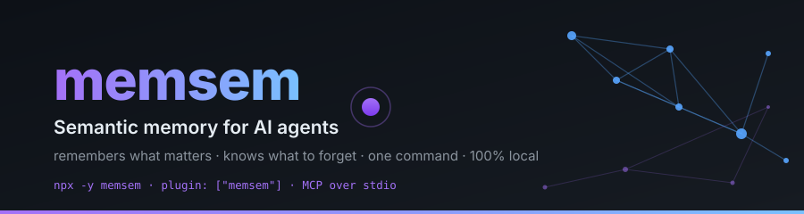
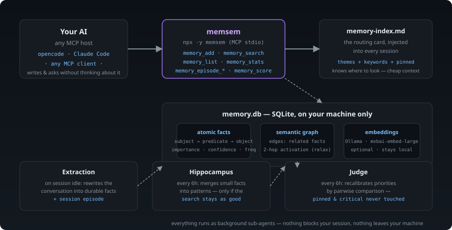

<p align="center">
  🌍 <strong>Languages:</strong>
  <a href="README.md">🇬🇧 English</a> ·
  <a href="README.fr.md">🇫🇷 Français</a> ·
  <a href="README.de.md">🇩🇪 Deutsch</a> ·
  <a href="README.es.md">🇪🇸 Español</a> ·
  <a href="README.it.md">🇮🇹 Italiano</a> ·
  <a href="README.pt.md">🇵🇹 Português</a> ·
  <a href="README.nl.md">🇳🇱 Nederlands</a> ·
  <a href="README.ru.md">🇷🇺 Русский</a> ·
  <a href="README.ja.md">🇯🇵 日本語</a> ·
  <a href="README.zh.md">🇨🇳 中文</a> ·
  <a href="README.ko.md">🇰🇷 한국어</a> ·
  <a href="README.pl.md">🇵🇱 Polski</a> ·
  <a href="README.tr.md">🇹🇷 Türkçe</a> ·
  <a href="README.uk.md">🇺🇦 Українська</a> ·
  <a href="README.hi.md">🇮🇳 हिन्दी</a> ·
  <a href="README.vi.md">🇻🇳 Tiếng Việt</a>
</p>

<p align="center">
  
</p>

<p align="center">
  <a href="https://www.npmjs.com/package/memsem"></a>
  <a href="LICENSE"></a>
  = 22.13">
  
  
</p>

> **Yapay zeka ajanları için anlamsal bellek** — önemli olanı hatırlar, neyi unutması gerektiğini bilir.
> Kurulumu tek komut. *Her* projede, *her* yapay zekada çalışır. %100 yerel.

## Neden?

Yapay zekanız oturumlar arasında her şeyi unutur. `CLAUDE.md` statik bir dosyadır — öğrenemez.
Vektör veritabanları ağırdır ve çoğunlukla bulut tabanlıdır. Çoğu "bellek" aracı pasif bir depodur:
kendisine ne atarsanız onu saklar, asla önceliklendirmez, çelişkileri asla uzlaştırmaz.

**memsem farklıdır.** Bir çekmece değil, bir bellek *sistemi*dır:

- 🧠 **Kendini yazar** — oturum sırasında yapay zekanız kalıcı gerçekleri (tercihler, kararlar, kısıtlar) otomatik olarak kaydeder. "Bunu kaydetmeyi unutma" yok artık.
- ⚖️ **Önceliklendirir** — her gerçeğin dinamik bir önceliği vardır (`önem × güven × güncellik × sıklık`). Bağlam daraldığında en alakalı anılar her zaman önce yüzeye çıkar.
- 🔄 **Çelişkileri yönetir** — "Yıllardır süt içiyorum… dur, laktoz intoleransım var." Eski gerçek üzerine yazılmaz: kademeli olarak *solar* ve arşivlenir, tam geçmiş korunur. Kritik gerçekler (önem ≥ 0.9) koruma altındadır.
- 🔗 **Kavramlar arasında köprü kurar** — isteğe bağlı yerel anlamsal dizin (Ollama, sizin makinenizde) `fromage` ile `lactose` arasında tek bir ortak kelime olmadan eşleşme sağlar.
- 🕰️ **Epizodik belleği vardır** — anlamsal gerçeklerin üzerine oturum özetleri, beynin iki uzun süreli sistemi gibi.
- 🔧 **Kendini bakımda tutar** — arka plan ajanları küçük gerçekleri kalıplara dönüştürür ("hipokampus") ve öncelikleri ikili karşılaştırmayla yeniden kalibre eder, yalnızca belleği *aranabilir kıldığı* zaman.

## Çalışırken görün

Bir kez kurun, çalışmaya bırakın. Bu, geçici bir veritabanında gerçek bir oturumdur — gerçek belleğinize asla dokunulmaz (`node scripts/demo.mjs`):

```
=== memsem — demo on a temporary database ===
(your real memory in ~/.memory-mcp stays untouched)

1. The AI writes durable facts (memory_add_many)
   → 4 facts written

2. Strict search (lexical): memory_search { query: 'milk' }
   → user → drinks → milk

3. Semantic search (relax, local embeddings): memory_search { query: 'cheese', relax: true }
   No shared word with « lactose » — the local semantic index (Ollama) bridges it
   → lactose → is-present-in → cheese, yogurt, cream
   → user → is-intolerant-to → lactose
   → user → drinks → milk

4. Soft supersession: the AI learns you no longer drink milk
   → conflict: true, old fact faded (faded: [1])

5. Search now returns the current fact
   → user → drinks → no more milk (lactose intolerant)
   → user → drinks → milk

Stats: 5 active memories, semantic index OK (mxbai-embed-large)
```

## Gizlilik — bellek sizindir

- **%100 yerel** — *sizin* makinenizde `~/.memory-mcp/memory.db` içinde saklanır. Bulut yok, telemetri yok, hiçbir şey bilgisayarınızdan çıkmaz.
- **Asla taahhüt edilmez** — veritabanı her deponun dışında yaşar. Açık bir depoyu klonlayın, kod gönderin, ekran görüntüsü paylaşın: belleğiniz sizinle kalır. Her kullanıcının kendi belleği vardır.
- **Bellek projelerinizi değil *sizi* takip eder** — aynı veritabanı tüm depolarınız arasında paylaşılır. Yeni bir klasör açın, yeni bir depo: bellek hâlâ oradadır.

## Kurulum

### opencode — tek satır

`opencode.json` dosyasına ekleyin (proje veya `~/.config/opencode/opencode.json`):

```json
{ "plugin": ["memsem"] }
```

Hepsi bu. Eklenti MCP sunucusunu kaydeder, her oturuma bellek protokolünü ve bellek dizinini enjekte eder, gerekli izinleri verir ve arka plan ajanlarını çalıştırır. opencode'u yeniden başlatın.

### Claude Code — tek komut

```bash
npx -y memsem setup
```

Bu, MCP sunucusunu kaydeder (`claude mcp add memory -- npx -y memsem`) ve tam protokole işaret eden bir "memsem memory" bloğunu `~/.claude/CLAUDE.md` dosyasına ekler.

**Ya da yapay zekayla kurun**: sadece Claude'a yapıştırın:

> Install the memsem persistent memory: run `npx -y memsem setup`, read `~/.memsem/memory-protocol.md`, and apply the protocol.

### Herhangi bir MCP istemcisi

```bash
npx -y memsem
```

Sunucu, stdio üzerinden MCP konuşur. MCP destekleyen herhangi bir ana bilgisayarı buna yönlendirin ve yapay zekayı otonom kılmak için `memory-protocol.md` dosyasını ana bilgisayarın talimatlarına enjekte edin (ör. `AGENTS.md` olarak).

### Evrensel yükleyici

```bash
npx -y memsem setup        # detects and configures your hosts (opencode, Claude)
npx -y memsem setup --help # see options
```

Idempotent, güvenli, geri alınabilir (`--uninstall`).

## Nasıl çalışır

<p align="center">
  
</p>

**Bellek yaşam döngüsü** — her gerçek aynı yolu izler:


- **Atomik gerçekler** — her bellek, önem, güven, sıklık, etiketler, tema ve kaynak (provenance) içeren bir `subject → predicate → object` üçlüsüdür.
- **Temalar ve odak** — hiyerarşik temalar (`food/drinks`) yönlendirme haritasıdır; temaya göre arama tüm projeleri keser. `focus` listesi, oturumun aktif temalarını tam öncelikte tutar.
- **Dinamik öncelik** — `0.45 × importance + 0.25 × confidence + 0.2 × recency + 0.1 × frequency`. Kritik bir gerçek, yinelenen bir kalıbı yener.
- **Yumuşak değişim (soft supersession)** — çelişkiler eski gerçeği soldurur (güven azalır), ta ki bir eşiğin altında arşivlenene dek. Geçmiş her zaman korunur.
- **Anlamsal dizin (isteğe bağlı)** — her gerçek yerel olarak vektörleştirilir (`mxbai-embed-large` Ollama aracılığıyla); `relax: true` aramaları kosinüs benzerliği ekler (eşik 0.5). Ollama olmadan her şey aynen çalışır — katı sözcüksel arama.

## Karşılaştırma

| | memsem | `CLAUDE.md` / notlar | mem0 | Zep / Graphiti | resmi memory MCP | Obsidian bellek olarak |
|---|---|---|---|---|---|---|
| Oturumlar sırasında otomatik yazma | ✅ | ❌ | ⚠️ uygulama koduyla | ⚠️ | ❌ | ❌ |
| Bağlam bütçesi için önceliklendirme | ✅ | ❌ | ❌ | ❌ | ❌ | ❌ |
| Çelişkiler (yumuşak değişim) | ✅ | ❌ (üzerine yazar) | ❌ (üzerine yazar) | ❌ | ❌ | ❌ |
| Anlamsal arama, yerel ve özel | ✅ (Ollama) | ❌ | ⚠️ (vektör DB gerekir) | ⚠️ (graf DB gerekir) | ❌ | ⚠️ (eklentiler) |
| Epizodik bellek + kendi kendine bakım | ✅ | ❌ | ❌ | ⚠️ | ❌ | ❌ |
| Tüm depolarınız arasında tek bellek | ✅ | ❌ (proje başına) | ⚠️ | ⚠️ | ❌ | ⚠️ (vault) |
| Sıfır bağımlılık, `npx -y` | ✅ | ✅ | ❌ | ❌ | ✅ | ✅ |
| İnsan tarafından okunabilir / düzenlenebilir | ❌ | ✅ | ❌ | ❌ | ✅ (JSON) | ✅ |

## Dokümantasyon

- [`memory-protocol.md`](memory-protocol.md) — yapay zekanıza enjekte edilen protokol: belleği nasıl otomatik olarak yazdığı, aradığı ve bakımını yaptığı.
- [`DESIGN.md`](DESIGN.md) — tam tasarım: vizyon, ilkeler, laktoz vaka çalışması, yol haritası.
- [`scripts/demo.mjs`](scripts/demo.mjs) — yukarıdaki demoyu geçici bir veritabanında yeniden üretin.

## Yol haritası

- [x] Anlamsal dizin (yerel Ollama vektörleştirmeleri)
- [x] Epizodik bellek + oturum çıkarımı
- [x] Hipokampus birleştirme + ikili karşılaştırma puanlama yargıcı
- [x] Evrensel opencode eklentisi + `memsem setup`
- [ ] Obsidian köprüsü: belleği okunabilir markdown notları olarak dışa/içe aktar
- [ ] Çok adımlı (multi-hop) graf yayılımı

## Lisans

MIT — her şey için ücretsiz. Belleğiniz sizin kalır.
