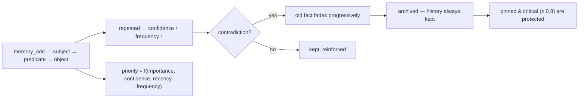

<p align="center">
  🌍 <strong>Languages:</strong>
  <a href="README.md">🇬🇧 English</a> ·
  <a href="README.fr.md">🇫🇷 Français</a> ·
  <a href="README.de.md">🇩🇪 Deutsch</a> ·
  <a href="README.es.md">🇪🇸 Español</a> ·
  <a href="README.it.md">🇮🇹 Italiano</a> ·
  <a href="README.pt.md">🇵🇹 Português</a> ·
  <a href="README.nl.md">🇳🇱 Nederlands</a> ·
  <a href="README.ru.md">🇷🇺 Русский</a> ·
  <a href="README.ja.md">🇯🇵 日本語</a> ·
  <a href="README.zh.md">🇨🇳 中文</a> ·
  <a href="README.ko.md">🇰🇷 한국어</a> ·
  <a href="README.pl.md">🇵🇱 Polski</a> ·
  <a href="README.tr.md">🇹🇷 Türkçe</a> ·
  <a href="README.uk.md">🇺🇦 Українська</a> ·
  <a href="README.hi.md">🇮🇳 हिन्दी</a> ·
  <a href="README.vi.md">🇻🇳 Tiếng Việt</a>
</p>

<p align="center">
  
</p>

<p align="center">
  <a href="https://www.npmjs.com/package/memsem"></a>
  <a href="LICENSE"></a>
  = 22.13">
  <a href="https://github.com/WindSeries69/memsem/actions"></a>
  
  
</p>

> **AI ajanları için anlamsal bellek** — önemli olanı hatırlar, neyi unutacağını bilir.
> Kurulumu tek komut. *Her* projede, *her* AI ile çalışır. %100 yerel.

## Neden — büyük bellek sistemleri zaten varken?

Varlar ve zor kısımları doğru yapıyorlar: vektör depoları (mem0), zamansal
bilgi grafikleri (Zep / Graphiti), ajan çerçeveleri (MemGPT / Letta). Ama hepsi
aynı üç kusuru paylaşıyor:

1. **Kör depolama, yapı yok.** Kendilerine atılan her şeyi saklarlar ve
   erişim, *her şey* üzerinde bir benzerlik aramasıdır. AI **nereye
   bakacağını** bilmez — bu yüzden her yere bakar ve gürültü sinyali boğar.
2. **Kesinlik yok.** Bulanık bir eşleşme bulanık bir eşleşmedir: neredeyse
   doğru anılar bağlam bütçesini doldurur ve token israf eder.
3. **Kendi kendini düzeltme yok.** Aylar önce çelişilen bir gerçek, yazıldığı
   günkü kadar güçlü kalır.

memsem tam olarak bu üç şeyi düzeltir:

- 🧭 **Nereye bakacağını bilir.** Her oturum bir yönlendirme kartıyla başlar
  (`memory-index.md`): temalar + anahtar kelimeler, bağlama enjekte edilir. AI
  temaya göre yönlendirir, projeler arasında geçer ve yalnızca ihtiyacı
  kadarını öder. Hiyerarşik temalar + canlı bir odak listesi, oturumun aktif
  dallarını tam öncelikte tutar — geri kalanı zayıflatılır, asla kaybedilmez.
- 🎯 **Kesindir.** Varsayılan olarak katı sözcüksel arama (%50 kelime eşleşme
  eşiği, açıkça istemedikçe grafik yayılımı yok) — bir sorgu, doğru gerçekleri
  dinamik önceliğe göre sıralanmış halde döndürür
  (`importance × confidence × recency × frequency`). Kesinlik varsayılmaz,
  ölçülür: referans kıyaslamasında **P@3 0.958** (51 gerçek, 20 sorgu,
  [`scripts/bench.mjs`](scripts/bench.mjs), sonuçlar
  [`DESIGN.md`](DESIGN.md) §11).
- 🔄 **Kendini düzeltir.** Çelişkiler eski gerçeği üzerine yazmak yerine
  soldurur ("Yıllarca süt içtim… bir dakika, laktoz intoleransım var") —
  geçmiş her zaman korunur, kritik gerçekler (≥ 0.8) koruma altındadır. Arka
  plan ajanları oturum sonunda kalıcı gerçekleri çıkarır, küçük gerçekleri
  örüntüler halinde birleştirir ve öncelikleri yeniden kalibre eder — yalnızca
  bellek *en az onun kadar aranabilir* kaldığı sürece.

Büyük sistemlerin tüm vaatleri, kusurları olmadan: tek komut, %100 yerel ve
belleğiniz sizin kalır — asla commit edilmez, kullanıcıya özeldir, tüm
repolarınız arasında paylaşılır.

## Çalışırken görün

Bir kez kurun, çalışsın. Bu, atılabilir bir veritabanında gerçek bir oturum — gerçek belleğinize asla dokunulmaz (`node scripts/demo.mjs`):

<p align="center">
  
</p>

```
=== memsem — demo on a temporary database ===
(your real memory in ~/.memory-mcp stays untouched)

1. The AI writes durable facts (memory_add_many)
   → 4 facts written

2. Strict search (lexical): memory_search { query: 'milk' }
   → user → drinks → milk

3. Semantic search (relax, local embeddings): memory_search { query: 'cheese', relax: true }
   No shared word with « lactose » — the local semantic index (Ollama) bridges it
   → lactose → is-present-in → cheese, yogurt, cream
   → user → is-intolerant-to → lactose
   → user → drinks → milk

4. Soft supersession: the AI learns you no longer drink milk
   → conflict: true, old fact faded (faded: [1])

5. Search now returns the current fact
   → user → drinks → no more milk (lactose intolerant)
   → user → drinks → milk

Stats: 5 active memories, semantic index OK (mxbai-embed-large)
```

## Gizlilik — belleğiniz sizindir

- **%100 yerel** — `~/.memory-mcp/memory.db` içinde *sizin* makinenizde saklanır. Bulut yok, telemetri yok, hiçbir şey bilgisayarınızdan çıkmaz.
- **Asla commit edilmez** — veritabanı her deponun dışında yaşar. Halka açık bir repoyu klonlayın, kod push edin, ekran görüntüsü paylaşın: belleğiniz sizde kalır. Her kullanıcının kendi belleği vardır.
- **Bellek *sizi* izler**, projelerinizi değil — aynı veritabanı tüm repolarınız arasında paylaşılır. Yeni bir klasör, yeni bir repo oluşturun: bellek hâlâ oradadır.

## Kurulum

### opencode — tek satır

`opencode.json` dosyasına ekleyin (proje veya `~/.config/opencode/opencode.json`):

```json
{ "plugin": ["memsem"] }
```

Bu kadar. Eklenti MCP sunucusunu kaydeder, bellek protokolünü ve bellek indeksini her oturuma enjekte eder, gereken izinleri verir ve arka plan ajanlarını çalıştırır. opencode'u yeniden başlatın.

### Claude Code — tek komut

```bash
npx -y memsem setup
```

Bu, MCP sunucusunu kaydeder (`claude mcp add memory -- npx -y memsem`) ve tam protokole işaret eden bir "memsem memory" bloğunu `~/.claude/CLAUDE.md` dosyasına ekler.

**Ya da AI ile kurun**: sadece Claude'a yapıştırın:

> memsem kalıcı belleğini kur: `npx -y memsem setup` çalıştırın, `~/.memsem/memory-protocol.md` dosyasını okuyun ve protokolü uygulayın.

### Herhangi bir MCP istemcisi

```bash
npx -y memsem
```

Sunucu, stdio üzerinden MCP konuşur. MCP destekleyen herhangi bir ana bilgisayarı buna yönlendirin ve AI'ı özerk hale getirmek için `memory-protocol.md` dosyasını ana bilgisayarın talimatlarına (ör. `AGENTS.md` olarak) enjekte edin.

### Evrensel kurulum

```bash
npx -y memsem setup        # ana bilgisayarlarınızı algılar ve yapılandırır (opencode, Claude)
npx -y memsem setup --help # seçenekleri görün
```

Idempotent, güvenli, geri alınabilir (`--uninstall`).

## Nasıl çalışır

<p align="center">
  
</p>

**Bellek yaşam döngüsü** — her gerçek aynı yolu izler:



- **Atomik gerçekler** — her bellek, önem, güven, sıklık, etiketler, tema ve kaynak içeren bir `subject → predicate → object` üçlüsüdür.
- **Temalar ve odak** — hiyerarşik temalar (`food/drinks`) yönlendirme haritasıdır; temaya göre yapılan arama tüm projeleri kapsar. `focus` listesi, oturumun aktif temalarını tam öncelikte tutar.
- **Dinamik öncelik** — `0.45 × importance + 0.25 × confidence + 0.2 × recency + 0.1 × frequency`. Kritik bir gerçek, tekrarlayan bir örüntüyü yener.
- **Yumuşak ikame** — çelişkiler eski gerçeği soldurur (güven azalır), bir eşiğin altında arşivlenene kadar. Geçmiş her zaman korunur.
- **Anlamsal indeks (isteğe bağlı)** — her gerçek yerel olarak gömülür (`mxbai-embed-large`, Ollama aracılığıyla); `relax: true` aramaları kosinüs benzerliği ekler (eşik 0.5). Ollama olmadan her şey aynı şekilde çalışır — katı sözcüksel arama.

## Karşılaştırma

| | memsem | `CLAUDE.md` / notlar | mem0 | Zep / Graphiti | official memory MCP | Obsidian as memory |
|---|---|---|---|---|---|---|
| Oturumlar sırasında otomatik yazım | ✅ | ❌ | ⚠️ uygulama koduyla | ⚠️ uygulama koduyla | ❌ | ❌ |
| Bağlam bütçesi için öncelik | ✅ | ❌ | ❌ | ❌ | ❌ | ❌ |
| Çelişkiler (yumuşak ikame) | ✅ | ❌ (üzerine yazar) | ❌ (üzerine yazar) | ✅ (zamansal sürümleme) | ❌ | ❌ |
| Anlamsal arama | ✅ yerel (Ollama) | ❌ | ✅ (vektör deposu) | ✅ (grafik + gömmeler) | ❌ | ⚠️ (eklentiler) |
| Epizodik bellek + kendi kendine bakım | ✅ | ❌ | ⚠️ (epizodik eklentiler) | ✅ (zamansal bilgi grafiği) | ❌ | ❌ |
| Tüm repolarınızda tek bellek | ✅ | ❌ (proje başına) | ⚠️ (uygulama başına yapılandırma) | ⚠️ (uygulama başına yapılandırma) | ❌ | ⚠️ (vault) |
| Sıfır bağımlılık, `npx -y` | ✅ | ✅ | ❌ | ❌ | ✅ | ✅ |
| İnsan tarafından okunabilir / düzenlenebilir | ⚠️ (CLI list/edit) | ✅ | ❌ | ❌ | ✅ (JSON) | ✅ |

*Karşılaştırma Aug 2026 itibarıyla, herkese açık dokümanlardan alınmıştır; yetenekler gelişir — seçmeden önce doğrulayın.*

## Komut satırı

MCP üzerinden yapılabilen her şey bir terminalden yapılabilir:

```bash
memsem list [--theme x] [--project p] [--limit n] [--all]   # read your memory
memsem edit <id> [--object "..."] [--importance 0.6] [...]  # fix a fact by hand (audited)
memsem forget <id> [--yes]                                  # archive a fact (confirm)
memsem doctor [--limit n] [--hours h]                       # most-modified facts — spot drift
memsem export [--output f] [--project p]                    # full JSON dump
memsem import <file.json>                                   # restore / merge a dump
memsem setup [--host opencode|claude]                       # install for your hosts
```

Manuel düzeltmeler denetim günlüğüne yazılır — `memsem doctor` onları da gösterir.

## Yapılandırma

Ayarlanabilir sabitler (öncelik ağırlıkları, eşikler, solma faktörleri, model…) [`src/config.ts`](src/config.ts) içinde yaşar. Bunlardan herhangi birini `~/.memsem/config.json` (veya `$MEMSEM_CONFIG`) içinde geçersiz kılabilirsiniz; doğrulamayla derin birleştirme yapılır:

```json
{ "priority": { "importance": 0.4, "confidence": 0.3 }, "minLexical": 0.4 }
```

Ayarlar bir kıyaslama tarafından belgelenir ve doğrulanır ([`scripts/bench.mjs`](scripts/bench.mjs) — 51 gerçek, 20 sorgu, sabit kümeleri arasında P@k/R@k; sonuçlar [`DESIGN.md`](DESIGN.md) §11).

## Dayanıklılık

Veritabanı sürümlenir ve başlangıçta otomatik olarak taşınır (`schema_migrations`), her taşımadan önce otomatik bir yedek alınır (`~/.memory-mcp/backups/`, son 5 tutulur). WAL modu açıktır — yazma sırasında bir çökme veritabanını bozulmamış bırakır. Tam dökümler ve geri yüklemeler `memsem export` / `memsem import` ile yapılır.

## Dokümantasyon

- [`memory-protocol.md`](memory-protocol.md) — AI'ınıza enjekte edilen protokol: belleği otomatik olarak nasıl yazdığı, aradığı ve koruduğu.
- [`DESIGN.md`](DESIGN.md) — tam tasarım: vizyon, ilkeler, laktoz vaka çalışması, sabit kalibrasyonu, yol haritası.
- [`scripts/demo.mjs`](scripts/demo.mjs) — yukarıdaki demoyu atılabilir bir veritabanında yeniden üretir.

## Bilinen sınırlamalar

Dürüstçe okuyun, bağımsız bir incelemeden ([Agent Memory Atlas](https://neoneye.github.io/agent-memory-atlas/systems/memsem/)):

- **Otomatik düzeltme yolunda kilit yok.** *Yeniden onaylanan* reddedilmiş bir
  değer (diyelim ki aynı eski döküm on kez okundu) geri döner ve kendi
  düzeltmesini soldurur — sıradan bir düzeltme üçüncü yeniden onaylamada
  arşivlenir. Yalnızca **bir adayı reddeden insan**, değeri doğrudan reddeden
  kalıcı bir bastırma (`memory_suppressions`) yazar. Bu, gerçek bir maliyeti
  olan bilinçli bir pozisyondur (tekrar, kanıttır).
- **Sabitleme hayatta kalmayı korur, görünürlüğü değil.** Sabitlenmiş bir
  düzeltme asla güvenini kaybetmez ve `memsem list` içinde ilk sırada kalır,
  ancak tekrarlanan reddedilmiş bir değer yine de `memory_search` sonucunun en
  üstünü alabilir.
- **`import` kapının ötesine yazar** — bir yedeği geri yüklemek bastırılmış
  bir değeri geri getirir.
- **Reddedilen bir yazma denetim satırı bırakmaz** ve incelenmiş bir gerçeğin
  temizlenmesi metnini `memory_candidates` içinde bırakır.
- **Konsolidasyon ve çıkarım güvenlik kuralları kod değil, prompt'lardır.**

Pürüzlü kenarlar, hata değil — her biri [DESIGN.md](DESIGN.md) yol haritasında
ve açık sorularda izlenir.

## Yol haritası

- [x] Anlamsal indeks (yerel Ollama gömmeleri)
- [x] Epizodik bellek + oturum çıkarımı
- [x] Hipokampus konsolidasyonu + ikili puanlama yargıcı
- [x] Evrensel opencode eklentisi + `memsem setup`
- [x] Sürümlü taşımalar + otomatik yedek + dışa/içe aktarma
- [x] Bir kıyaslamayla doğrulanan yapılandırılabilir sabitler
- [x] Güvenli yargıç: kuru çalıştırma, denetim günlüğü, güvenlik korkulukları, `memsem doctor`
- [x] CLI: `list` / `edit` / `forget` — bir gerçeği elle düzeltin
- [x] Çok atlamalı grafik yayılımı
- [ ] Otomatik yolda write gate (supersession → suppression kararı)
- [ ] `import` kapının arkasında (suppression'ları kontrol etme)
- [ ] Reddedilmeleri denetleme ; adayları temizleme ; konsolidasyon kurallarını kodda
- [ ] Obsidian köprüsü: belleği okunabilir markdown notları olarak dışa/içe aktarma

## Lisans

MIT — her şey için ücretsiz. Belleğiniz sizin kalır.
