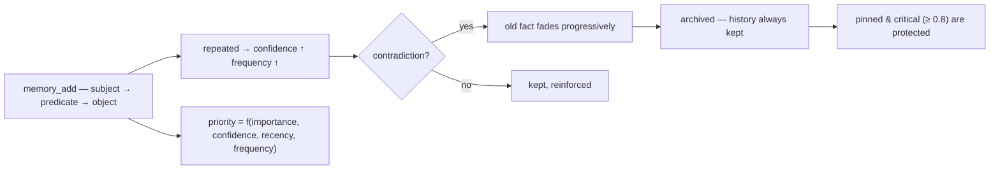

<p align="center">
  🌍 <strong>Languages:</strong>
  <a href="README.md">🇬🇧 English</a> ·
  <a href="README.fr.md">🇫🇷 Français</a> ·
  <a href="README.de.md">🇩🇪 Deutsch</a> ·
  <a href="README.es.md">🇪🇸 Español</a> ·
  <a href="README.it.md">🇮🇹 Italiano</a> ·
  <a href="README.pt.md">🇵🇹 Português</a> ·
  <a href="README.nl.md">🇳🇱 Nederlands</a> ·
  <a href="README.ru.md">🇷🇺 Русский</a> ·
  <a href="README.ja.md">🇯🇵 日本語</a> ·
  <a href="README.zh.md">🇨🇳 中文</a> ·
  <a href="README.ko.md">🇰🇷 한국어</a> ·
  <a href="README.pl.md">🇵🇱 Polski</a> ·
  <a href="README.tr.md">🇹🇷 Türkçe</a> ·
  <a href="README.uk.md">🇺🇦 Українська</a> ·
  <a href="README.hi.md">🇮🇳 हिन्दी</a> ·
  <a href="README.vi.md">🇻🇳 Tiếng Việt</a>
</p>

<p align="center">
  
</p>

<p align="center">
  <a href="https://www.npmjs.com/package/memsem"></a>
  <a href="LICENSE"></a>
  = 22.13">
  <a href="https://github.com/WindSeries69/memsem/actions"></a>
  
  
</p>

> **Семантична пам'ять для AI-агентів** — пам'ятає, що важливо, знає, що забути.
> Одна команда для встановлення. Працює в *кожному* проєкті, для *кожного* AI. 100% локально.

## Чому — коли вже існують великі системи пам'яті?

Вони існують, і вони добре вирішили складні частини: векторні сховища (mem0),
темпоральні графи знань (Zep / Graphiti), фреймворки агентів (MemGPT / Letta).
Але всім їм притаманні одні й ті самі три вади:

1. **Грубе зберігання без структури.** Вони зберігають усе, що в них кидають,
   а пошук — це пошук подібності по *всьому*. AI не знає, **де шукати** —
   тож шукає всюди, і шум заглушає сигнал.
2. **Жодної точності.** Нечіткий збіг залишається нечітким: майже-правильні
   спогади заповнюють бюджет контексту та витрачають токени.
3. **Жодної самокорекції.** Факт, якому суперечать уже місяці тому, залишається
   таким самим сильним, як у день його запису.

memsem виправляє саме ці три речі:

- 🧭 **Він знає, де шукати.** Кожна сесія починається з карти маршрутизації
  (`memory-index.md`): теми + ключові слова, впроваджені в контекст. AI
  маршрутизує за темою, перетинає проєкти та платить лише за те, що йому
  потрібно. Ієрархічні теми + живий список фокуса тримають активні гілки сесії
  на повному пріоритеті — решта послаблюється, але ніколи не втрачається.
- 🎯 **Він точний.** Суворий лексичний пошук за замовчуванням (поріг збігу слів
  50%, жодної графової пропагації, якщо ви явно не попросите) — запит повертає
  правильні факти, відсортовані за динамічним пріоритетом
  (`importance × confidence × recency × frequency`). Точність вимірюється,
  а не передбачається: **P@3 0.958** на референсному бенчмарку (51 факт,
  20 запитів, [`scripts/bench.mjs`](scripts/bench.mjs), результати в
  [`DESIGN.md`](DESIGN.md) §11).
- 🔄 **Він виправляє себе сам.** Суперечності згашують старий факт замість
  його перезапису («Я роками пив молоко… стривай, у мене непереносимість
  лактози») — історія завжди зберігається, критичні факти (≥ 0.8) захищені.
  Фонові агенти вилучають тривалі факти наприкінці сесії, об'єднують дрібні
  факти в патерни та перекалібровують пріоритети — лише коли пам'ять
  залишається *щонайменше настільки ж пошукуваною*.

Усі обіцянки великих систем, мінус їхні вади: одна команда, 100% локально,
і ваша пам'ять залишається вашою — ніколи не комітиться, окрема для кожного
користувача, спільна для всіх ваших репозиторіїв.

## Побачити в дії

Встановіть один раз і дайте йому працювати. Це реальна сесія на тимчасовій базі даних — ваша справжня пам'ять не зачіпається (`node scripts/demo.mjs`):

<p align="center">
  
</p>

```
=== memsem — demo on a temporary database ===
(your real memory in ~/.memory-mcp stays untouched)

1. The AI writes durable facts (memory_add_many)
   → 4 facts written

2. Strict search (lexical): memory_search { query: 'milk' }
   → user → drinks → milk

3. Semantic search (relax, local embeddings): memory_search { query: 'cheese', relax: true }
   No shared word with « lactose » — the local semantic index (Ollama) bridges it
   → lactose → is-present-in → cheese, yogurt, cream
   → user → is-intolerant-to → lactose
   → user → drinks → milk

4. Soft supersession: the AI learns you no longer drink milk
   → conflict: true, old fact faded (faded: [1])

5. Search now returns the current fact
   → user → drinks → no more milk (lactose intolerant)
   → user → drinks → milk

Stats: 5 active memories, semantic index OK (mxbai-embed-large)
```

## Приватність — ваша пам'ять належить вам

- **100% локально** — зберігається в `~/.memory-mcp/memory.db` на *вашій* машині. Жодної хмари, жодної телеметрії, нічого не залишає ваш комп'ютер.
- **Ніколи не комітиться** — база даних живе поза кожним репозиторієм. Клонуйте публічний репозиторій, пуште код, діліться скріншотами: ваша пам'ять залишається з вами. Кожен користувач має власну пам'ять.
- **Пам'ять слідує за *вами***, а не за вашими проєктами — одна й та сама база використовується у всіх ваших репозиторіях. Створіть нову папку, новий репозиторій: пам'ять усе ще там.

## Встановлення

### opencode — один рядок

Додайте до `opencode.json` (проєктного або `~/.config/opencode/opencode.json`):

```json
{ "plugin": ["memsem"] }
```

І все. Плагін реєструє MCP-сервер, впроваджує протокол пам'яті та індекс пам'яті в кожну сесію, надає необхідні дозволи та запускає фонові агенти. Перезапустіть opencode.

### Claude Code — одна команда

```bash
npx -y memsem setup
```

Це реєструє MCP-сервер (`claude mcp add memory -- npx -y memsem`) і додає блок «memsem memory» до `~/.claude/CLAUDE.md`, який посилається на повний протокол.

**Або встановіть за допомогою AI**: просто вставте в Claude:

> Install the memsem persistent memory: run `npx -y memsem setup`, read `~/.memsem/memory-protocol.md`, and apply the protocol.

### Будь-який MCP-клієнт

```bash
npx -y memsem
```

Сервер розмовляє MCP через stdio. Підключіть до нього будь-якого хоста з підтримкою MCP і впровадьте `memory-protocol.md` в інструкції хоста (наприклад, як `AGENTS.md`), щоб зробити AI автономним.

### Універсальний інсталятор

```bash
npx -y memsem setup        # detects and configures your hosts (opencode, Claude)
npx -y memsem setup --help # see options
```

Ідемпотентний, безпечний, зворотний (`--uninstall`).

## Як це працює

<p align="center">
  
</p>

**Життєвий цикл пам'яті** — кожен факт проходить один і той самий шлях:



- **Атомарні факти** — кожен спогад — це триплет `subject → predicate → object` з importance, confidence, frequency, тегами, темою, джерелом (provenance).
- **Теми та фокус** — ієрархічні теми (`food/drinks`) — це карта маршрутизації; пошук за темою перетинає всі проєкти. Список `focus` тримає активні теми сесії на повному пріоритеті.
- **Динамічний пріоритет** — `0.45 × importance + 0.25 × confidence + 0.2 × recency + 0.1 × frequency`. Критичний факт перемагає патерн, що повторюється.
- **М'яке витіснення** — суперечності згашують старий факт (confidence знижується), доки він не архівується нижче порога. Історія завжди зберігається.
- **Семантичний індекс (необов'язково)** — кожен факт вбудовується локально (`mxbai-embed-large` через Ollama); пошуки з `relax: true` додають косинусну подібність (поріг 0.5). Без Ollama все працює так само — суворий лексичний пошук.

## Порівняння

| | memsem | `CLAUDE.md` / нотатки | mem0 | Zep / Graphiti | офіційний memory MCP | Obsidian як пам'ять |
|---|---|---|---|---|---|---|
| Автозапис під час сесій | ✅ | ❌ | ⚠️ через код застосунку | ⚠️ через код застосунку | ❌ | ❌ |
| Пріоритет для бюджету контексту | ✅ | ❌ | ❌ | ❌ | ❌ | ❌ |
| Суперечності (м'яке витіснення) | ✅ | ❌ (перезапис) | ❌ (перезапис) | ✅ (темпоральне версіювання) | ❌ | ❌ |
| Семантичний пошук | ✅ локально (Ollama) | ❌ | ✅ (векторне сховище) | ✅ (граф + ембедінги) | ❌ | ⚠️ (плагіни) |
| Епізодична пам'ять + самопідтримка | ✅ | ❌ | ⚠️ (епізодичні доповнення) | ✅ (темпоральний граф знань) | ❌ | ❌ |
| Одна пам'ять для всіх ваших репозиторіїв | ✅ | ❌ (на проєкт) | ⚠️ (на конфіг застосунку) | ⚠️ (на конфіг застосунку) | ❌ | ⚠️ (сховище) |
| Жодних залежностей, `npx -y` | ✅ | ✅ | ❌ | ❌ | ✅ | ✅ |
| Людиночитаний / редагований | ⚠️ (CLI list/edit) | ✅ | ❌ | ❌ | ✅ (JSON) | ✅ |

*Порівняння станом на серпень 2026 року, з публічної документації; можливості еволюціонують — перевіряйте перед вибором.*

## Командний рядок

Усе, що можна зробити через MCP, можна зробити з термінала:

```bash
memsem list [--theme x] [--project p] [--limit n] [--all]   # read your memory
memsem edit <id> [--object "..."] [--importance 0.6] [...]  # fix a fact by hand (audited)
memsem forget <id> [--yes]                                  # archive a fact (confirm)
memsem doctor [--limit n] [--hours h]                       # most-modified facts — spot drift
memsem export [--output f] [--project p]                    # full JSON dump
memsem import <file.json>                                   # restore / merge a dump
memsem setup [--host opencode|claude]                       # install for your hosts
```

Ручні виправлення записуються до журналу аудиту — `memsem doctor` їх теж показує.

## Конфігурація

Константи, які можна налаштовувати (ваги пріоритету, пороги, коефіцієнти
згасання, модель…) знаходяться в [`src/config.ts`](src/config.ts). Перевизначайте
будь-яку з них у `~/.memsem/config.json` (або `$MEMSEM_CONFIG`), з глибоким
злиттям та валідацією:

```json
{ "priority": { "importance": 0.4, "confidence": 0.3 }, "minLexical": 0.4 }
```

Налаштування документовані та валідуються бенчмарком
([`scripts/bench.mjs`](scripts/bench.mjs) — 51 факт, 20 запитів, P@k/R@k для
різних наборів констант; результати в [`DESIGN.md`](DESIGN.md) §11).

## Надійність

База даних версіонується та мігрується автоматично під час запуску
(`schema_migrations`), з автоматичним резервним копіюванням перед будь-якою
міграцією (`~/.memory-mcp/backups/`, зберігаються останні 5). Увімкнено режим
WAL — збій посеред запису залишає базу даних неушкодженою. Повні дампи та
відновлення через `memsem export` / `memsem import`.

## Документація

- [`memory-protocol.md`](memory-protocol.md) — протокол, впроваджуваний у ваш AI: як він автоматично пише, шукає та підтримує пам'ять.
- [`DESIGN.md`](DESIGN.md) — повний дизайн: бачення, принципи, кейс із лактозою, калібрування констант, дорожня карта.
- [`scripts/demo.mjs`](scripts/demo.mjs) — відтворіть демо вище на тимчасовій базі даних.

## Відомі обмеження

Читайте чесно, з незалежного огляду ([Agent Memory Atlas](https://neoneye.github.io/agent-memory-atlas/systems/memsem/)):

- **Шлях автоматичного виправлення не має блокування.** Відхилене значення, яке *підтверджується повторно* (скажімо, той самий старий транскрипт прочитано десять разів), повертається й послаблює власне виправлення — звичайне виправлення архівується за третього повторного підтвердження. Лише **людина, яка відхиляє кандидата**, записує стійке придушення (`memory_suppressions`), що прямо відмовляє значенню. Це свідома позиція (повторення — це доказ) із реальною ціною.
- **Закріплення захищає виживання, а не видимість.** Закріплене виправлення ніколи не втрачає довіру й залишається першим у `memsem list`, але повторюване відхилене значення все ще може посісти верхній результат у `memory_search`.
- **`import` пише поза воротами** — відновлення резервної копії повертає придушене значення.
- **Відмовлений запис не залишає рядка аудиту**, а видалення переглянутого факту залишає його текст у `memory_candidates`.
- **Правила безпеки консолідації та вилучення — це підказки, а не код.**

Шорсткі краї, а не баги — кожен із них відстежується в [DESIGN.md](DESIGN.md) дорожній карті та відкритих питаннях.

## Дорожня карта

- [x] Семантичний індекс (локальні Ollama-ембедінги)
- [x] Епізодична пам'ять + вилучення з сесій
- [x] Консолідація гіпокампа + суддя попарного оцінювання
- [x] Універсальний opencode-плагін + `memsem setup`
- [x] Версіоновані міграції + автоматичний бекап + експорт/імпорт
- [x] Конфігуровані константи, валідовані бенчмарком
- [x] Безпечний суддя: сухий прогін, журнал аудиту, обмежувачі, `memsem doctor`
- [x] CLI: `list` / `edit` / `forget` — виправте факт вручну
- [x] Багатокрокова графова пропагація
- [ ] Write gate на автоматичному шляху (рішення supersession → suppression)
- [ ] `import` за воротами (консультуватися з suppressions)
- [ ] Аудит відмов; очищення кандидатів; правила консолідації в коді
- [ ] Obsidian-міст: експорт/імпорт пам'яті як читабельних markdown-нотаток

## Ліцензія

MIT — вільно для будь-чого. Ваша пам'ять залишається вашою.
