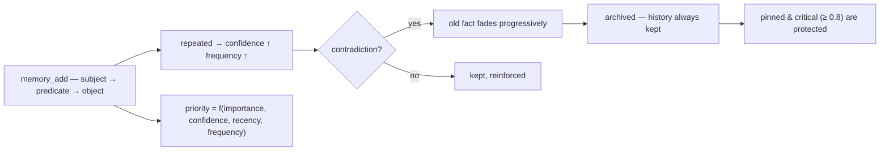

<p align="center">
  🌍 <strong>Languages:</strong>
  <a href="README.md">🇬🇧 English</a> ·
  <a href="README.fr.md">🇫🇷 Français</a> ·
  <a href="README.de.md">🇩🇪 Deutsch</a> ·
  <a href="README.es.md">🇪🇸 Español</a> ·
  <a href="README.it.md">🇮🇹 Italiano</a> ·
  <a href="README.pt.md">🇵🇹 Português</a> ·
  <a href="README.nl.md">🇳🇱 Nederlands</a> ·
  <a href="README.ru.md">🇷🇺 Русский</a> ·
  <a href="README.ja.md">🇯🇵 日本語</a> ·
  <a href="README.zh.md">🇨🇳 中文</a> ·
  <a href="README.ko.md">🇰🇷 한국어</a> ·
  <a href="README.pl.md">🇵🇱 Polski</a> ·
  <a href="README.tr.md">🇹🇷 Türkçe</a> ·
  <a href="README.uk.md">🇺🇦 Українська</a> ·
  <a href="README.hi.md">🇮🇳 हिन्दी</a> ·
  <a href="README.vi.md">🇻🇳 Tiếng Việt</a>
</p>

<p align="center">
  
</p>

<p align="center">
  <a href="https://www.npmjs.com/package/memsem"></a>
  <a href="LICENSE"></a>
  = 22.13">
  <a href="https://github.com/WindSeries69/memsem/actions"></a>
  
  
</p>

> **Bộ nhớ ngữ nghĩa cho các tác nhân AI** — ghi nhớ những gì quan trọng, biết cách quên.
> Một lệnh để cài đặt. Hoạt động trong *mọi* dự án, cho *mọi* AI. 100% cục bộ.

## Tại sao — khi các hệ thống bộ nhớ lớn đã tồn tại?

Chúng tồn tại, và chúng đã làm đúng những phần khó: lưu trữ vector (mem0),
đồ thị tri thức theo thời gian (Zep / Graphiti), các framework tác nhân (MemGPT / Letta).
Nhưng tất cả đều có chung ba khiếm khuyết:

1. **Lưu trữ thô, không có cấu trúc.** Chúng giữ những gì bạn ném vào, và việc
   truy xuất là một phép tìm kiếm tương đồng trên *mọi thứ*. AI không biết
   **tìm ở đâu** — nên nó tìm khắp nơi, và nhiễu làm át tín hiệu.
2. **Không chính xác.** Khớp mờ là khớp mờ: những ký ức gần đúng lấp đầy ngân sách
   ngữ cảnh và lãng phí token.
3. **Không tự sửa chữa.** Một sự kiện bị mâu thuẫn từ nhiều tháng trước vẫn mạnh
   như ngày nó được ghi.

memsem sửa chính xác ba điều này:

- 🧭 **Nó biết tìm ở đâu.** Mỗi phiên bắt đầu bằng một thẻ định tuyến
  (`memory-index.md`): chủ đề + từ khóa, được tiêm vào ngữ cảnh. AI định
  tuyến theo chủ đề, đi xuyên qua các dự án và chỉ trả chi phí cho những gì nó cần.
  Các chủ đề phân cấp + một danh sách focus sống giữ các nhánh đang hoạt động của
  phiên ở mức ưu tiên tối đa — phần còn lại bị giảm nhẹ, không bao giờ mất.
- 🎯 **Nó chính xác.** Tìm kiếm từ vựng nghiêm ngặt theo mặc định (ngưỡng khớp 50% số
  từ, không lan truyền đồ thị trừ khi bạn yêu cầu rõ ràng) — một truy vấn trả về
  các sự kiện đúng, xếp hạng theo ưu tiên động
  (`importance × confidence × recency × frequency`). Độ chính xác được đo,
  không phải giả định: **P@3 0.958** trên điểm chuẩn tham chiếu (51 sự kiện, 20 truy vấn,
  [`scripts/bench.mjs`](scripts/bench.mjs), kết quả trong
  [`DESIGN.md`](DESIGN.md) §11).
- 🔄 **Nó tự sửa mình.** Các mâu thuẫn làm mờ sự kiện cũ thay vì ghi đè nó
  ("Tôi đã uống sữa nhiều năm… khoan, bất dung nạp lactose") — lịch sử
  luôn được giữ, các sự kiện quan trọng (≥ 0.8) được bảo vệ. Các tác nhân nền
  trích xuất các sự kiện bền vững khi kết thúc phiên, gộp các sự kiện nhỏ thành các
  khuôn mẫu và hiệu chỉnh lại mức ưu tiên — chỉ khi bộ nhớ vẫn *dễ tìm kiếm ít nhất như trước*.

Tất cả những lời hứa của các hệ thống lớn, trừ đi những khiếm khuyết của chúng:
một lệnh, 100% cục bộ, và bộ nhớ của bạn vẫn là của bạn — không bao giờ được
commit, theo từng người dùng, được chia sẻ trên tất cả các repo của bạn.

## Xem cách hoạt động

Cài đặt một lần, để nó tự chạy. Đây là một phiên thực trên cơ sở dữ liệu dùng một lần — bộ nhớ thật của bạn không bao giờ bị động đến (`node scripts/demo.mjs`):

<p align="center">
  
</p>

```
=== memsem — demo on a temporary database ===
(your real memory in ~/.memory-mcp stays untouched)

1. The AI writes durable facts (memory_add_many)
   → 4 facts written

2. Strict search (lexical): memory_search { query: 'milk' }
   → user → drinks → milk

3. Semantic search (relax, local embeddings): memory_search { query: 'cheese', relax: true }
   No shared word with « lactose » — the local semantic index (Ollama) bridges it
   → lactose → is-present-in → cheese, yogurt, cream
   → user → is-intolerant-to → lactose
   → user → drinks → milk

4. Soft supersession: the AI learns you no longer drink milk
   → conflict: true, old fact faded (faded: [1])

5. Search now returns the current fact
   → user → drinks → no more milk (lactose intolerant)
   → user → drinks → milk

Stats: 5 active memories, semantic index OK (mxbai-embed-large)
```

## Quyền riêng tư — bộ nhớ là của bạn

- **100% cục bộ** — được lưu trong `~/.memory-mcp/memory.db` trên *chính* máy của bạn. Không có đám mây, không có telemetry, không có gì rời khỏi máy tính của bạn.
- **Không bao giờ được commit** — cơ sở dữ liệu nằm bên ngoài mọi kho lưu trữ. Clone một repo công khai, push mã, chia sẻ ảnh chụp màn hình: bộ nhớ vẫn ở với bạn. Mỗi người dùng có bộ nhớ riêng của mình.
- **Bộ nhớ đi theo *bạn***, không phải theo dự án — cùng một cơ sở được chia sẻ trên mọi repo của bạn. Tạo một thư mục mới, một repo mới: bộ nhớ vẫn còn đó.

## Cài đặt

### opencode — một dòng

Thêm vào `opencode.json` (dự án hoặc `~/.config/opencode/opencode.json`):

```json
{ "plugin": ["memsem"] }
```

Xong. Plugin đăng ký máy chủ MCP, tiêm giao thức bộ nhớ và chỉ mục bộ nhớ vào mọi phiên, cấp các quyền cần thiết và chạy các tác nhân nền. Khởi động lại opencode.

### Claude Code — một lệnh

```bash
npx -y memsem setup
```

Lệnh này đăng ký máy chủ MCP (`claude mcp add memory -- npx -y memsem`) và thêm một khối "memsem memory" vào `~/.claude/CLAUDE.md` trỏ tới giao thức đầy đủ.

**Hoặc cài đặt bằng AI**: chỉ cần dán đoạn sau vào Claude:

> Cài đặt bộ nhớ bền vững memsem: chạy `npx -y memsem setup`, đọc `~/.memsem/memory-protocol.md` và áp dụng giao thức.

### Mọi máy khách MCP

```bash
npx -y memsem
```

Máy chủ nói giao thức MCP qua stdio. Trỏ bất kỳ máy chủ tương thích MCP nào vào nó và tiêm `memory-protocol.md` vào phần hướng dẫn của máy chủ (ví dụ dưới dạng `AGENTS.md`) để AI tự chủ.

### Trình cài đặt phổ quát

```bash
npx -y memsem setup        # detects and configures your hosts (opencode, Claude)
npx -y memsem setup --help # see options
```

Idempotent, an toàn, có thể hoàn tác (`--uninstall`).

## Cách hoạt động

<p align="center">
  
</p>

**Vòng đời của bộ nhớ** — mọi sự kiện đều đi theo cùng một con đường:



- **Sự kiện nguyên tử** — mọi ký ức là một bộ ba `subject → predicate → object` kèm mức độ quan trọng, độ tin cậy, tần suất, thẻ, chủ đề, nguồn gốc.
- **Chủ đề & tiêu điểm (focus)** — các chủ đề phân cấp (`food/drinks`) là bản đồ định tuyến; tìm kiếm theo chủ đề đi xuyên qua mọi dự án. Danh sách `focus` giữ các chủ đề đang hoạt động của phiên ở mức ưu tiên tối đa.
- **Ưu tiên động** — `0.45 × importance + 0.25 × confidence + 0.2 × recency + 0.1 × frequency`. Một sự kiện quan trọng đánh bại một khuôn mẫu lặp lại.
- **Thay thế mềm (soft supersession)** — các mâu thuẫn làm mờ sự kiện cũ (độ tin cậy suy giảm) cho đến khi nó được lưu trữ dưới một ngưỡng. Lịch sử luôn được giữ.
- **Chỉ mục ngữ nghĩa (tùy chọn)** — mỗi sự kiện được nhúng cục bộ (`mxbai-embed-large` qua Ollama); tìm kiếm `relax: true` thêm độ tương đồng cosine (ngưỡng 0.5). Không có Ollama, mọi thứ vẫn hoạt động y hệt — tìm kiếm từ vựng nghiêm ngặt.

## So sánh

| | memsem | `CLAUDE.md` / notes | mem0 | Zep / Graphiti | official memory MCP | Obsidian as memory |
|---|---|---|---|---|---|---|
| Tự ghi trong các phiên | ✅ | ❌ | ⚠️ qua mã ứng dụng | ⚠️ qua mã ứng dụng | ❌ | ❌ |
| Ưu tiên cho ngân sách ngữ cảnh | ✅ | ❌ | ❌ | ❌ | ❌ | ❌ |
| Mâu thuẫn (thay thế mềm) | ✅ | ❌ (ghi đè) | ❌ (ghi đè) | ✅ (phiên bản theo thời gian) | ❌ | ❌ |
| Tìm kiếm ngữ nghĩa | ✅ cục bộ (Ollama) | ❌ | ✅ (lưu trữ vector) | ✅ (đồ thị + nhúng) | ❌ | ⚠️ (plugin) |
| Ký ức tình tiết + tự bảo trì | ✅ | ❌ | ⚠️ (tiện ích bổ sung episodic) | ✅ (đồ thị tri thức theo thời gian) | ❌ | ❌ |
| Một bộ nhớ dùng chung mọi repo | ✅ | ❌ (theo dự án) | ⚠️ (theo cấu hình ứng dụng) | ⚠️ (theo cấu hình ứng dụng) | ❌ | ⚠️ (vault) |
| Không phụ thuộc, `npx -y` | ✅ | ✅ | ❌ | ❌ | ✅ | ✅ |
| Dễ đọc / chỉnh sửa bằng người | ⚠️ (CLI list/edit) | ✅ | ❌ | ❌ | ✅ (JSON) | ✅ |

*So sánh tính đến tháng 8 năm 2026, dựa trên tài liệu công khai; khả năng có thể phát triển — hãy kiểm chứng trước khi lựa chọn.*

## Dòng lệnh

Mọi thứ có thể làm qua MCP đều có thể làm từ terminal:

```bash
memsem list [--theme x] [--project p] [--limit n] [--all]   # read your memory
memsem edit <id> [--object "..."] [--importance 0.6] [...]  # fix a fact by hand (audited)
memsem forget <id> [--yes]                                  # archive a fact (confirm)
memsem doctor [--limit n] [--hours h]                       # most-modified facts — spot drift
memsem export [--output f] [--project p]                    # full JSON dump
memsem import <file.json>                                   # restore / merge a dump
memsem setup [--host opencode|claude]                       # install for your hosts
```

Các chỉnh sửa thủ công được ghi vào nhật ký kiểm toán — `memsem doctor` cũng hiển thị chúng.

## Cấu hình

Các hằng số có thể điều chỉnh (trọng số ưu tiên, ngưỡng, hệ số mờ dần, mô hình…) nằm trong
[`src/config.ts`](src/config.ts). Bạn có thể ghi đè bất kỳ hằng số nào trong `~/.memsem/config.json`
(hoặc `$MEMSEM_CONFIG`), được hợp nhất sâu kèm kiểm tra hợp lệ:

```json
{ "priority": { "importance": 0.4, "confidence": 0.3 }, "minLexical": 0.4 }
```

Các cài đặt được ghi chép và kiểm chứng bằng một điểm chuẩn
([`scripts/bench.mjs`](scripts/bench.mjs) — 51 sự kiện, 20 truy vấn, P@k/R@k trên các bộ
hằng số; kết quả trong [`DESIGN.md`](DESIGN.md) §11).

## Độ bền

Cơ sở dữ liệu được quản lý phiên bản và di trú tự động khi khởi động (`schema_migrations`),
với bản sao lưu tự động trước mọi lần di trú (`~/.memory-mcp/backups/`, giữ 5 bản gần nhất).
Chế độ WAL được bật — sự cố giữa chừng khi ghi vẫn để lại cơ sở dữ liệu nguyên vẹn.
Xuất và khôi phục toàn bộ qua `memsem export` / `memsem import`.

## Tài liệu

- [`memory-protocol.md`](memory-protocol.md) — giao thức được tiêm vào AI của bạn: cách nó tự động ghi, tìm kiếm và duy trì bộ nhớ.
- [`DESIGN.md`](DESIGN.md) — thiết kế đầy đủ: tầm nhìn, nguyên tắc, nghiên cứu tình huống lactose, hiệu chỉnh hằng số, lộ trình phát triển.
- [`scripts/demo.mjs`](scripts/demo.mjs) — tái hiện bản demo ở trên trên một cơ sở dữ liệu dùng một lần.

## Hạn chế đã biết

Đọc một cách trung thực, từ một bài đánh giá độc lập ([Agent Memory Atlas](https://neoneye.github.io/agent-memory-atlas/systems/memsem/)):

- **Đường dẫn sửa chữa tự động không có khóa.** Một giá trị bị từ chối được *khẳng định lại* (chẳng hạn cùng một bản ghi cũ được đọc mười lần) quay trở lại và làm lu mờ chính sự sửa chữa của nó — một sự sửa chữa thông thường được lưu trữ ở lần khẳng định lại thứ ba. Chỉ khi **một con người từ chối một ứng viên** mới ghi một suppression bền vững (`memory_suppressions`) thẳng thừng khước từ giá trị đó. Đây là một lập trường có chủ đích (sự lặp lại là bằng chứng) với một cái giá thực sự.
- **Một pin bảo vệ sự tồn tại, không phải khả năng hiển thị.** Một sự sửa chữa được ghim không bao giờ mất độ tin cậy và luôn đứng đầu trong `memsem list`, nhưng một giá trị bị từ chối lặp lại vẫn có thể chiếm kết quả đầu tiên của `memory_search`.
- **`import` ghi qua cổng** — khôi phục bản sao lưu sẽ đưa lại một giá trị đã bị chặn.
- **Một lần ghi bị từ chối không để lại dòng kiểm toán**, và việc xóa một sự kiện đã duyệt để lại văn bản của nó trong `memory_candidates`.
- **Các quy tắc an toàn của hợp nhất và trích xuất là các lời nhắc (prompt), không phải mã.**

Các góc cạnh thô, không phải lỗi — từng vấn đề được theo dõi trong lộ trình và các câu hỏi mở của [DESIGN.md](DESIGN.md).

## Lộ trình

- [x] Chỉ mục ngữ nghĩa (nhúng Ollama cục bộ)
- [x] Ký ức tình tiết + trích xuất phiên
- [x] Gộp hippocampus + bộ đánh giá chấm điểm từng cặp
- [x] Plugin opencode phổ quát + `memsem setup`
- [x] Di trú theo phiên bản + sao lưu tự động + xuất/nhập
- [x] Các hằng số có thể cấu hình, kiểm chứng bằng điểm chuẩn
- [x] Bộ đánh giá an toàn: chạy thử (dry-run), nhật ký kiểm toán, lan can an toàn, `memsem doctor`
- [x] CLI: `list` / `edit` / `forget` — chỉnh sửa sự kiện bằng tay
- [x] Lan truyền đồ thị đa chặng (multi-hop)
- [ ] Write gate trên đường tự động (quyết định supersession → suppression)
- [ ] `import` sau cánh cổng (tham khảo suppressions)
- [ ] Từ chối kiểm toán; dọn dẹp ứng viên; quy tắc hợp nhất trong mã
- [ ] Cầu nối Obsidian: xuất/nhập bộ nhớ dưới dạng ghi chú markdown dễ đọc

## Giấy phép

MIT — miễn phí cho mọi mục đích. Bộ nhớ của bạn vẫn là của bạn.
