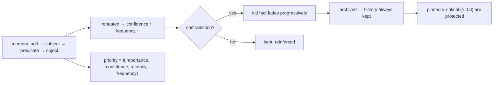

<p align="center">
  🌍 <strong>Languages:</strong>
  <a href="README.md">🇬🇧 English</a> ·
  <a href="README.fr.md">🇫🇷 Français</a> ·
  <a href="README.de.md">🇩🇪 Deutsch</a> ·
  <a href="README.es.md">🇪🇸 Español</a> ·
  <a href="README.it.md">🇮🇹 Italiano</a> ·
  <a href="README.pt.md">🇵🇹 Português</a> ·
  <a href="README.nl.md">🇳🇱 Nederlands</a> ·
  <a href="README.ru.md">🇷🇺 Русский</a> ·
  <a href="README.ja.md">🇯🇵 日本語</a> ·
  <a href="README.zh.md">🇨🇳 中文</a> ·
  <a href="README.ko.md">🇰🇷 한국어</a> ·
  <a href="README.pl.md">🇵🇱 Polski</a> ·
  <a href="README.tr.md">🇹🇷 Türkçe</a> ·
  <a href="README.uk.md">🇺🇦 Українська</a> ·
  <a href="README.hi.md">🇮🇳 हिन्दी</a> ·
  <a href="README.vi.md">🇻🇳 Tiếng Việt</a>
</p>

<p align="center">
  
</p>

<p align="center">
  <a href="https://www.npmjs.com/package/memsem"></a>
  <a href="LICENSE"></a>
  = 22.13">
  <a href="https://github.com/WindSeries69/memsem/actions"></a>
  
  
</p>

> **面向 AI 智能体的语义记忆** — 记住重要的，懂得遗忘。
> 一条命令即可安装。在 *每个* 项目中、为 *每个* AI 工作。100% 本地。

## 为什么 — 大型记忆系统不是已经存在了吗？

它们确实存在，而且把难的部分做对了：向量存储（mem0）、时序知识图谱
（Zep / Graphiti）、智能体框架（MemGPT / Letta）。但它们都有同样的三个缺陷：

1. **暴力存储，没有结构。** 它们存下你丢给它们的一切，而检索是对 *所有东西*
   的相似度搜索。AI 不知道**该往哪儿看** — 于是它到处看，噪音淹没了信号。
2. **不精确。** 模糊匹配就是模糊匹配：近似正确的记忆填满了上下文预算，浪费 token。
3. **没有自我修正。** 几个月前就被推翻的事实，仍然和它刚写入那天一样强硬。

memsem 恰好修复了这三点：

- 🧭 **它知道去哪儿搜索。** 每次会话都以一张路由卡（`memory-index.md`）开始：
  主题 + 关键词，注入上下文。AI 按主题路由，跨项目检索，只为所需付费。
  分层主题 + 实时焦点列表让会话中的活跃分支保持全优先级 — 其余被衰减，但永不丢失。
- 🎯 **它很精确。** 默认严格词汇搜索（50% 词匹配阈值，除非你明确要求，否则不传播图谱）—
  查询返回正确的事实，按动态优先级排序
  （`importance × confidence × recency × frequency`）。精确度是被测量过的，不是想当然：
  在参考基准上 **P@3 0.958**（51 个事实，20 个查询，
  [`scripts/bench.mjs`](scripts/bench.mjs)，结果见
  [`DESIGN.md`](DESIGN.md) §11）。
- 🔄 **它会自我修正。** 矛盾会让旧事实逐渐淡出，而不是覆盖它（“我喝了多年牛奶…
  等等，乳糖不耐受”）— 历史永远保留，关键事实（≥ 0.8）受到保护。后台智能体
  在会话结束时提取持久事实，把小事实整合成模式，并重新校准优先级 — 且仅在记忆
  保持 *至少同样可搜索* 的前提下进行。

所有大型系统的优点，却没有它们的缺陷：一条命令、100% 本地，你的记忆始终属于你 —
永不提交，按用户隔离，在你所有的仓库间共享。

## 看它工作

安装一次，让它跑起来。这是一个在一次性数据库上的真实会话 — 你的真实记忆不会被触碰（`node scripts/demo.mjs`）：

<p align="center">
  
</p>

```
=== memsem — demo on a temporary database ===
(your real memory in ~/.memory-mcp stays untouched)

1. The AI writes durable facts (memory_add_many)
   → 4 facts written

2. Strict search (lexical): memory_search { query: 'milk' }
   → user → drinks → milk

3. Semantic search (relax, local embeddings): memory_search { query: 'cheese', relax: true }
   No shared word with « lactose » — the local semantic index (Ollama) bridges it
   → lactose → is-present-in → cheese, yogurt, cream
   → user → is-intolerant-to → lactose
   → user → drinks → milk

4. Soft supersession: the AI learns you no longer drink milk
   → conflict: true, old fact faded (faded: [1])

5. Search now returns the current fact
   → user → drinks → no more milk (lactose intolerant)
   → user → drinks → milk

Stats: 5 active memories, semantic index OK (mxbai-embed-large)
```

## 隐私 — 你的记忆属于你

- **100% 本地** — 存储在 *你* 机器上的 `~/.memory-mcp/memory.db` 中。没有云，没有遥测，
  没有任何东西离开你的电脑。
- **永不提交** — 数据库位于每个仓库之外。克隆公开仓库、推送代码、分享截图：
  你的记忆始终与你同在。每个用户都有自己的记忆。
- **记忆跟随 *你***，而不是你的项目 — 同一个数据库在你所有的仓库之间共享。
  新建文件夹、新建仓库：记忆依然还在。

## 安装

### opencode — 一行

添加到 `opencode.json`（项目级或 `~/.config/opencode/opencode.json`）：

```json
{ "plugin": ["memsem"] }
```

就这样。该插件注册 MCP 服务器、把记忆协议和记忆索引注入每次会话、授予所需权限，
并运行后台智能体。重启 opencode 即可。

### Claude Code — 一条命令

```bash
npx -y memsem setup
```

这会注册 MCP 服务器（`claude mcp add memory -- npx -y memsem`），并在
`~/.claude/CLAUDE.md` 中添加一个指向完整协议的“memsem memory”区块。

**或者让 AI 帮你安装**：直接把下面这段话粘贴给 Claude：

> 安装 memsem 持久记忆：运行 `npx -y memsem setup`，阅读 `~/.memsem/memory-protocol.md`，并应用该协议。

### 任何 MCP 客户端

```bash
npx -y memsem
```

服务器通过 stdio 使用 MCP 协议。把任何支持 MCP 的主机指向它，并将
`memory-protocol.md` 注入主机的指令（例如作为 `AGENTS.md`），即可让 AI 自主工作。

### 通用安装器

```bash
npx -y memsem setup        # 检测并配置你的主机（opencode、Claude）
npx -y memsem setup --help # 查看选项
```

幂等、安全、可逆（`--uninstall`）。

## 工作原理

<p align="center">
  
</p>

**记忆生命周期** — 每个事实都遵循同一条路径：



- **原子事实** — 每条记忆都是 `subject → predicate → object` 三元组，带有重要性、
  置信度、频率、标签、主题、来源。
- **主题与焦点** — 分层主题（`food/drinks`）是路由地图；按主题搜索会跨越所有项目。
  `focus` 列表让会话中的活跃主题保持全优先级。
- **动态优先级** — `0.45 × importance + 0.25 × confidence + 0.2 × recency + 0.1 × frequency`。
  关键事实胜过重复出现的模式。
- **软更替** — 矛盾会让旧事实逐渐淡出（置信度衰减），直到低于阈值被归档。历史永远保留。
- **语义索引（可选）** — 每个事实都在本地嵌入（通过 Ollama 使用 `mxbai-embed-large`）；
  `relax: true` 搜索会增加余弦相似度（阈值 0.5）。没有 Ollama 时，一切照常工作 —
  严格词汇搜索。

## 对比

| | memsem | `CLAUDE.md` / notes | mem0 | Zep / Graphiti | official memory MCP | Obsidian as memory |
|---|---|---|---|---|---|---|
| 会话中自动写入 | ✅ | ❌ | ⚠️ 通过应用代码 | ⚠️ 通过应用代码 | ❌ | ❌ |
| 上下文预算的优先级 | ✅ | ❌ | ❌ | ❌ | ❌ | ❌ |
| 矛盾处理（软更替） | ✅ | ❌（覆盖） | ❌（覆盖） | ✅（时序版本化） | ❌ | ❌ |
| 语义搜索 | ✅ 本地（Ollama） | ❌ | ✅（向量存储） | ✅（图谱 + 嵌入） | ❌ | ⚠️（插件） |
| 情节记忆 + 自我维护 | ✅ | ❌ | ⚠️（情节附加组件） | ✅（时序知识图谱） | ❌ | ❌ |
| 所有仓库共享一条记忆 | ✅ | ❌（按项目） | ⚠️（按应用配置） | ⚠️（按应用配置） | ❌ | ⚠️（vault） |
| 零依赖，`npx -y` | ✅ | ✅ | ❌ | ❌ | ✅ | ✅ |
| 人类可读 / 可编辑 | ⚠️（CLI 列表/编辑） | ✅ | ❌ | ❌ | ✅（JSON） | ✅ |

*对比截至 2026 年 8 月，依据公开文档；能力会不断演进 — 选择前请自行核实。*

## 命令行

所有能通过 MCP 做的事情，都可以在终端里完成：

```bash
memsem list [--theme x] [--project p] [--limit n] [--all]   # read your memory
memsem edit <id> [--object "..."] [--importance 0.6] [...]  # fix a fact by hand (audited)
memsem forget <id> [--yes]                                  # archive a fact (confirm)
memsem doctor [--limit n] [--hours h]                       # most-modified facts — spot drift
memsem export [--output f] [--project p]                    # full JSON dump
memsem import <file.json>                                   # restore / merge a dump
memsem setup [--host opencode|claude]                       # install for your hosts
```

手动修正会写入审计日志 — `memsem doctor` 也会显示它们。

## 配置

可调常数（优先级权重、阈值、淡出因子、模型…）位于
[`src/config.ts`](src/config.ts)。你可以在 `~/.memsem/config.json`
（或 `$MEMSEM_CONFIG`）中覆盖其中任何一项，进行深度合并并带校验：

```json
{ "priority": { "importance": 0.4, "confidence": 0.3 }, "minLexical": 0.4 }
```

这些设置由基准测试进行文档化和验证
（[`scripts/bench.mjs`](scripts/bench.mjs) — 51 个事实、20 个查询，跨常数集的
P@k/R@k；结果见 [`DESIGN.md`](DESIGN.md) §11）。

## 持久性

数据库带版本号，并在启动时自动迁移（`schema_migrations`），
任何迁移前都会自动备份（`~/.memory-mcp/backups/`，保留最近 5 份）。
WAL 模式已开启 — 写入中途崩溃也不会破坏数据库。完整导出和恢复
通过 `memsem export` / `memsem import` 完成。

## 文档

- [`memory-protocol.md`](memory-protocol.md) — 注入到你的 AI 的协议：它如何自动写入、搜索和维护记忆。
- [`DESIGN.md`](DESIGN.md) — 完整设计：愿景、原则、乳糖案例研究、常数校准、路线图。
- [`scripts/demo.mjs`](scripts/demo.mjs) — 在一次性数据库上复现上面的演示。

## 已知限制

这是根据一份独立评审（[Agent Memory Atlas](https://neoneye.github.io/agent-memory-atlas/systems/memsem/)）如实所记：

- **自动修正路径没有锁。** 被拒绝的值被*重新断言*（比如同一份旧记录被读了十遍）时，它就会回来，并淡化自己的修正 — 普通的修正会在第三次重新断言时被归档。只有**人类拒绝候选**才会写入一条永久抑制（`memory_suppressions`），彻底拒绝该值。这是一个有意为之的立场（重复就是证据），并有其真实的代价。
- **置顶保护的是存活，而不是可见性。** 被置顶的修正永远不会失去置信度，且始终排在 `memsem list` 的第一位，但一个被反复拒绝的值仍可能占据 `memory_search` 的置顶结果。
- **`import` 会绕过闸门写入** — 恢复备份会重新启用被抑制的值。
- **被拒绝的写入不会留下审计行**，而清除一个已评审的事实会将其文本留在 `memory_candidates` 中。
- **整合与提取的安全规则是提示词，而不是代码。**

这些是粗粝之处，不是缺陷 — 每一项都记录在 [DESIGN.md](DESIGN.md) 的路线图和未决问题中。

## 路线图

- [x] 语义索引（本地 Ollama 嵌入）
- [x] 情节记忆 + 会话提取
- [x] 海马体整合 + 成对比较评分裁判
- [x] 通用 opencode 插件 + `memsem setup`
- [x] 带版本的迁移 + 自动备份 + 导出/导入
- [x] 可配置常数，由基准测试验证
- [x] 安全裁判：试运行、审计日志、护栏、`memsem doctor`
- [x] CLI：`list` / `edit` / `forget` — 手动修正事实
- [x] 多跳图谱传播（relax 模式）
- [ ] 自动路径上的写入闸门（更替 → 抑制决策）
- [ ] 闸门后的 `import`（查询抑制记录）
- [ ] 审计被拒的写入；清除候选文本；将整合规则写入代码
- [ ] Obsidian 桥接：将记忆导出/导入为可读的 markdown 笔记

## 许可证

MIT — 可自由用于任何用途。你的记忆始终属于你。
